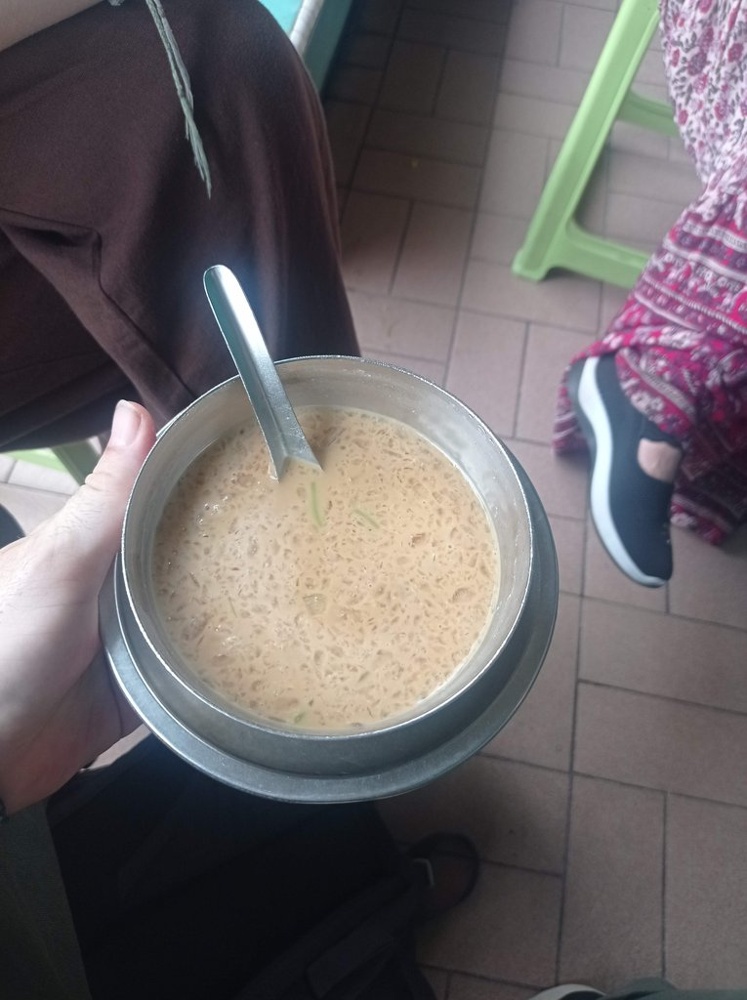
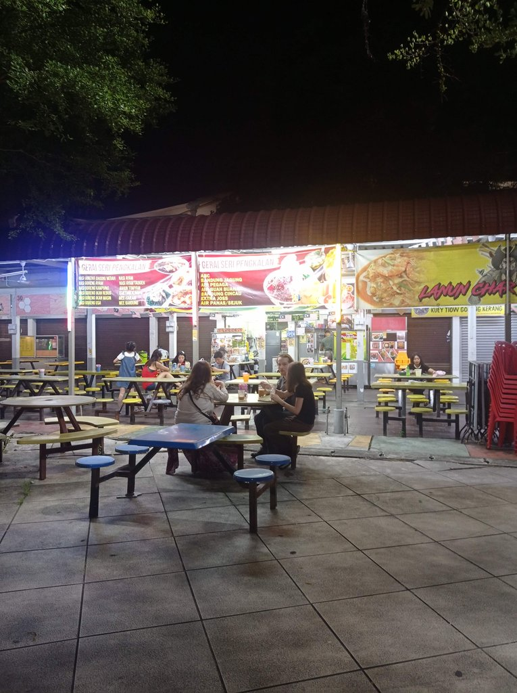

9h15 Réveil.

10h30 Petit déjeuner sur le food court.

11h **Métro** pour la **gare** de Kuala Lumpur.

12h05 Le **train** pour Ipoh. Deux boissons, une panne de clim, vingt minutes de retard.

14h25 jusqu’à 14h50 Attente du bus, qui ne passera jamais absent, donc on y va à pied. On achète de l’eau (1,5 myr).

15h10 Arrivée à l’hôtel.

16h10 Nous sortons prendre un **cendol** en face (Deen CT Corner Cendol) à 3,5 myr avant d’aller à la papeterie pour (6,50
myr) acheter des crayons de couleur à Ingham.

16h30 Le Old White House Coffee. Un café bobo branché, avec deux thés tarik, un café vietnamien glacé, une limonade et
un pain perdu.
Passage ensuite au Seven Eleven pour acheter de l’eau et des litchis, avant de retourner à l’hôtel pour rechercher
l’itinéraire de la suite du voyage.

19h50 Tour du Night Market, puis restaurant pour trouver à manger.
On achète des douceurs et nous trouvons un restaurant Dim Sum.
Nous enchaînons avec des petits gâteaux chinois fourrés que l’on mange sur le **food court**, avec un jus de litchis,
deux thés tarik chauds et un ice tea pour 11 myr

