9h30 Réveil.

10h00 direction l'arrêt du bus. Sur le chemin stop dans une petite gargote pour le petit déjeuner. Passons au Minimart
pour de l'eau et des petits gateaux.

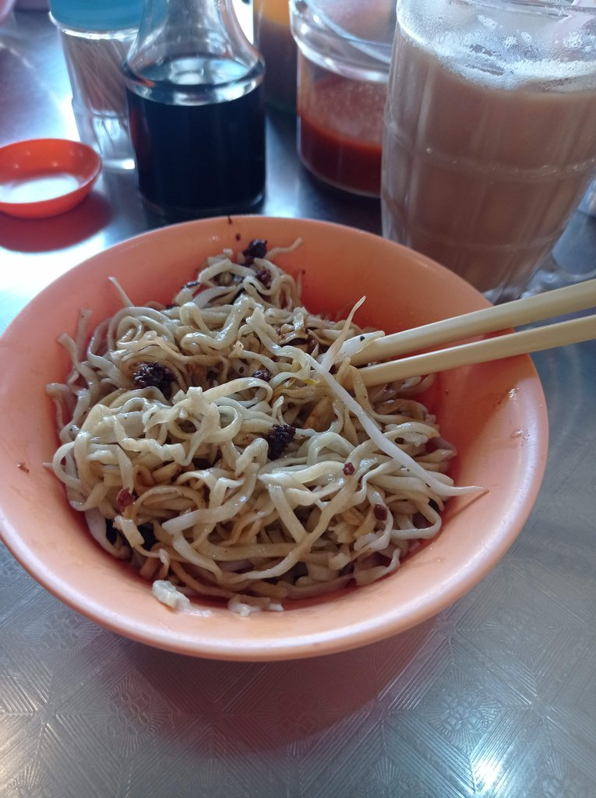

10h45 bus (4,80 myr) pour le premier **temple** (Ling Sen Tong Temple). Géraldine s'achète uen éventail (15 myr)

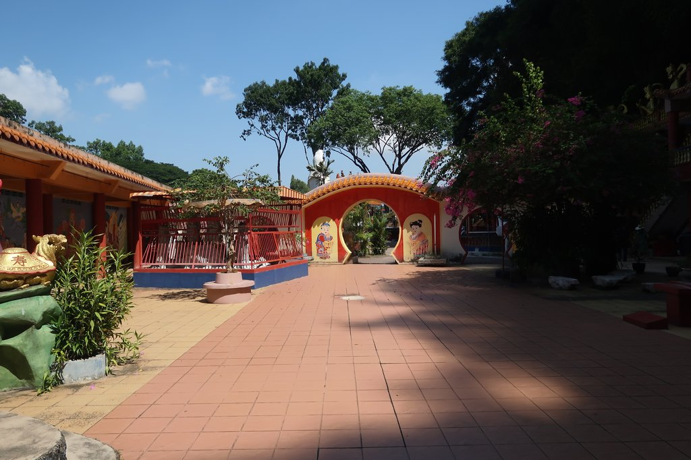
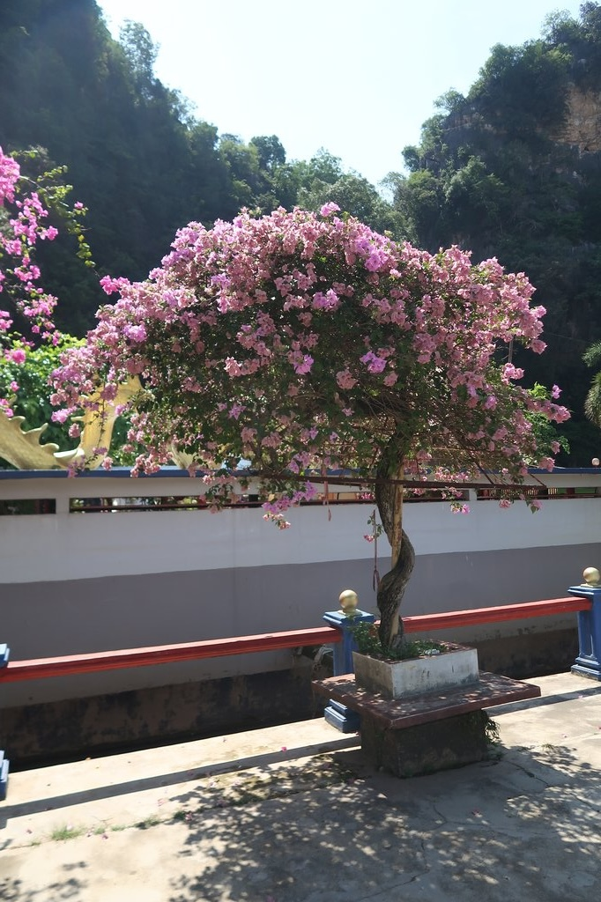

12h30 bus (4 myr) pour un autre temple (Da Seng Ngan Temple). Les enfants achètent 2 médailles (10 myr).

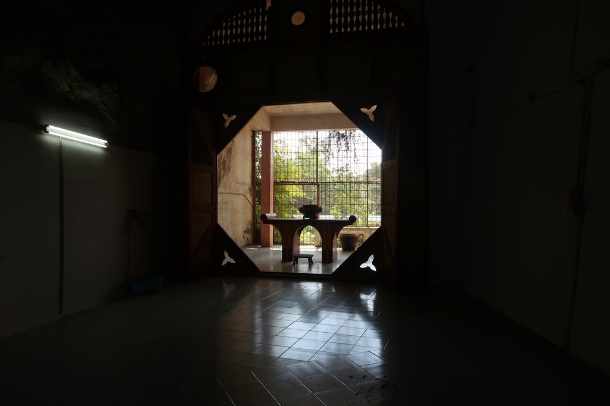
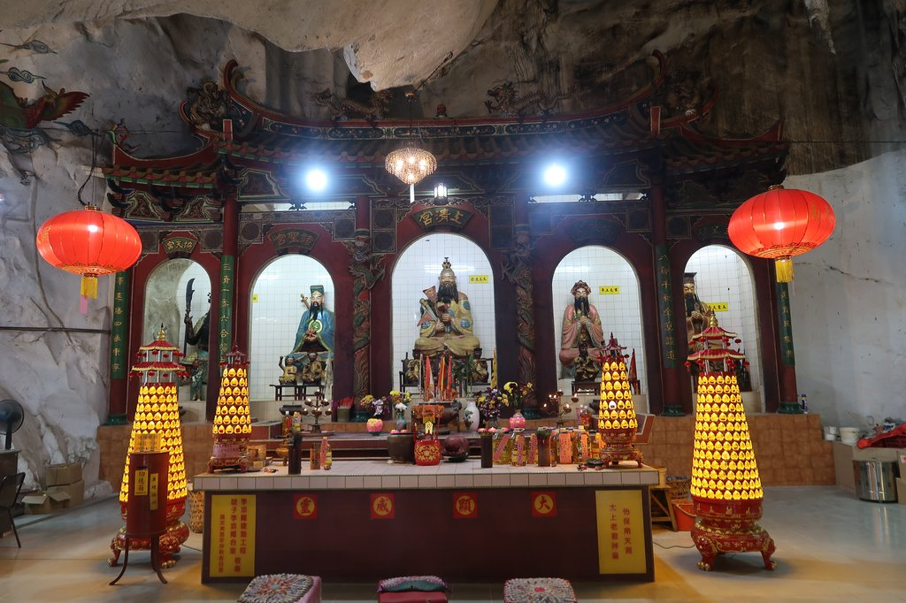
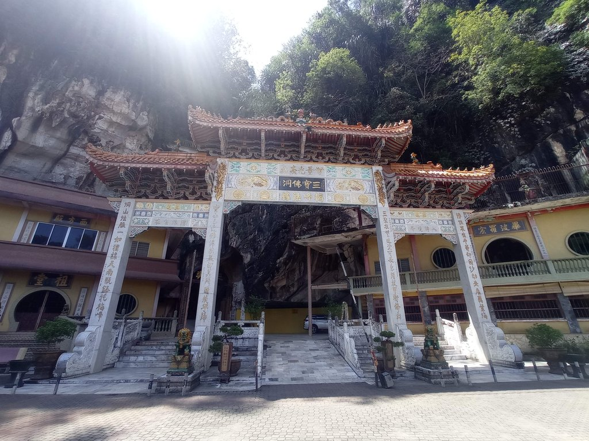
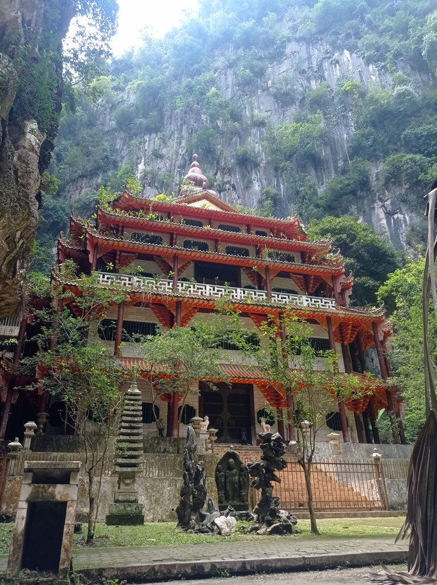
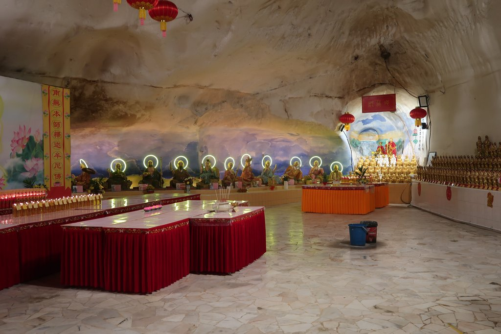
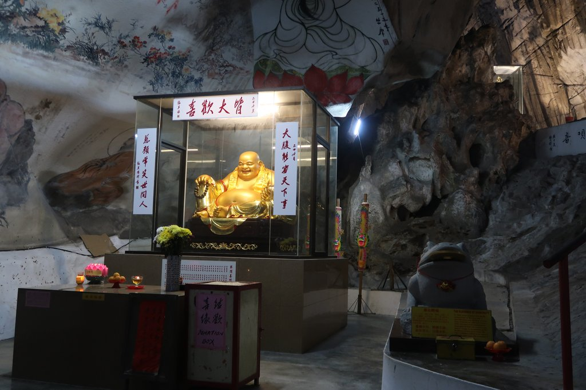

14h00 grab (14,45 myr) pour le dernier temple de la journée (Perak Cave Temple). Visite de ce très beau temple et
tisanes.

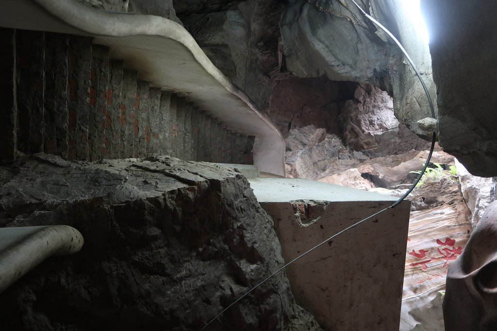
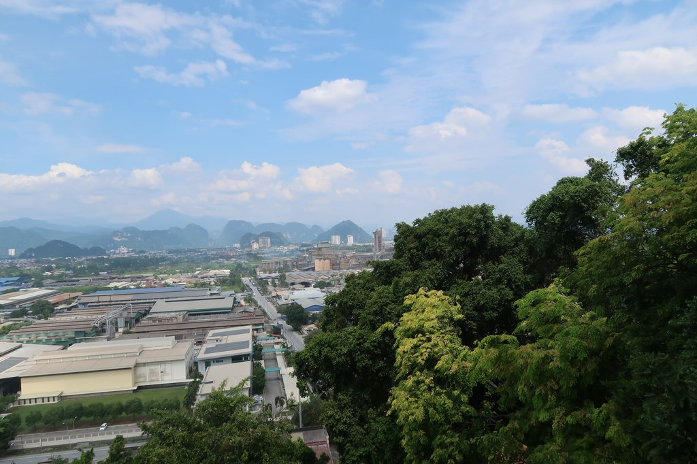
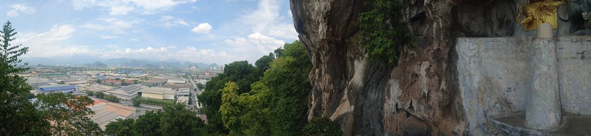

15h30 grab pour revenir dans le centre-ville. Visite du quartier touristique et tendance. Minimart pour completer les
réserves d'eau et de gateaux. Le stand de Silk Tofu est ouvert, on en profite.

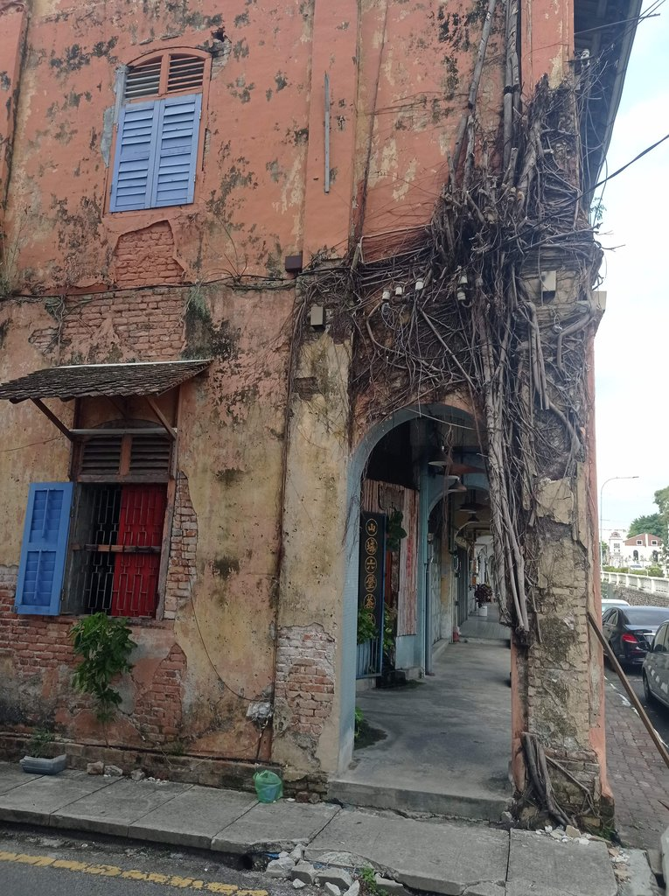

17h00 sur le food court : thés glacés, ju litchi, 2 cafés glacés (11 myr). De retour à l'hôtel, on cherche où se loger
le lendemain.

19h30 ATM pour reconstituer les reserves. Retour sur le **food court** pour le repas du soir.

