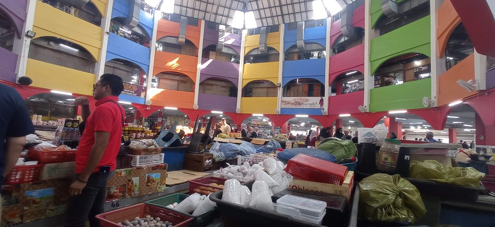
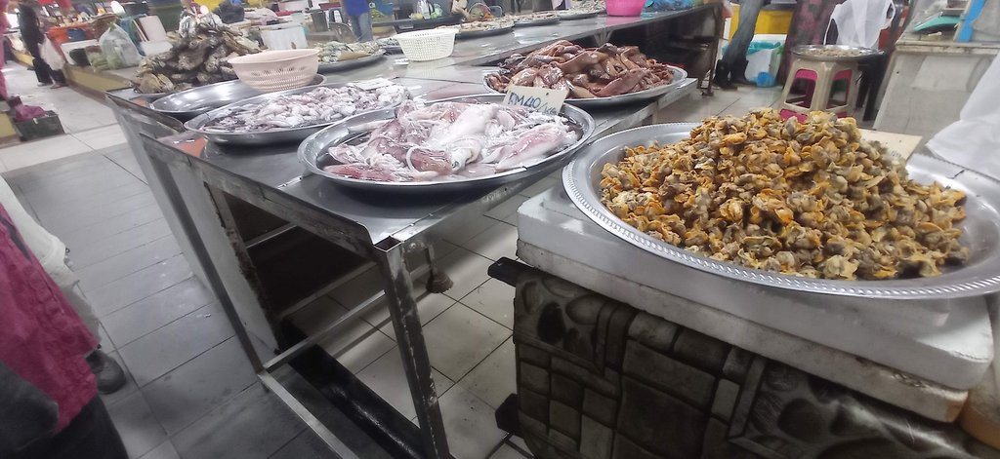
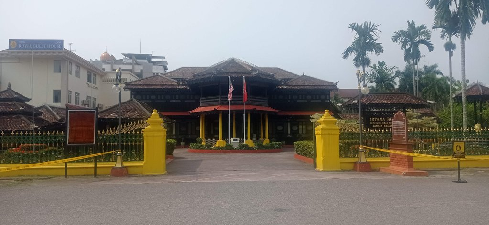
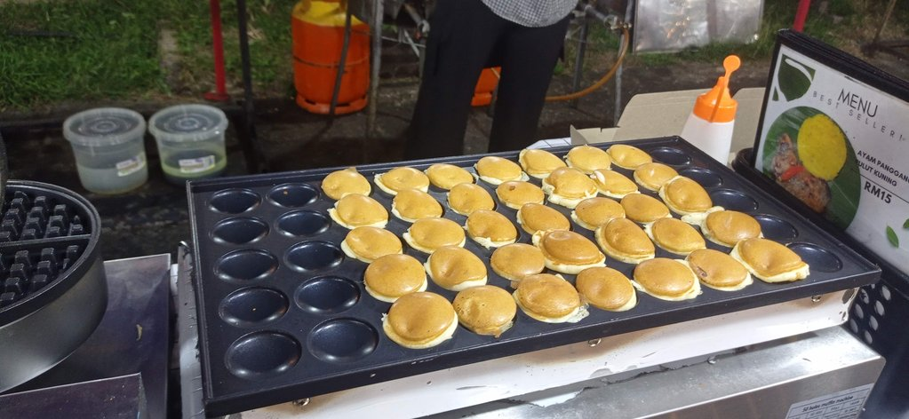
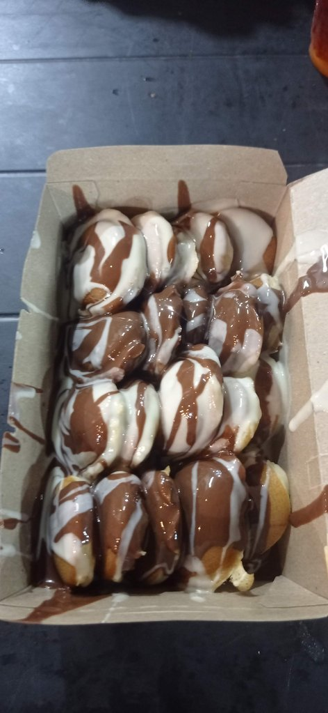

09h30 Réveil dans notre chambre sans fenêtre.

10h00 nous déposons les sacs dans notre nouvel hôtel situé non loin, mais plus classique. La chambre ne sera disponible que vers 14h00.

10h30 Visite du **marché**, les stands de nourriture sont ouvert, vite un petit déjeuner.

11h00 Journée des visites de la ville. Le handicraft muséum dans une très belle vieille demeure.  Visite du **palais**. Visite de la **résidence**.

13h00 Arrivés au **musée** municipal, mais il est fermé pour "Installation" 

13h55 retour dans notre nouvel hôtel, la chambre est disponible. Heureusement, car cette pause à l'ombre est la bienvenue.

15h30 De retour au handicraft center, dessiner à l'ombre et sirotant un tea O ice. NOus revenons ensuite tranquillement par la mosquée et les quais.

19h00 De nouveau au restaurant chinois.

Sur le retour, arrêt dans un petit stand de rue pour des petits beignets

