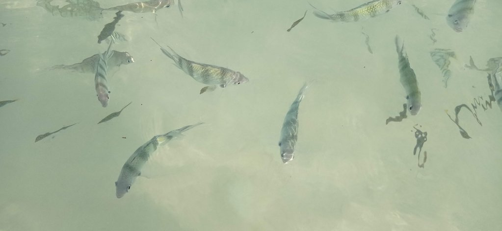
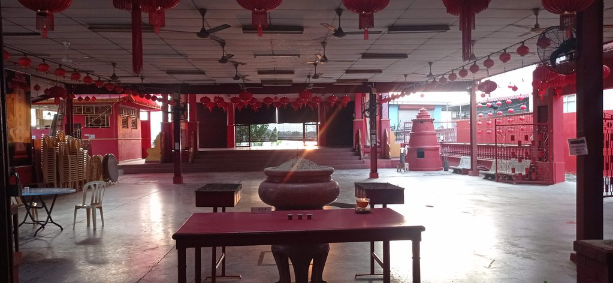

8h00 réveil

8h30 petit déjeuner au Coral Beach (le restaurant de l'hôtel voisin)

9h00 **baignade** pour profiter jusqu'au bout

11h30 dépot des clés et petites gaufres au chocolat sur la plage en attendant notre bateau.

12h30 **Bateau** pour Marang

13h30 Grab pour Kuala Terranganu. L'hôtel du jour précédent est devenu trop cher, nous en trouvons un autre. On achète
les tickets de bus du lendemain à la **gare routière**. Passage par le **marché**, achat de 1kg de rambutans que l'on mange face
à la rivière. Petit **café** vietnamien dans la rue chinoise pour se rafraichir.

16h00 retour hôtel, sieste, carnet, billard

19h00 direction **Chinatown** en passant par un petit temple en bord de rivière.
Nous retournons évidemment manger chez Oncle Heng das le grand hangar pour diner.

Retour hôtel, partie de billard en famille.

