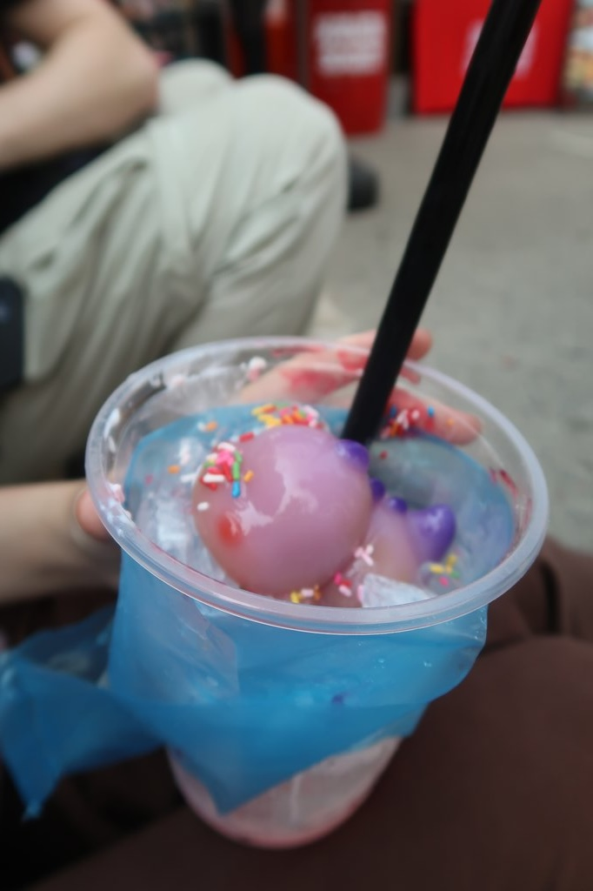
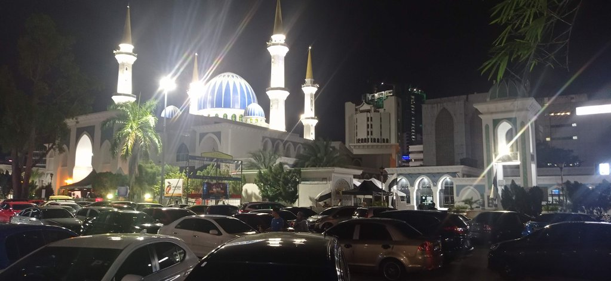

7h30 réveil

8h15 départ pour la gare routière où nous prenons 2 cafés à emporter.

9h00 départ du bus

13h00 arrivée à **Kuantan**. Dans cette **gare routière**, on achète directement les billets pour Malacca. Prenons un
grab
pour rejoindre notre guest house. Il n'y a pas de bus, pas de trottoirs, c'est le royaume de la voiture.

14h00 grab pour le centre-ville. Korydwen teste une boulangerie réputée (4 myr le brownie bof). C'est la fête dans le
centre-ville. Il y a des stands partout, des courses de bateaux sur la rivère. Korydwen teste un "character drink", un
dinosaure en gelée dans un mix chimique (14 myr). Elouan un crispy banana roti (10 myr)

Arrêt café dans un lieu qui est normalement un restaurant spécialisé dans le poulet. Nous tentons de revenir à la gh à
pied, mais c'est trop compliqué.

17h00 grab retour

19h00 grab pour le Sara Thai Kitchen Jalan Gambut grand restaurant repéré l'après-midi. Nouas arrivons à rejoindre le
**marché de nuit** devant la **mosquée** Negeri Pahang. Nous mangeons quelques friandises avant de prendre un grab pour revenir à
la guest-house.

