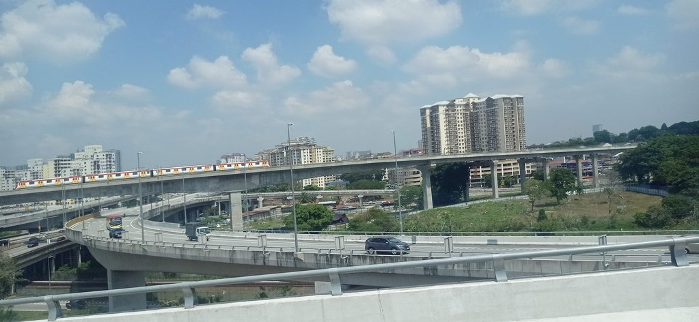
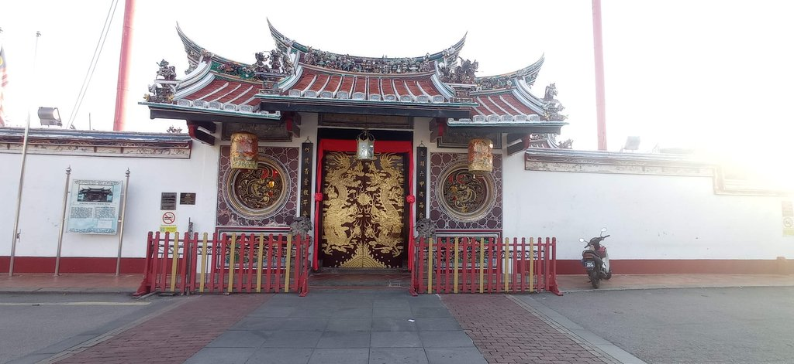
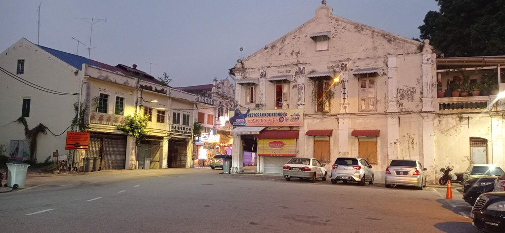
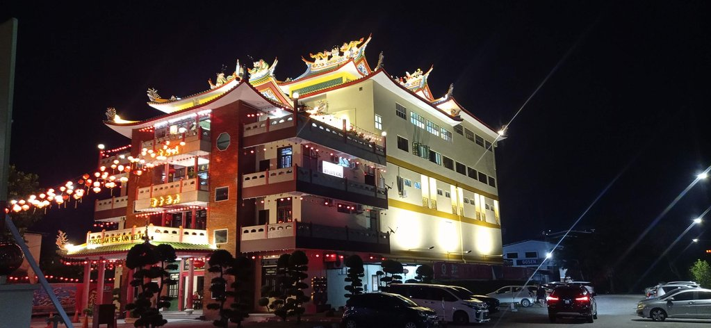
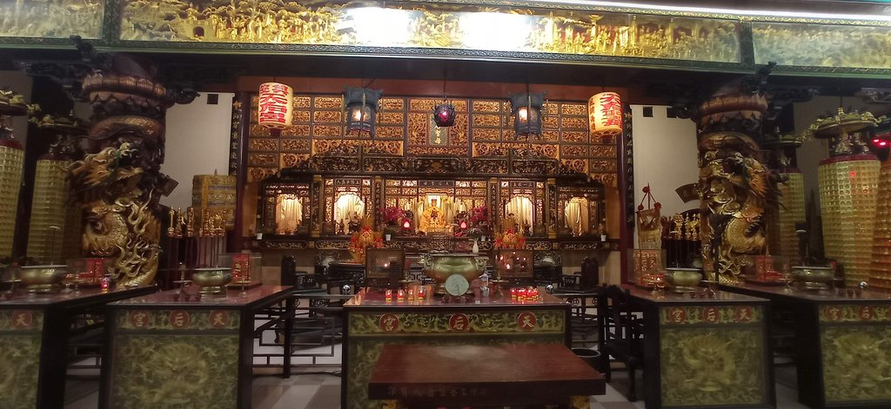

6h45 réveil

7h15 grab pour la **gare routière**, où nous prenons 4 cafés pour 12 myr.

8h30 départ du bus pour **Malacca**. Le trajet passe par les autoroutes autour de Kuala Lumpur, la vue est parfois
vertigineuse tellement les bretelles d'autoroute et les rails se superposent.

14h00 Taxi pour rejoindre notre hôtel situé dans un **temple**.

16h00 Nous partons à pied vers le centre-ville historique par les petites rues. Nous faisons escale dans un café
tendance dans la vieille ville, niché au fond d'une ruelle.

Pour le repas du soir, un restaurant un peu à l'écart de l'agitation le Kin Dee Thai Kitchen & Mookata.
Retour par les petites rues avec un stop chez un indien acheter goulab jamun et boules coco (7,5 myr)

