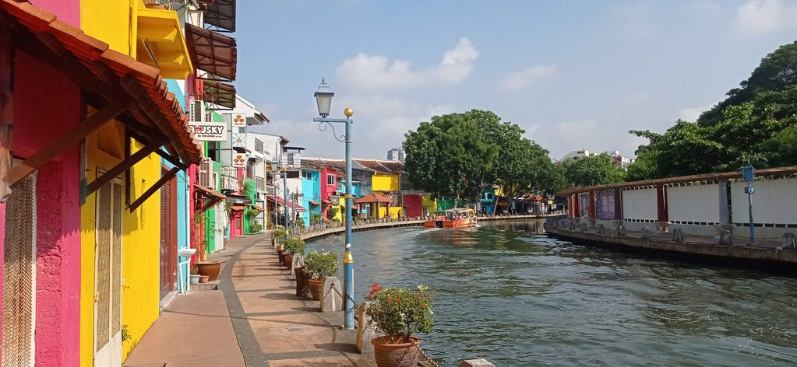
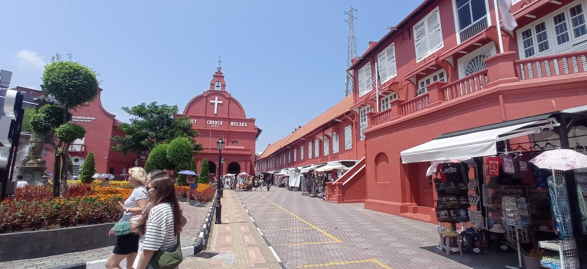
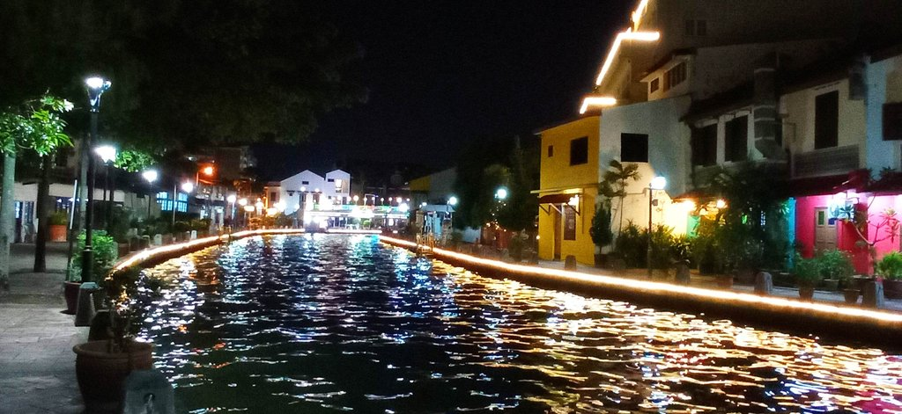

9h30 réveil, nous marchons vers la **vieille ville** en laissant de nombreuses gargotes sur notre chemin, nous voulions
tester
un magasin de dim sum, mais il est fermé. Du coup, nous trouvons une autre adresse pour le petit déjeuner.

Journée visite de Malacca : 

**Temple** chinois

Coline / **Église** de la Mère-de-Dieu de Malacca

**Musée** + achat timbres (55 myr)

Musée Rakyat (40 myr)

Musée Stadthuys (80 myr)

Retour à l'hôtel, déposer notre lessive. Nous logeons au Heng Ann Guest House 兴安雅舍. Il est situé dans les étages
d'un temple, très beau.

18h30 Nous sortons diner dans un restaurant indo pakistanais (le Pak Putra Restaurant ) en dehors des quartiers
touristiques.

Retour par la vieille ville, ses berges illuminées et colorées, avant de reprendre notre chemin habituel vers notre
temple.