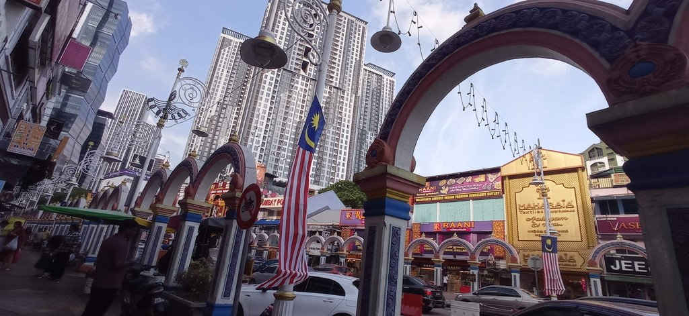
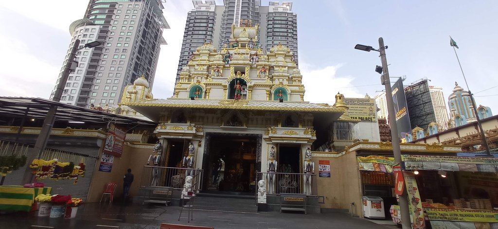
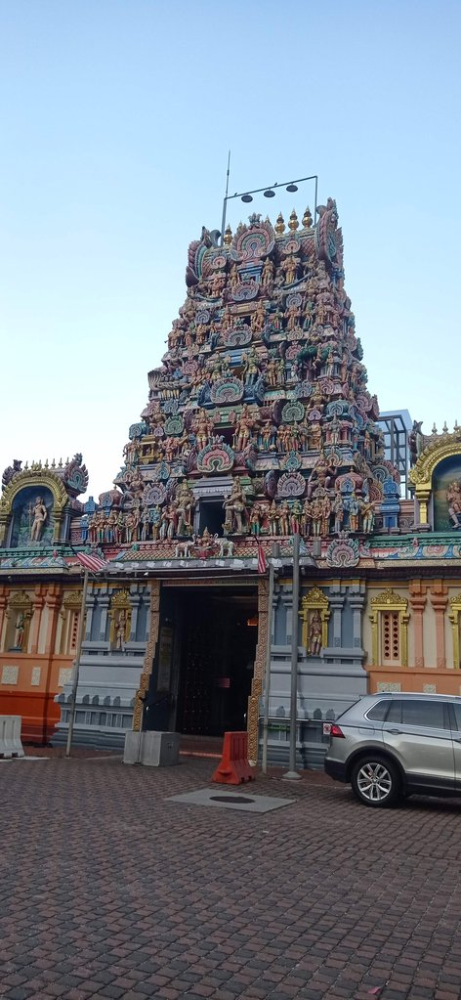
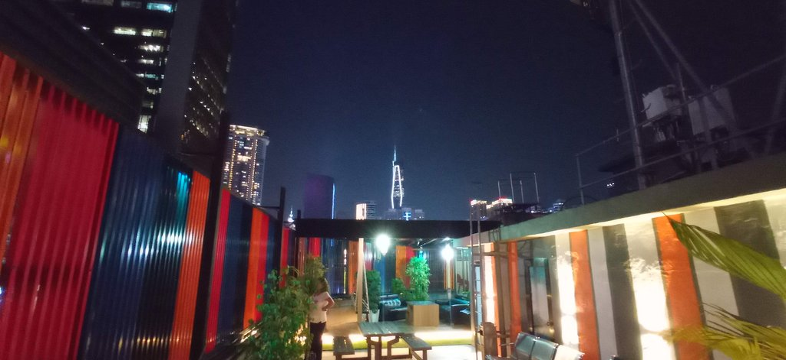

08h30 Réveil

10h15 Après avoir pris un grab jusqu'à la **gare routière**, bus pour Kuala Lumpur.

13h00 Arrivée à la gare routière de Kuala Lumpur. Prenons le train Expres pour revenir à KL Sentral. On déniche l'hôtel
caché derrière le centre commercial.

Visite du **musée** Negara très sympa. Retour hôtel, visite du quartier de Brickfield et des temples indiens des environs.

19h30 Nous testons un restaurant indien situé dans la rue de l'hôtel. C'est bien fade et cher.

