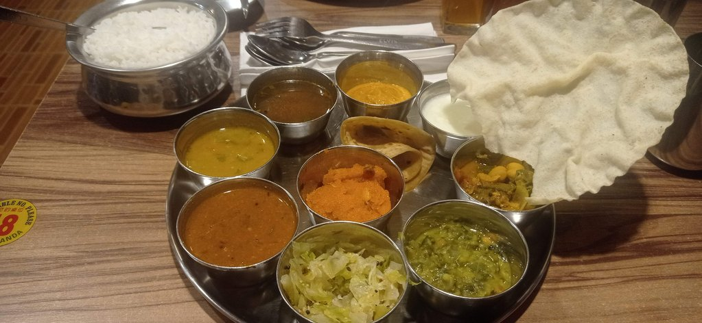
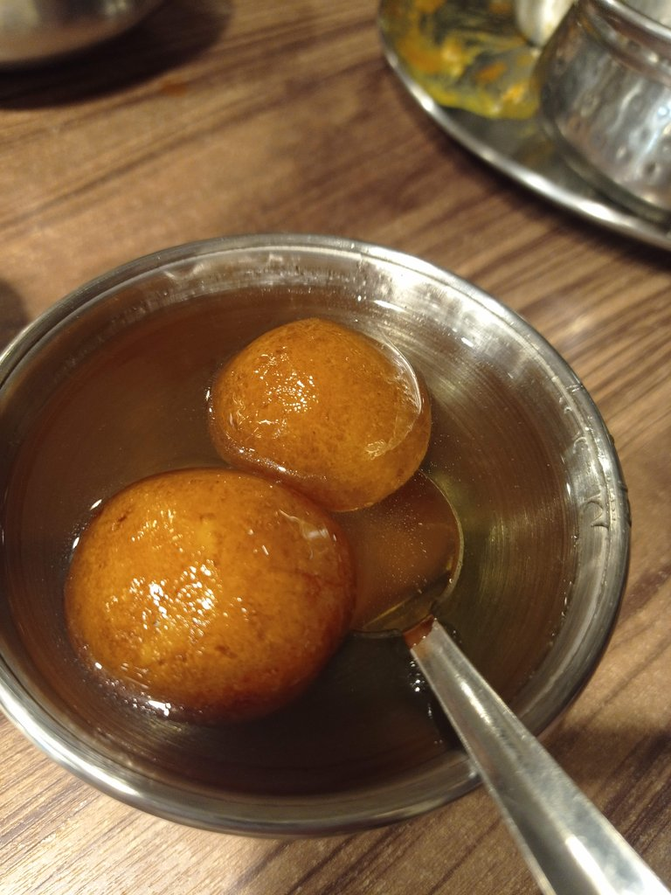

7h00 Réveil sous la pluie

10h00 Départ en Monorail pour **Chinatown**, achat des gateaux au pandan du début du voyage. Cookie sur le marché. Nous
prenons notre petit déjeuner dans une gargote non loin du marché central. Allons à la poste pour enrichir la collection
de timbres de Géraldine, avec de très jolies pièces.

Visite du musée du textile

Visite de la place de l'indépendance. La pluie menace, nous nous réfugions au **marché** central et faisons des courses (
souvenirs, chemises, etc.)

Retour à pied + train et métro à notre hôtel.

15h00 Direction le quartier des grands malls, dont celui avec le grand 8 à l'intérieur. Quelques achats. On se promène
dans le quartier, nous voulons aller visiter uen gallerie d'art, celle-ci est payante (et trop chere pour une
gallerie).

Marche jusqu'au centre commercial Pavilion. Bon mille-feuille à la pistache (cher : 21 myr).

Marche jusqu'au quartier de little india pour traverser une grande partie de la ville à pied en cette fin de journée.

Nous retournons évidemment manger au Betel Leaf. Avant de revenir en train à notre hôtel.

