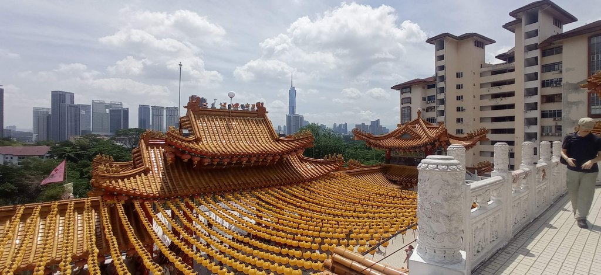
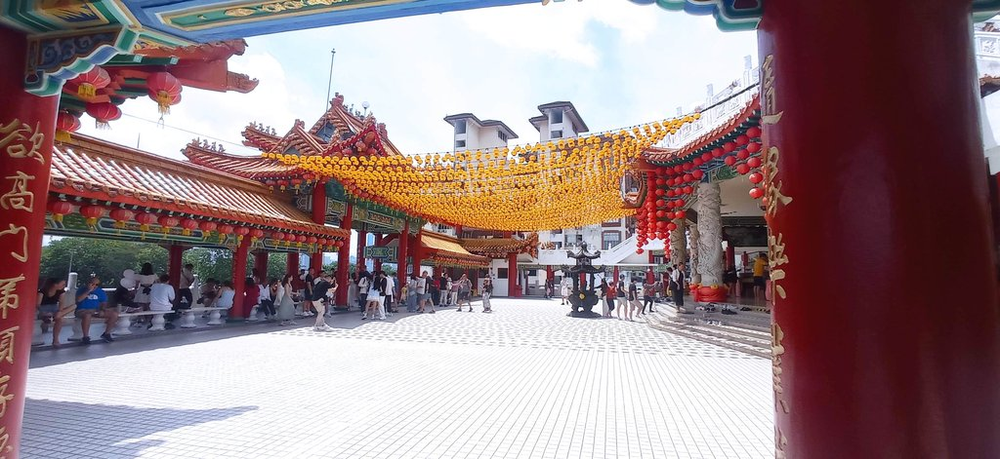
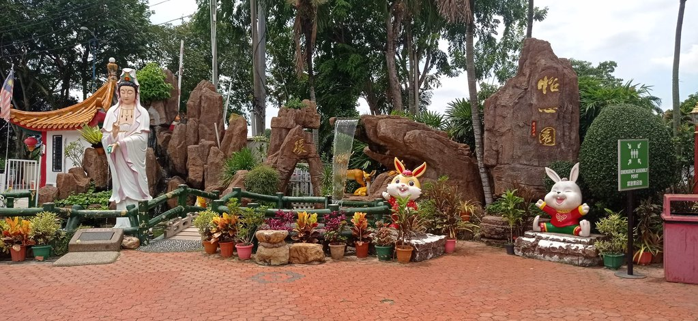
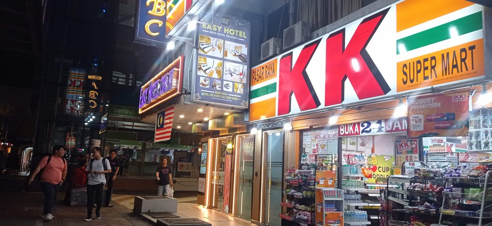
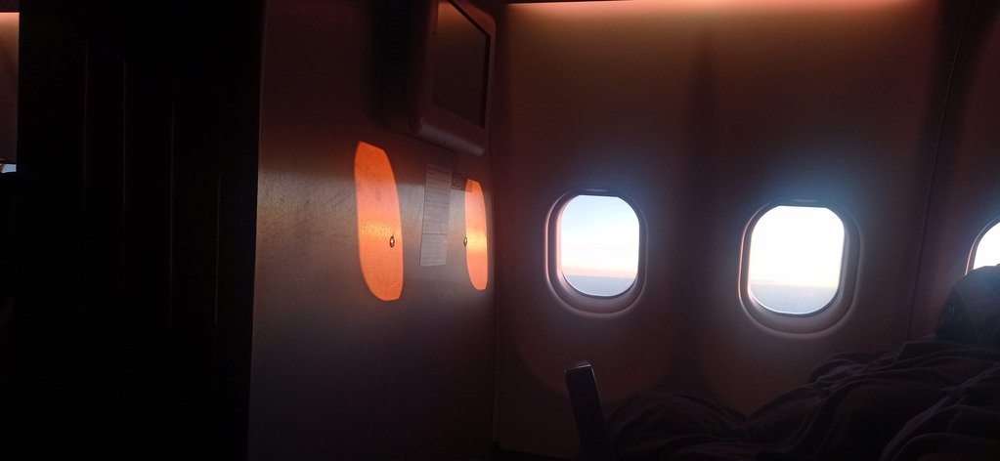

Pas de notes précises pour ce dernier jour. Nous sommes retournés à la poste, completer la collection. L'hôtel nous a
accordé uen petite chambre de transition, car nous prenons l'avion cette nuit.
Nous nous sommes promenés. Pas de musée. 

Nous avons pris un grab pour aller/revenir au **temple** **Thean Hou**, superbe point de vue sur la ville.

Nous sommes retournés le soir manger au Betel leaf.

Grab, bus pour l'aéroport, nous avons hésité. Les prix sont similaires, mais l'impossibilité de réserver les billets de bus à l'avance nous a fait pencher vers Grab. 

20h00 direction **aéroport**. Nous décollons à 1h00 du matin, demain.

