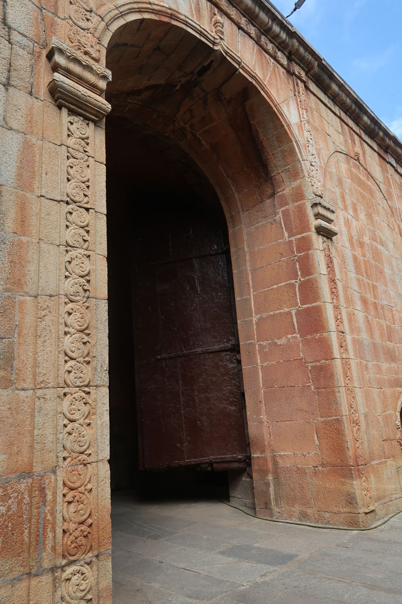
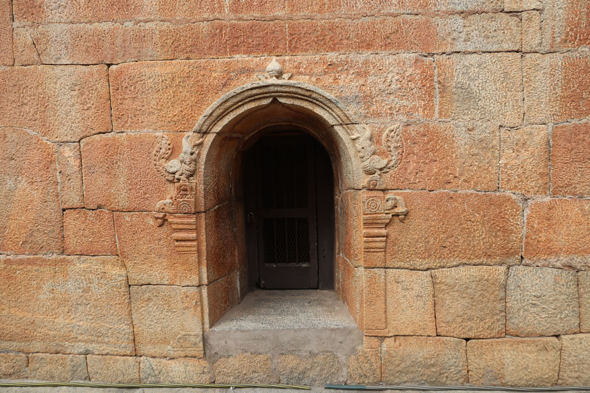
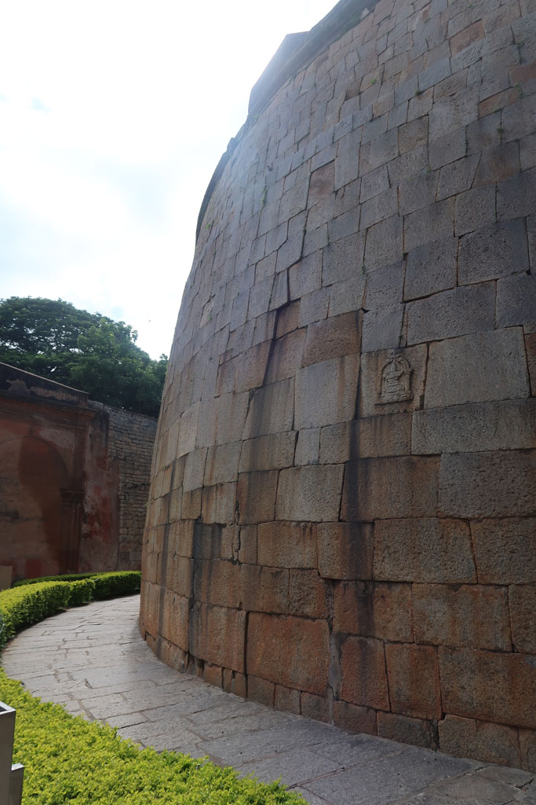
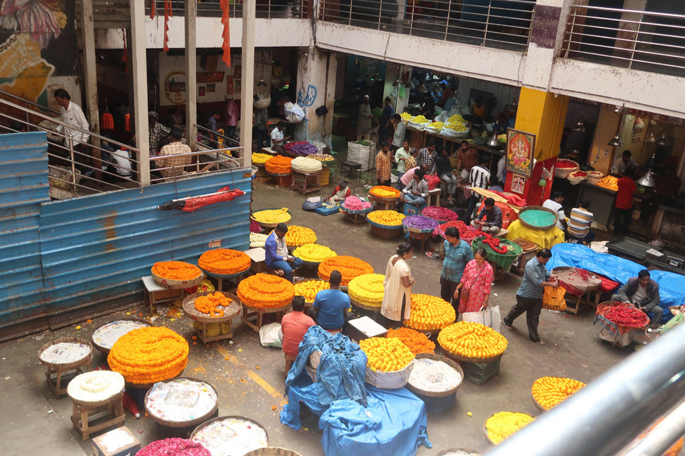
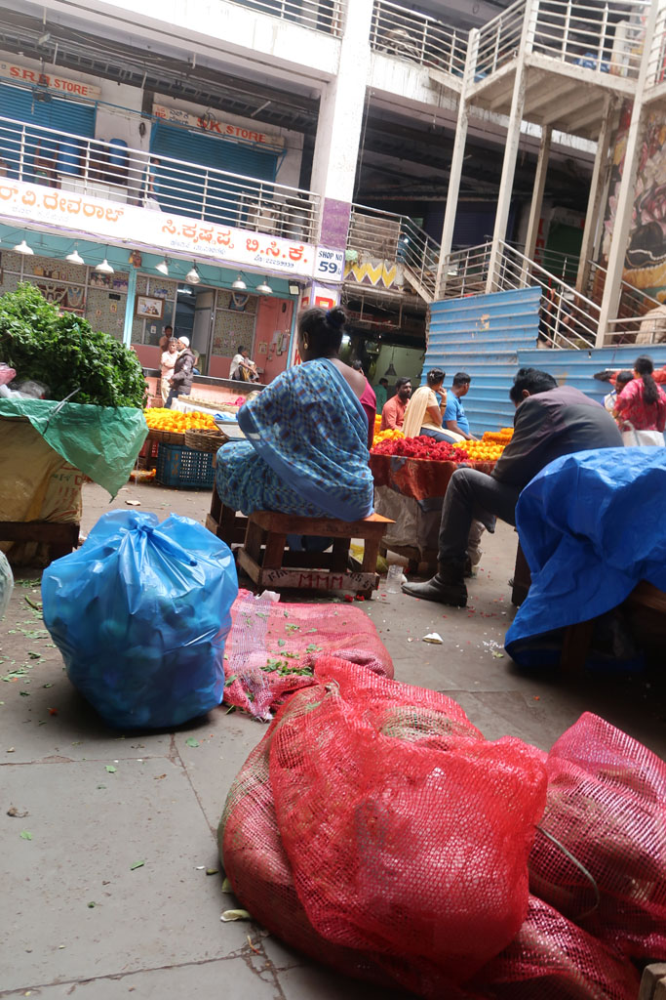
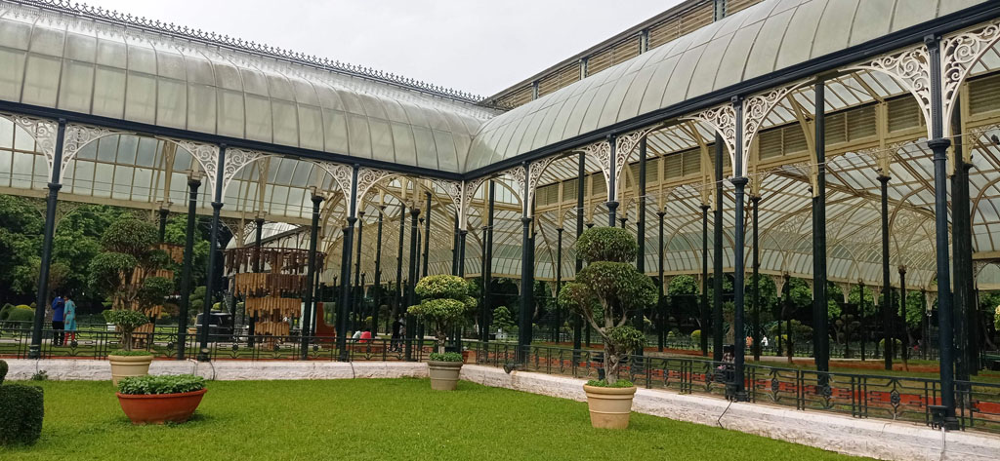
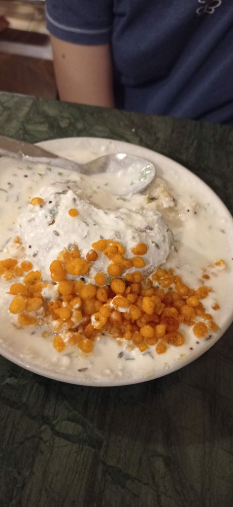
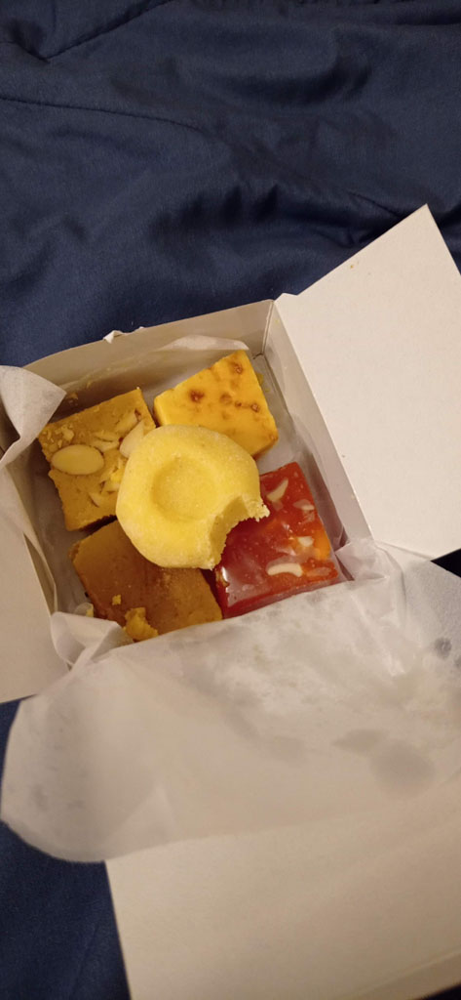

8h30 réveil

9h30 on renouvelle nos chambres pour une nuit supplémentaire. Direction à pieds vers la marché. Sur le chemin nous visitons le **Fort** de **Bangalore**, très beau mais cela se visite en 5 minutes.

Nous avons voulu visiter le Palais d'été de Tipû Sâhib mais première déception (qui se confirmera au fil des jours) les billets de certains lieux ne sont plus achetables sur place. Il faut les acheter en ligne et présenter le QR code au gardien. Nous renonçons donc.

10h30 premiers *Chais* dans la rue avant de visiter le très beau marché central de Bangalore, la section fleur est magnifique. Nous rejoignons ensuite le musée municipal en traversant le très joli *Sri Chamarajendra Park*.

Déception le **musée** est fermé depuis 2 ans. Non loin nous visitons le *Namma Bengaluru Aquarium*. Petit moment tranquille en compagnie de groupes d'enfants en sortie scolaire. (Le tarif indien est de 25 R/personne pour nous ce sera 236 R/personne)

12h30 pause à l'Indian coffe. Un vieux café dans son jus, qui rappelle celui du même nom à **Pondicherry**. On grignote aussi qq vadas accompagnés de café froid au lait.

Retour en tuktuk à l'hôtel. Nous nous faisons arrêter/raqueter par la police car nous sommes 4 à l'arrière. Nous finissons le trajet par les petites rues pour éviter toute nouvelle rencontre.

Nous ressortons pour ***Lalbagh Botanical Garden.** Une grosse averse de mousson* nous pousse à nous réfugier sous la verrière en compagnie des autres visiteurs. Moment sympa. La balade est très belle . Nous ne pouvons juste pas monter sur la colline en pierre tant le sol est glissant de pluie.

17h45 la nuit commence à tomber. Repas au MTR (ಎಂ.ಟಿ.ಆರ್, ಮಾವಳ್ಳಿ ಟಿಫನ್ ರೂಮ್) situé non loin. Superbe repas dans cette grosse cantine.

18h30 achetons qq douceurs dans la boutique avant de partir en direction de notre hôtel à pieds.

Sur le chemin du retour la mousson s'abat sur nous, il fait nuit. Nous trouvons refuge sous un auvent, les rues débordent. Nous finissons trempés.

19h10 la douche chaude de l'hôtel fait du bien.