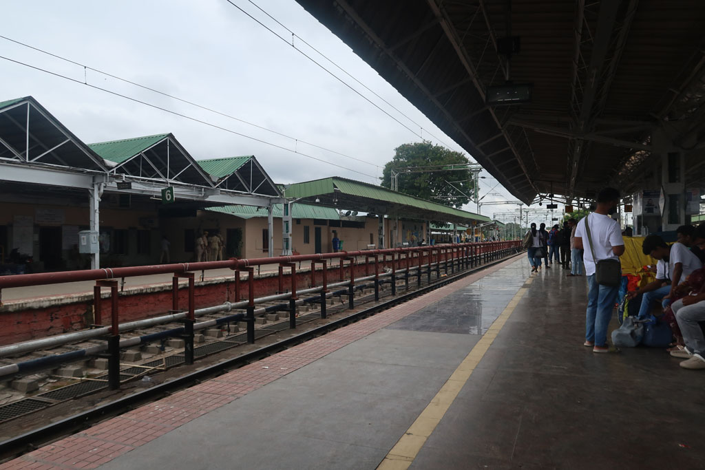
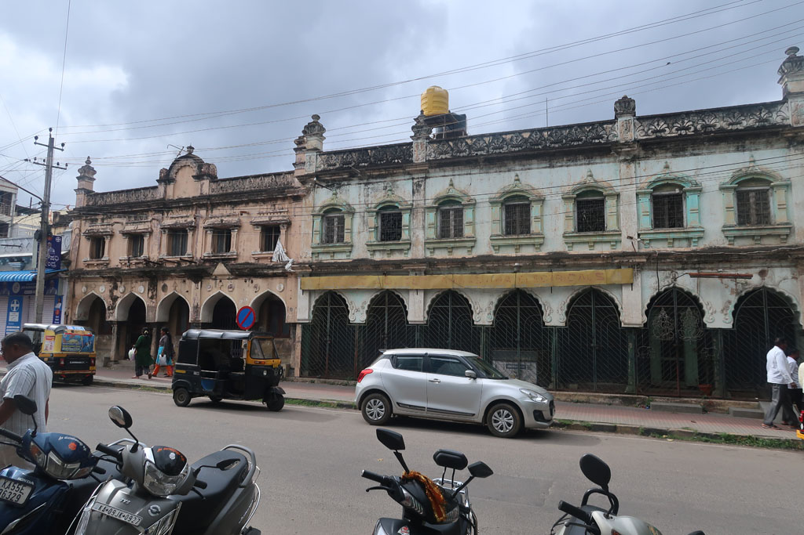
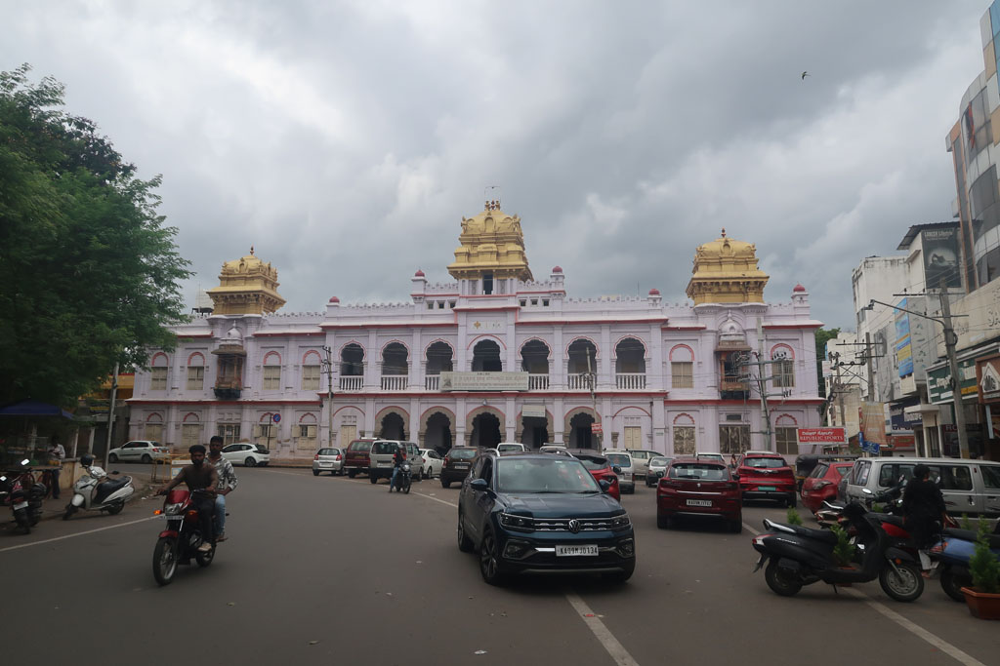
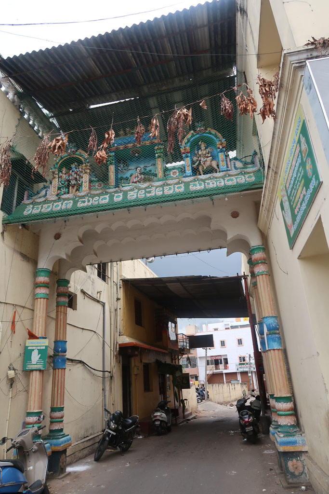
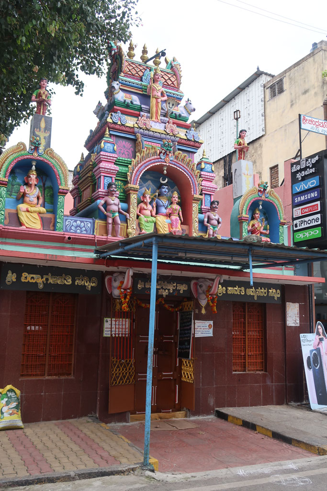

8h30 réveil et préparation des sacs. Les affaires de la veille ont séché dans la nuit.

9h30 tuk tuk pour la gare de **Bangalore** (200 R). On nous aiguille vers l'achat de billets de train sans réservation (300 R) mais c'est le mauvais comptoir. Nous trouvons finalement le bon et achetons après de la paperasse en jouant du coude avec les indiens à avoir les bons billets pour le bon train (900 R).

13h00 arrivée à **Mysore**. Nous marchons depuis la gare jusqu’à notre hôtel situé dans le vieux centre.

14h30 restaurant situé non loin. Gigantesque cantine végétarienne situé au premier étage d'un immeuble. *The Veg Kitchen*  
  
Promenade ensuite jusqu’au palais avant de revenir nous reposer à l'hôtel avant de ressortir pour des petites courses, la recherche de l'odomos, une librairie, etc...

La mousson nous fait trouver refuge dans le marché.

18h30 nous testons la gargote voisine de notre hôtel.

Fin de soirée après avoir pris un chai chez le chaiwala tout proche.