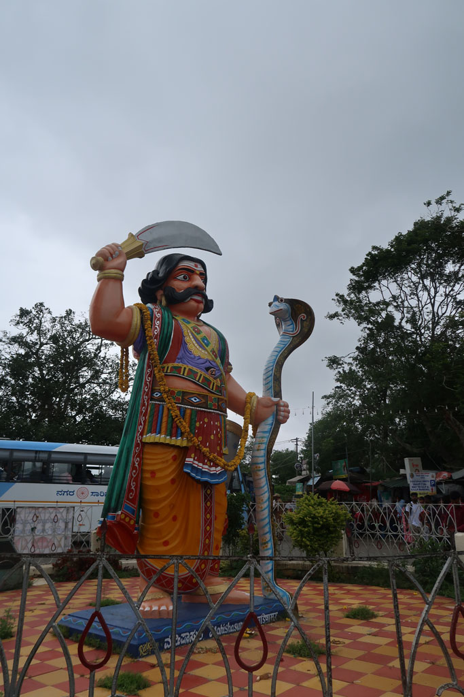
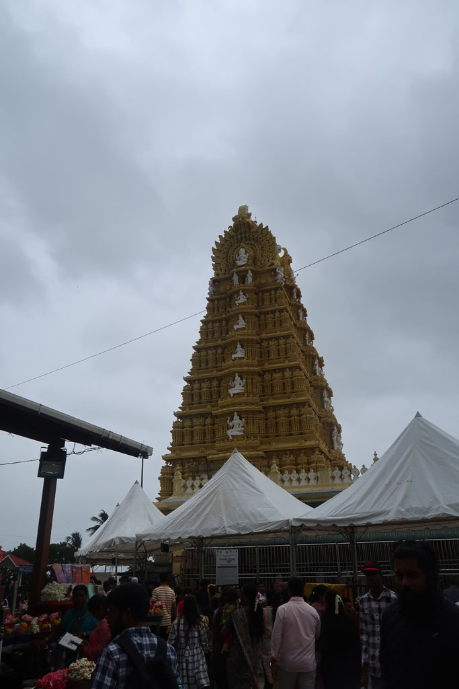
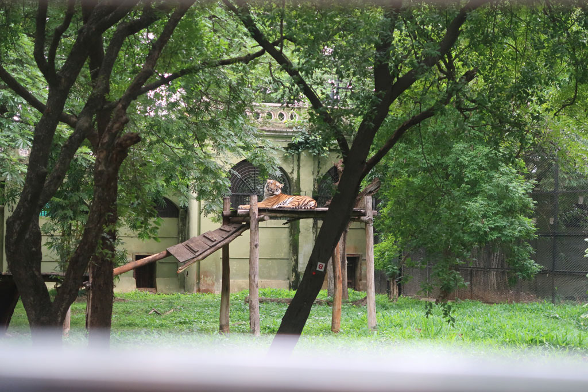
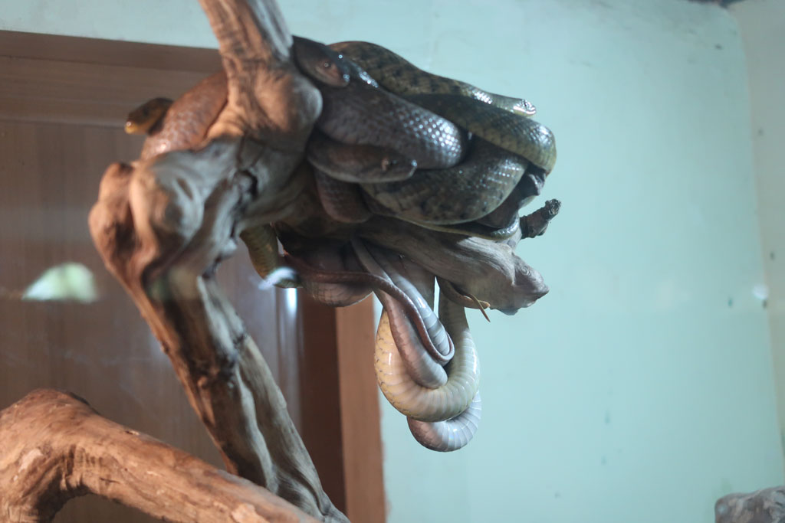
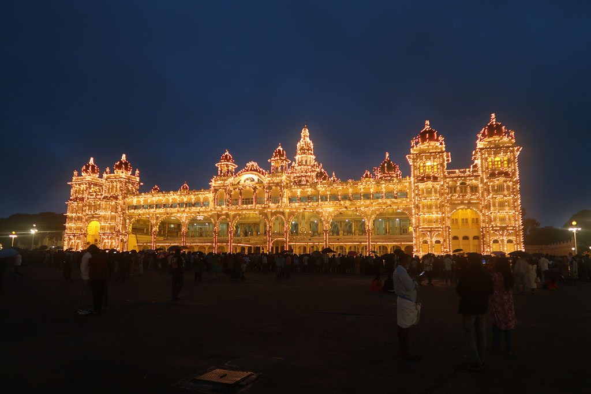
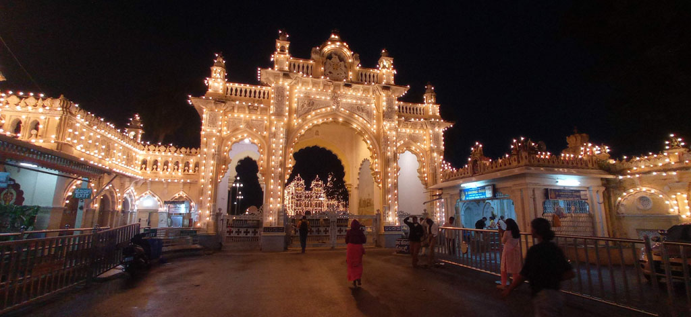
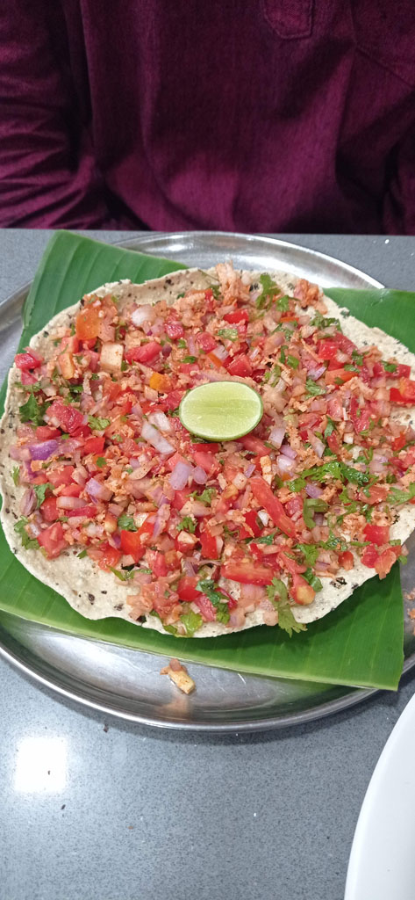
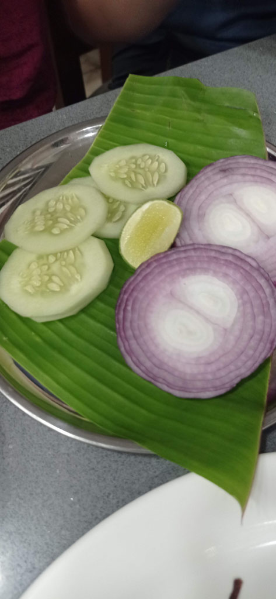
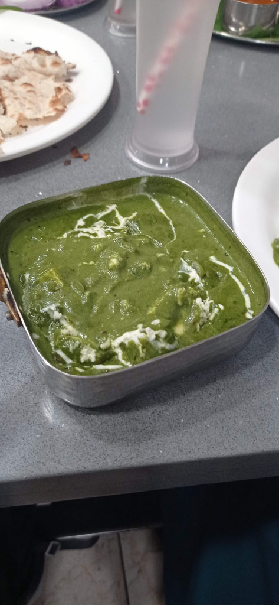

8h30 réveil

9h00 direction le marché pour grignoter, mais tout est fermé car c'est jour de poya. G se trouve néanmoins un vendeur de jellaby.

9h30 bus 201 pour le temple situé en haut de la colline (***Mysuru Shri Chamundeshwari Devi Temple***). Mais pas de chance nous ne pourrons pas nous approcher tant la foule est dense, il y a un pèlerinage.... Du coup nous mangeons juste 2 portions d'ananas au piment et quelques photos avant de reprendre le bus dans le sens inverse. Sur la route quelques champs appartiennent à "Montfort".

10h30 nous descendons au **zoo** de **Mysore** (*Sri Chamarajendra Zoological Garden*). Très belle balade en compagnie de toutes les familles indiennes.

14h00 prenons un tuktuk pour la cantine située à coté de notre hôtel. Nous sommes reconnus et devenons un peu l'attraction.

Sieste

18h10 il est temps de partir sous une petite pluie fine pour le palais qui s'illumine en musique le dimanche soir...

19h00 pile tout s'illumine, la fanfare de la police joue. L'ambiance est féérique.

20h10 retour dans notre cantine (*Ashirvaad Grand Pure Veg Restaurant*). Encore un régal.

22h00 dernier chais chez le voisin