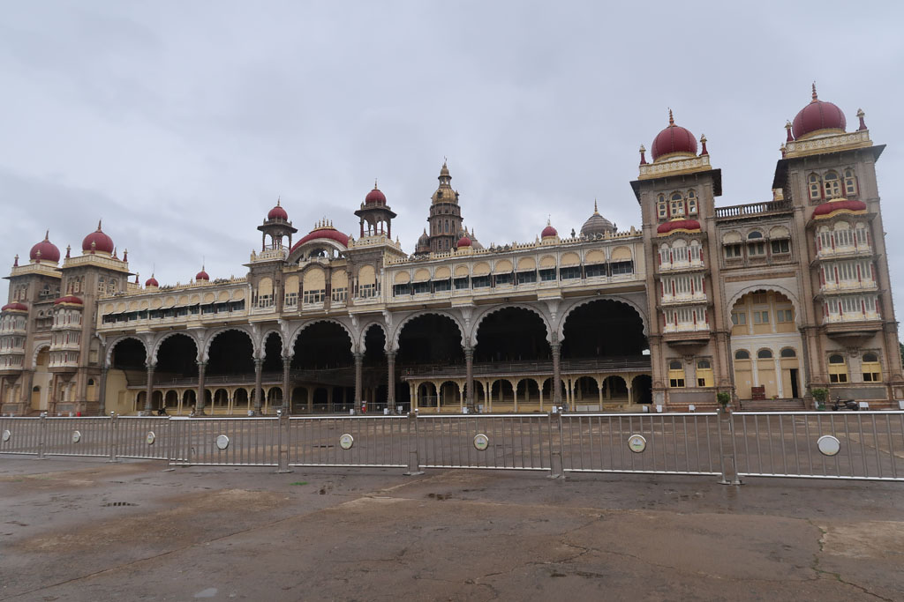

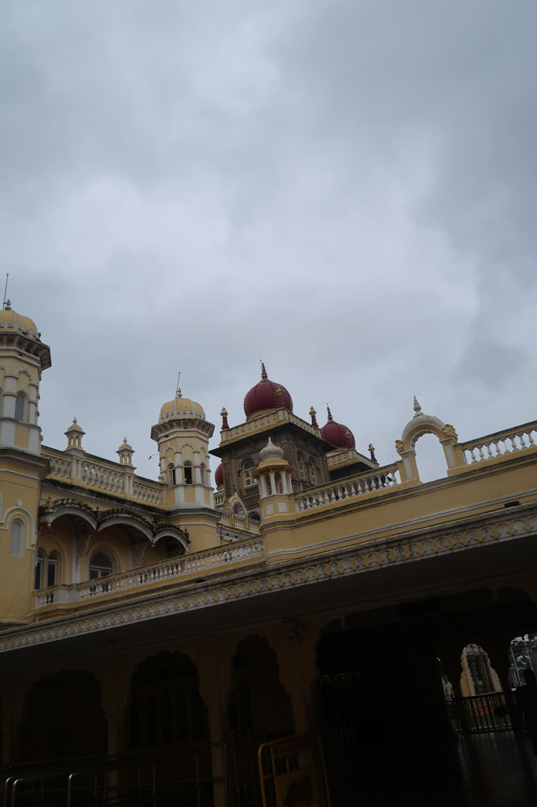
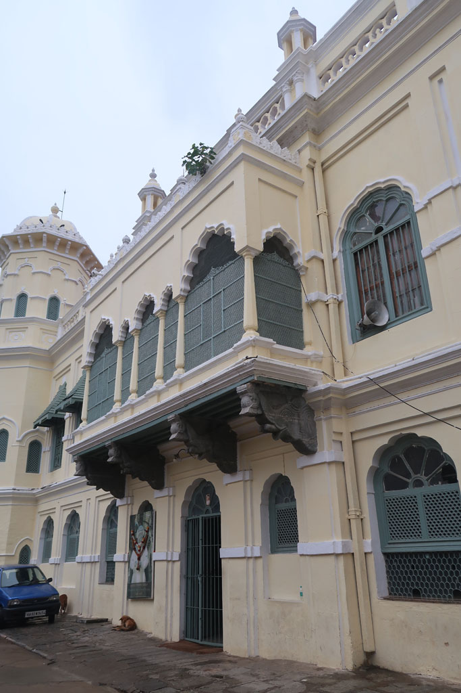
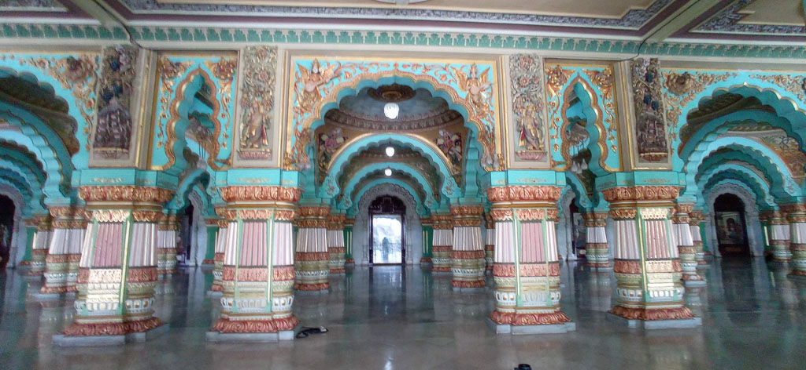

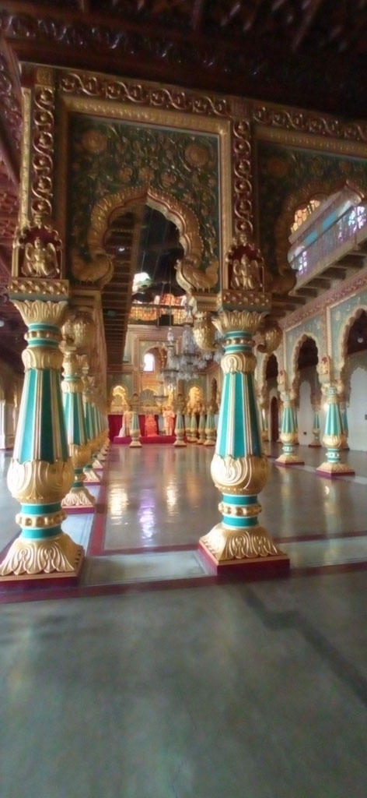
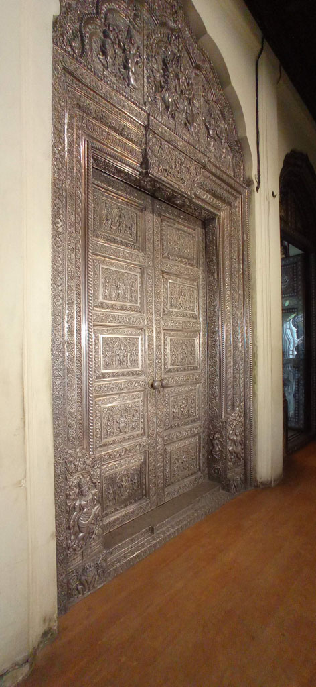
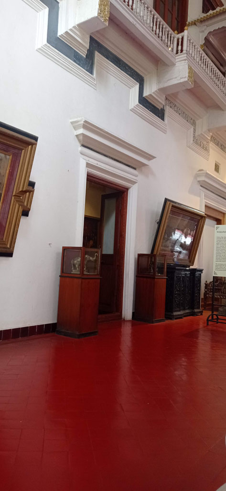

9h00 réveil

9h40 départ pour le palais

10h00 nous passons les portes à l'heure de l'ouverture (4 x 100 R). c'est pieds nus que nous visitons quelques salles magnifiques, mais c'est trop court... 45 minutes en prenant son temps.

Dans l'enceinte nous visitons un **temple** et trouvons les éléphants du palais.

11h30 tuk tuk pour la ***Cathédrale** Sainte-Philomène* de **Mysore**, mais nous ne pouvons pas entrer car une messe est en cours. La pluie menace.

12h00 la mousson s'abat sur nous. on en profite pour manger dans une petite gargote (*Hotel Mysuru Ruchi*) en face de la cathédrale.

14h00 Retour en tuk tuk en face de notre hôtel. Nous visitons le palais *Jaganmohan Palace*qui est aussi un **musée**. Magnifique bien que décrépi.

Sieste

Visite du marché, achat de douceurs, passage par la banque, déambulation dans les petites ruelles de Mysore. Nous trouvons un tailleur qui peut réparer le pantalon déchiré de K pour 30 R.

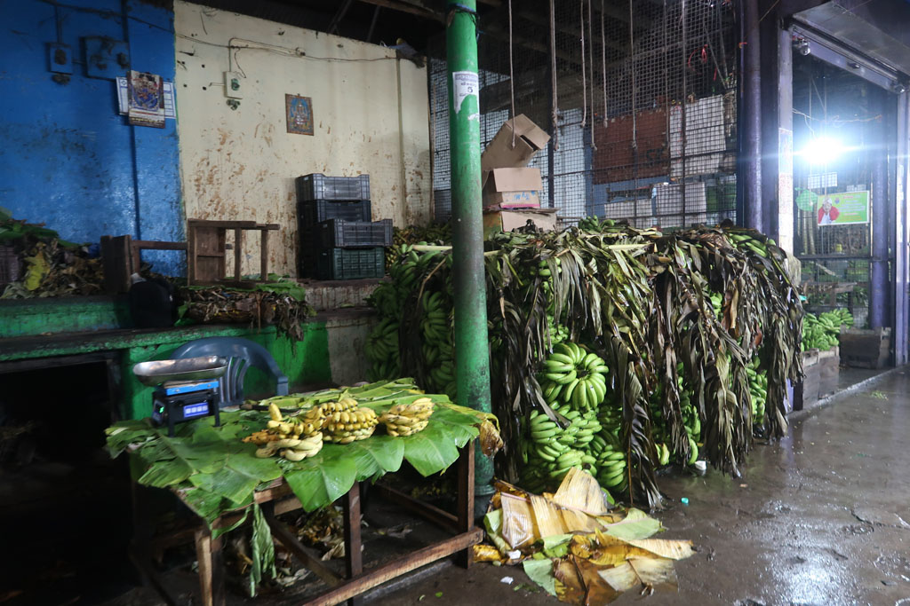
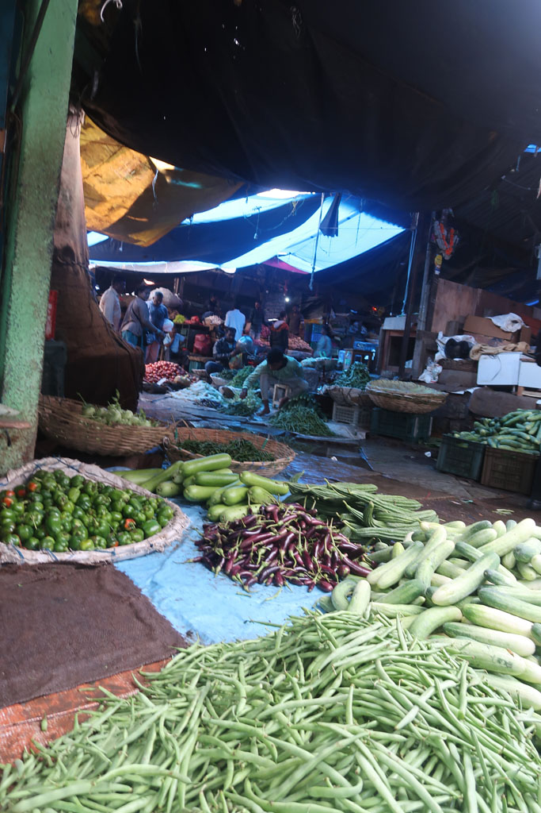
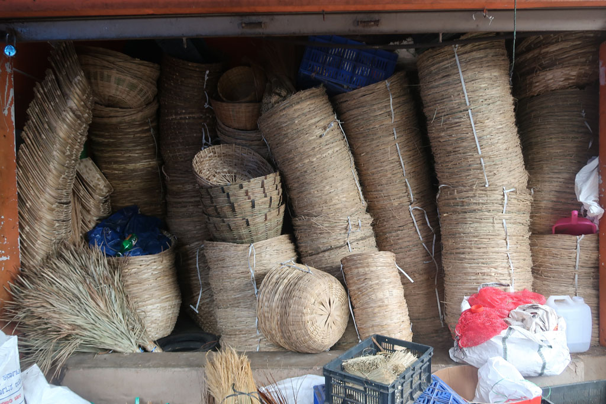
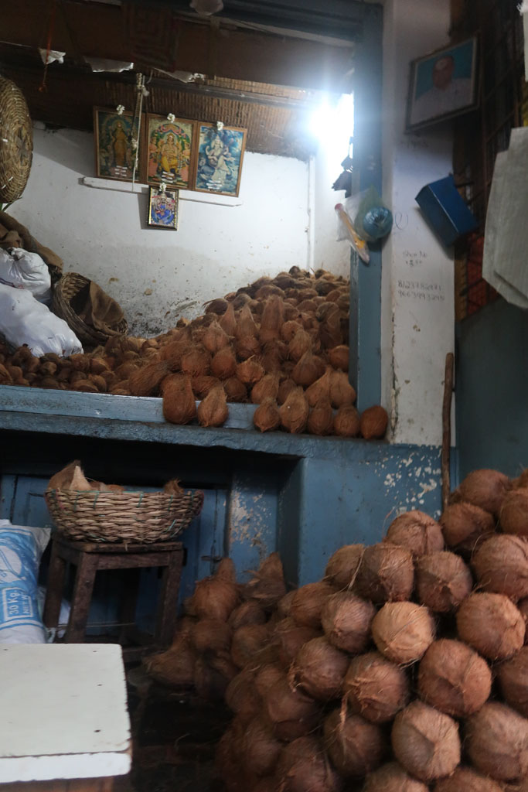
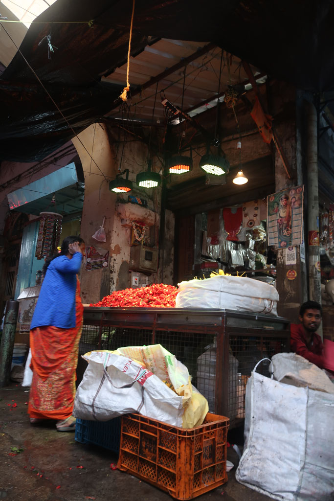
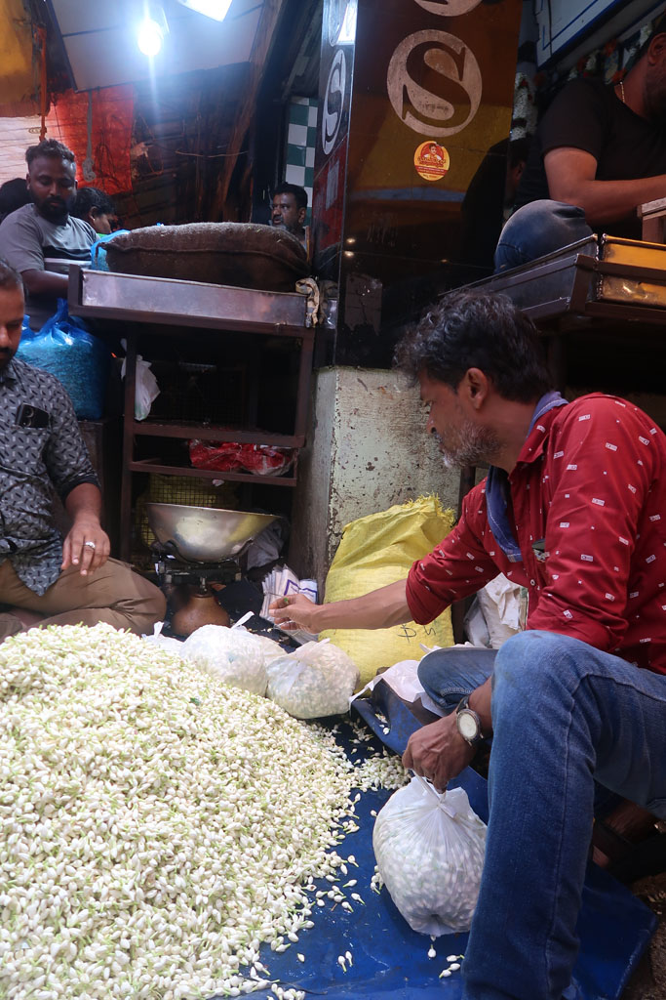

Retour sous une petite pluie fine à l'hôtel. On règle la note du jour (2620 R les 2 chambres)

Fin de soirée identique à la veille avec un passage dans la cantine proche avant de terminer chez le vendeur de chais.

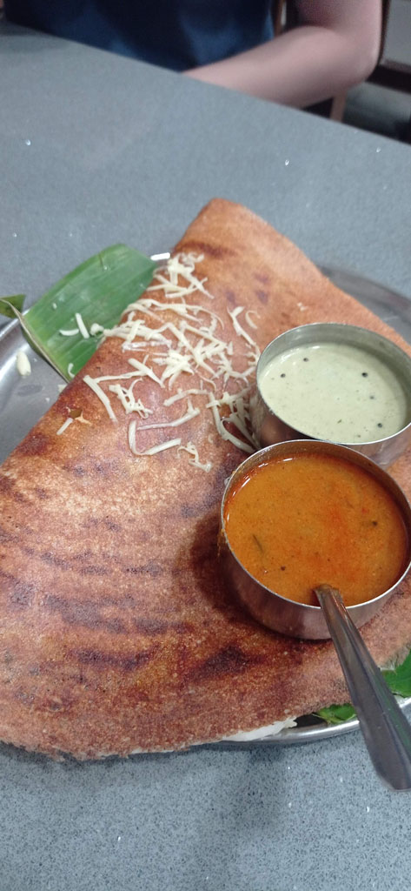
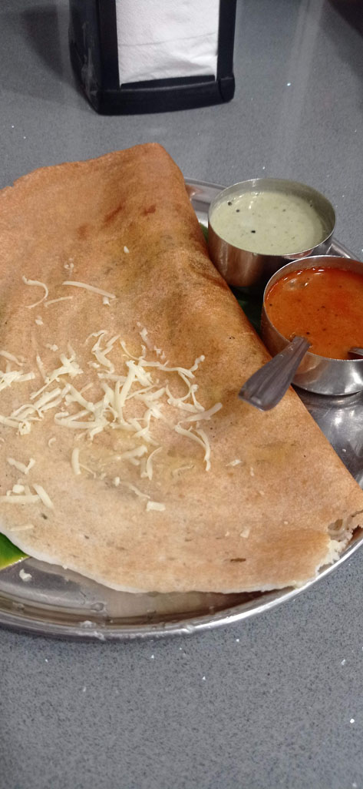
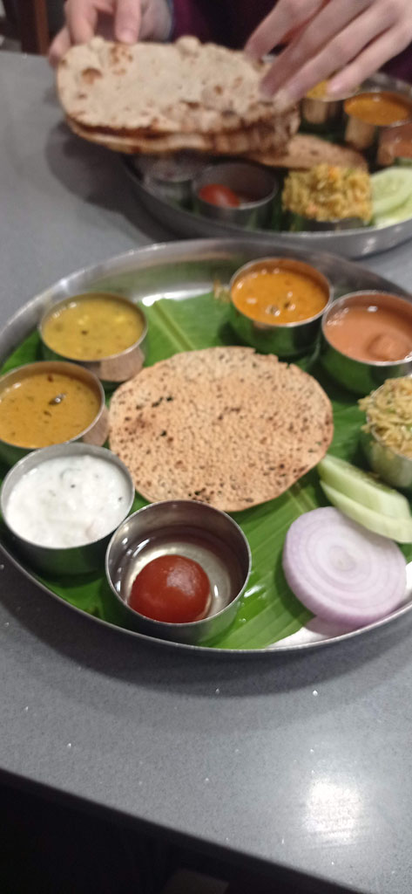