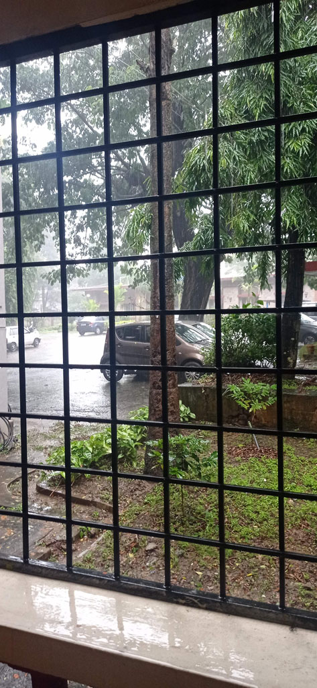

7h00 réveil, E arrive enfin à se réinscrire à l'université (ouf... nous étions parti alors que les serveurs/procédures n'étaient pas encore ouvert)

8h00 tuk tuk pour la gare routière sous un grand soleil, nous prenons un bus pour **Hassan** (500 R), où arrivés nous trouvons immédiatement un bus pour **Belur** (160 R)

13h00 arrivés à l'hôtel. Lors de notre séjour au tamil nadu nous avions découvert les "Tamil Nadu Hotels" , logements gérés par l'état du ***Tamil Nadu***. Nous essayons donc leur équivalent au ***Karnataka*** ([mayura-hotels](https://www.kstdc.co/mayura-hotels/))

14h00 repas dans une cantine de l'autre coté de la route. Bien que ce soit une ville de tourisme à cause du temple. Peu de touristes semblent se loger/manger à *Belur*. Nous sommes clairement l'attraction.

Nous marchons jusqu'au temple situé au bout de la rue, sans y aller encore. Achat de petits gâteaux secs dans une boulangerie, avant de rentrer à l'hôtel pour une petite sieste.

La mousson s'abat sur la ville, nous restons tranquillement dans nos chambres.

19h00 on profite d'une accalmie pour retourner dans le restaurant du midi situé juste en face (*Sumukha Grand*)

En sortant du restaurant on retourne à la boulangerie racheter des petits gâteaux car ils étaient très bons.

Sur le retour nous faisons un crochet par le bar de l'hôtel, qui semble être le lieu où l'on peut boire de l'alcool à Mysore. Nous prenons une grande bière et 2 cafés (270 R)  
Après cette longue journée de transport il est temps de se coucher.