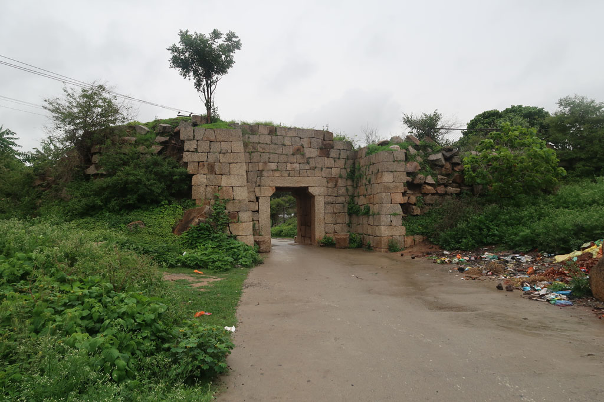
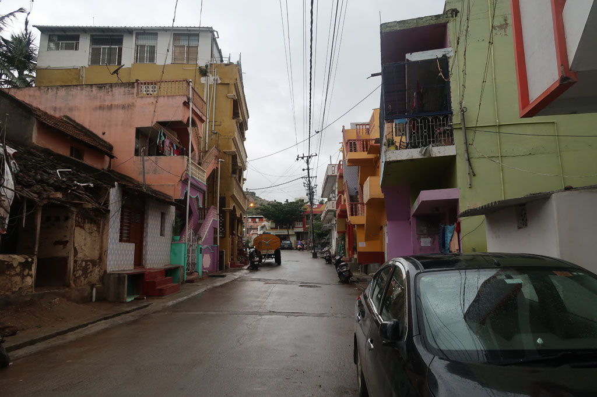
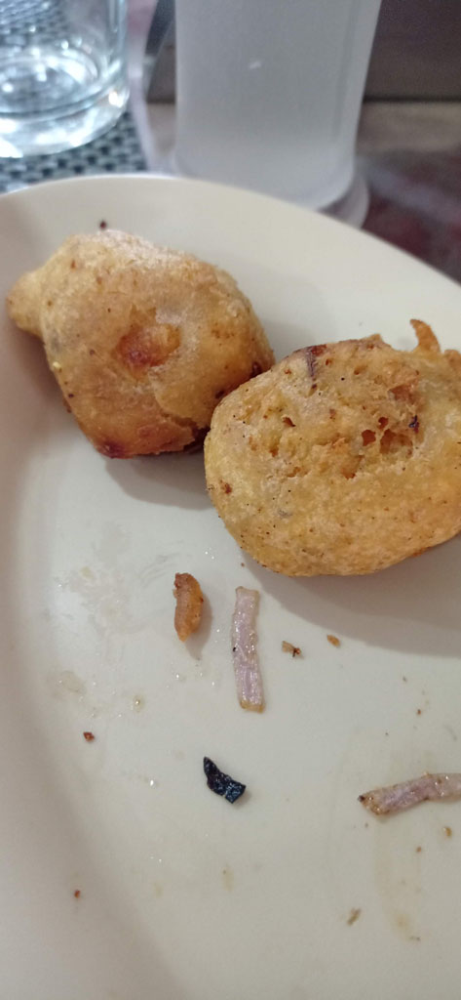
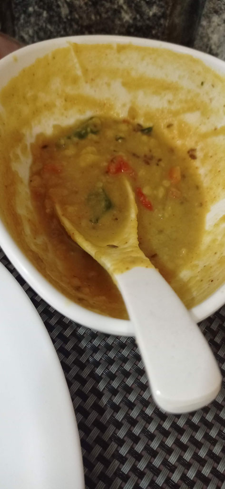
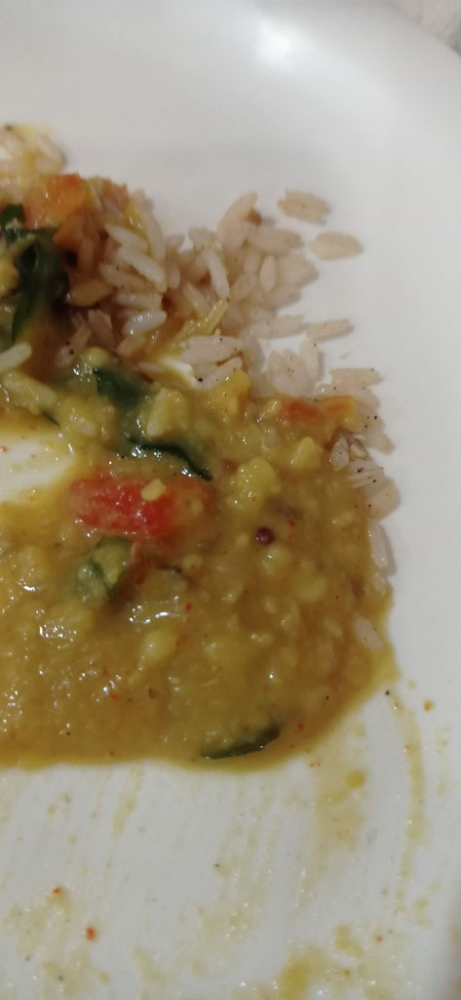
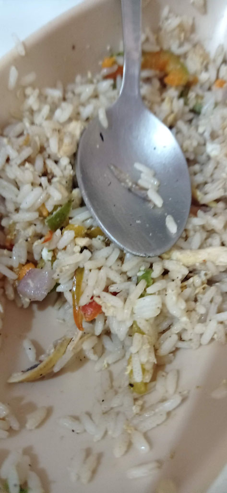
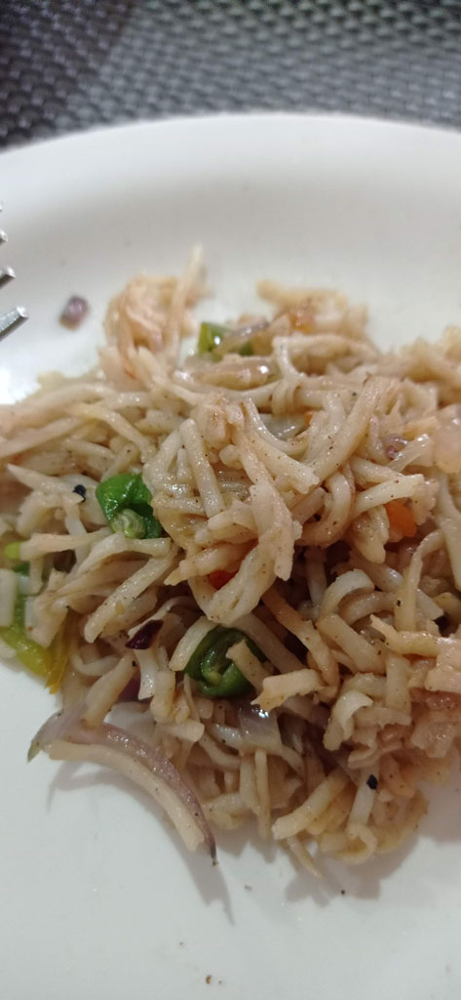
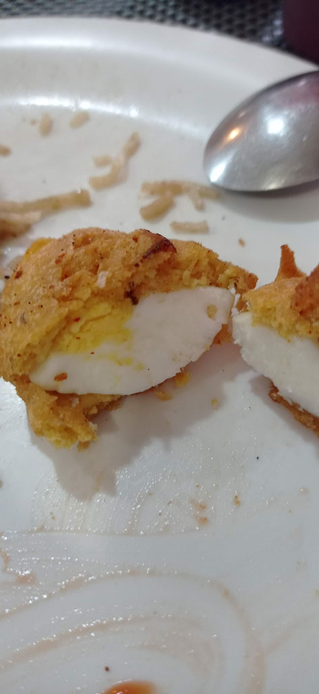

7 h00 réveil. on ne retente pas l'expérience toasts de la veille.

7h45 départ de l'hôtel pour la gare routière. On demande s'il y a un bus direct pour **Chitradurga** depuis **Belur**. Il se trouve qu'il y en a un direct à 8h15. Bonne nouvelle, sinon nous avions un itinéraire bis à base de bus + train bcp plus compliqué.

8h30 le chef de poste nous désigne le bus qui entre en gare

12h30 enfin arrivés à la gare routière de Chitradurga. Tuk tuk pour encore une fois un hôtel de la région le *Hotel Mayura Durg* que nous avons choisi compte tenu de sa localisation juste en face de la principale attraction de la ville le **fort**. On nous donne la seule chambre qui reste : une chambre avec 7 lits et une terasse.

13h30 nous profitons du restaurant de l’hôtel

14h45 sieste tandis que la mousson arrive.

17h00 balade à pieds dans la vielle ville pour repérer des cantines pour le soir et le lendemain. Ceux encore ouvert dans ce quartier ne nous inspirent pas trop. Nous revenons donc manger à l'hôtel. La cuisine est très bonne.

lavage au baquet après avoir allumé le chauffe eau (la douche chaude ne fonctionne plus)