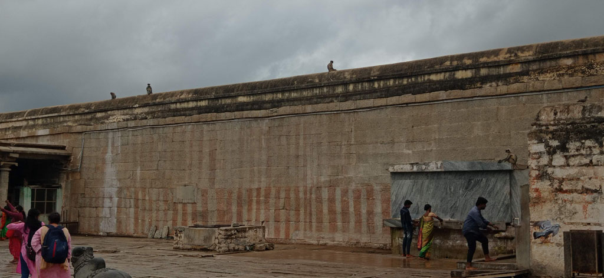
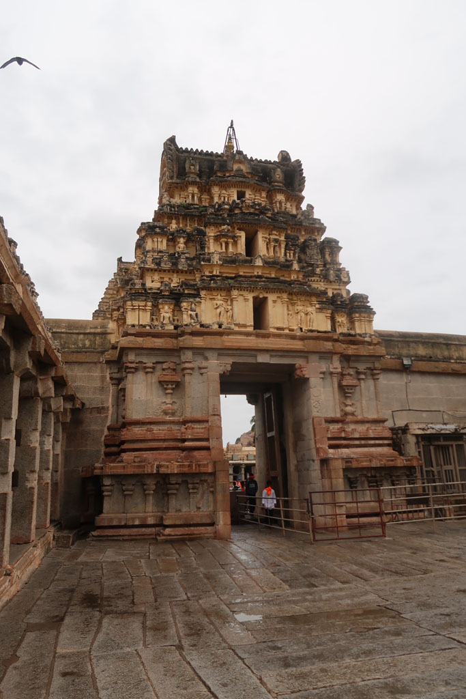
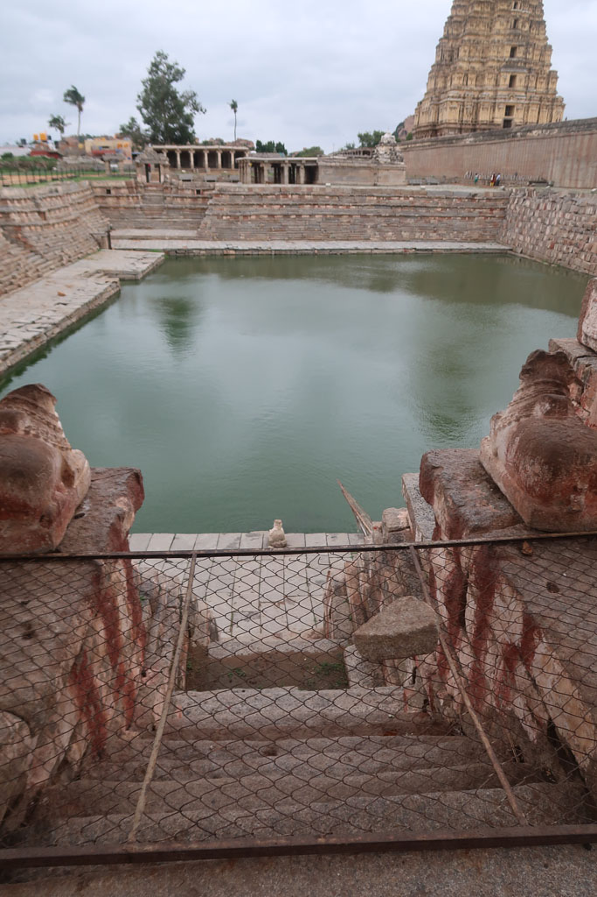
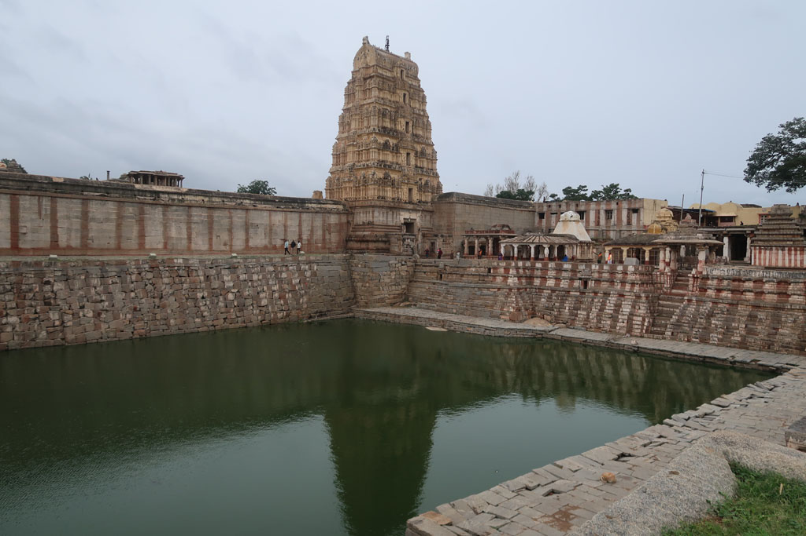

7h30 réveil

8h00 petit déjeuner à l'hôtel

8h45 nous demandons à l'accueil de nous envoyer un tuk tuk pour rejoindre la gare routière (100 R)

9h00 trouvons rapidement un bus pour **Hosapet**

12h00 la correspondance pour **Hampi** via un bus local se fait très facilement. Un jeune indien s'amuse avec nous de l'insistance des chauffeurs de tuk tuk.

13h00 nous rejoignons à pieds note hôtel depuis la place qui sert de gare routière. Et nous prenons u n repas à l'hôtel.

15h00 tuk tuk pour la ville voisine, aller-retour pour trouver un ATM qui fonctionne. On en profite pour solliciter/négocier le tuk tuk pour la visite du lendemain.

16h30 Les touristes qui ne logent pas sur Hampi sont partis. Nous en profitons pour visiter le **temple** local. Un indien nous fait refaire la visite complète en passant par la partie sacrée. Pleins de photos/ selfies avec les familles indiennes. Nous avons presque autant de succès que l'éléphant du temple.

18h30 Nous changeons de chambre, pour une plus grande qui donne sur la rue (et plus la rivière) mais surtout qui n'a pas l'odeur bizarre/désagréable de la première.

Nous prendrons notre repas encore une fois à l'hôtel. Le vieux village d'Hampi ne propose finalement que des boutiques et des guesthouses pour les touristes de passage.