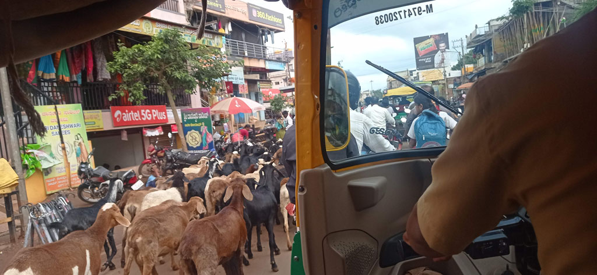

7h00 réveil

7h30 départ à pieds pour la "station" de bus de **Hampi**. Nous prenons le même que les écoliers et il y en a un toutes les demi heure.

8h30 à **Hosapet** nous cherchons un bus pour **Badami** (normalement à 10h). Le chef de gare nous dit que peut etre à 13h30 ....

Après avoir regardés la carte, nous retournons voir le chef de gare et trouvons un itinéraire alternatif, d'abord jusqu'à **Llkal** (560 R) et faire une correspondance. Juste après notre arrivée on saute dans celui pour **Badami** qui allait partir. (324 R). Sur la route on croise d'immenses troupeau de chèvres qui sembles tous se diriger vers notre destination.

13h30 Arrivés à l'hôtel en tuk tuk depuis la gare routière (à l'heure où nous aurions du partir). Nous sommes de retour dans un hôtel géré par la région. Du coup nous profitons du restaurant.

16h30 Par les petites rues nous rejoignons le centre ville à la recherche d'un ATM . ON en profite pour passer par la gare routière pendre des renseignements sur les moyens de quitter cette ville.

19h00 de retour au restaurant de l'hôtel.

20h30 dans les chambres, il y a la télévision mais pas d'eau chaude...