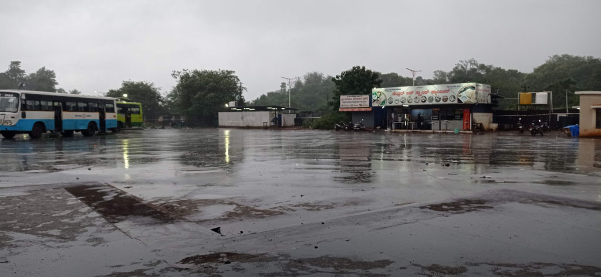
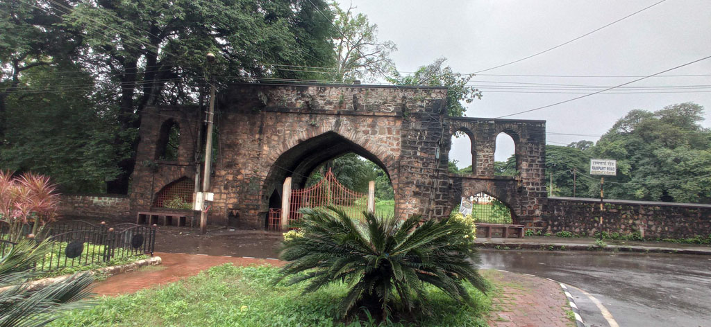
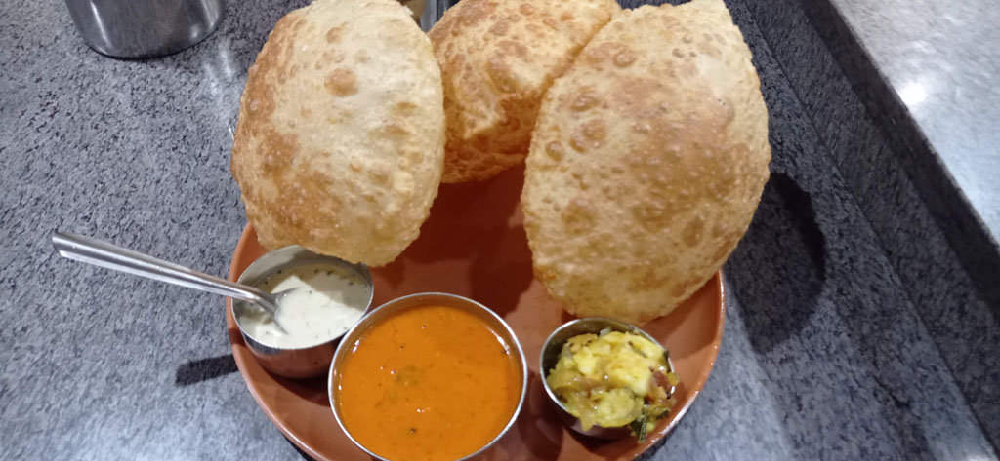
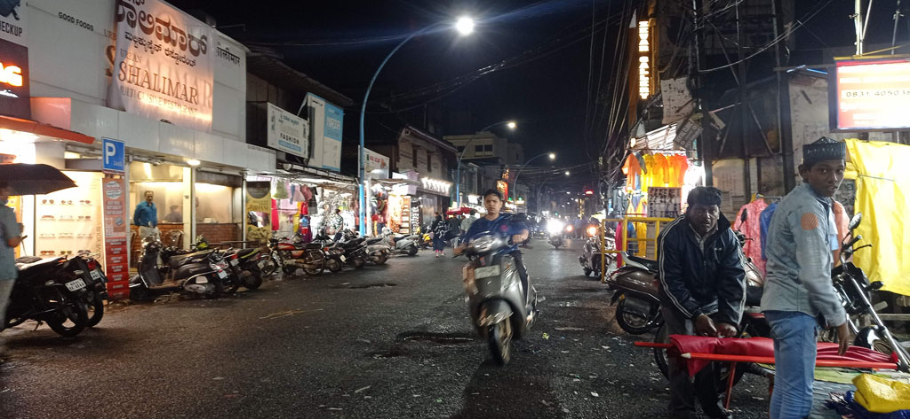

Réveil à 7h00 pour vite filer pour la gare routière. Si tôt il n'y a pas de tuk tuk. A mis chemin on en attrape un qui passait par là. Après prise d'infos, le bus pour Belgavi devrait passer / partir vers 8h00 non loin du quai 1

8h30 le bus arrive enfin, bousculade pour monter. On trouve une place en jouant un peu des coudes.

13h00 arrivée en gare routière de **Belgavi** / **Belgaum** sous des trombes d'eau. La pluie se clame suffisamment pour que l'on rejoigne la guesthouse. C'est une arnaque, c'est un immeuble de bureau dont 2 étages où les bureaux sont reconvertis en chambre.

14h30 nous ressortons manger, de toute manière on peu difficilement rester dans ces chambres. Bonne cantine musulmane dans la rue principale (*Taj Darbar Hyderabadi Restaurant*). Achat de douceurs dans la rue. D’après les vues aériennes et les photos il y a un **fort** à **Belgavi**. En fait il n'y a plus rien et c'est une caserne militaire.

De retour en ville, la mousson s'abat sur la bille. on trouve refuge sous un auvent avec les locaux. L'eau monte dans les rues. De retour à l'hôtel où un humain est finalement présent pour scanner nos passeports (que je n'ai pas voulu laisser à qui que ce soit).

19h00 la pluie se calme suffisamment pour chercher une nouvelle gargote pour le repas du soir. Belle découverte d'une cantine végétarienne (*Hotel Sangam*).

