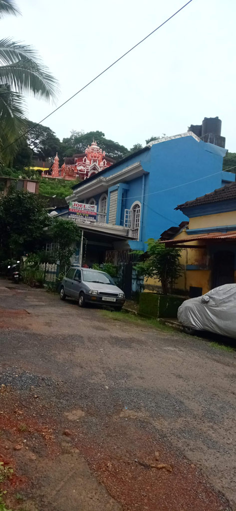
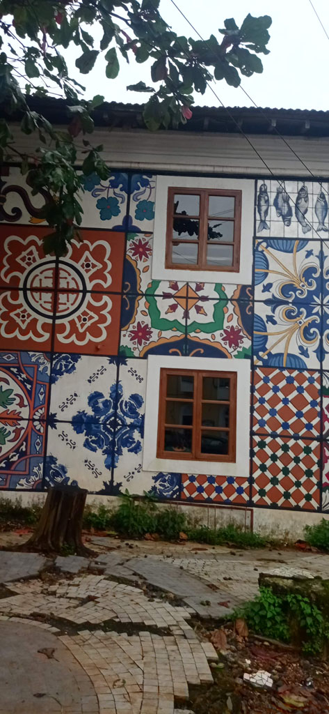
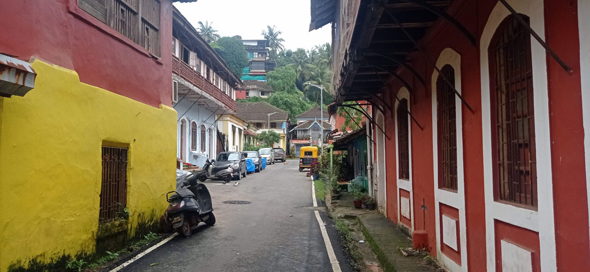

6h00 réveil

6h15 seuls dans les rues, nous marchons vers la gare routière. Le bus annoncé hier à 7h00 ne sera finalement là qu'à 7h30

7h45 le bus arrive enfin, grosse bousculade, rompus à l'exercice on ne se laisse pas faire et nous arrivons à avoir des places assises.

8h10 le bus par enfin, mais vers le garage. Les mécanos semblent intervenir sur le bus.

9h00 le bus est finalement évacué, dans le garage, on arrive à récupérer les sous des tickets.

9h10 retour au point de départ dans la gare routière, on arrive à attraper de justesse le bus en partance. G et K sont assises sur le capot moteur à coté du chauffeur, E coincé sur une banquette de 23 au milieu et moi tout à l'arrière au milieu d'une famille que je semble déranger.

Route de montage, nous traversons les ***Ghats occidentaux*** dans le brouillard du à la mousson. Précipices à demi voilés par la végétation et la pluie. Panneaux qui signalent la présence de tigres, qu'il ne faut pas s’arrêter. Une fois traversés, tout en bas, le climat change du tout au tout. De froid et humide on passe à chaud et très humide.

13h30 sommes arrivés à **Panaji** / **Panji** capitale de l'état de **Goa**. Tuk tuk pour la guesthouse réservée (*Villa Cleto Guest House*).

14h15 on se trouve une petite cantine végétarienne (*UDUPI ANNAPURNA RESTAURANT*) qui deviendra notre cantine pour les jours à venir.

Balade en ville, front de mer, marché, etc...

16h30 arrêt café, café glacé dans le centre avant de prendre un tuk tuk pour la guesthouse.

19h00 nous revenons dans la cantine du midi  
  
*Note : K commence à avoir mal aux dents, elle commence la cure d'antibiotique prévue à cet effet (soignée avant le voyage il y avait un risque de rechute).*