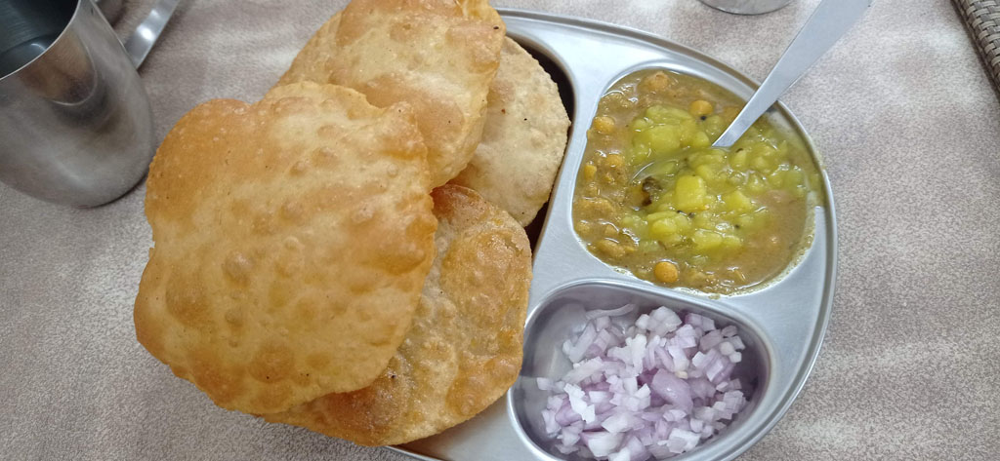
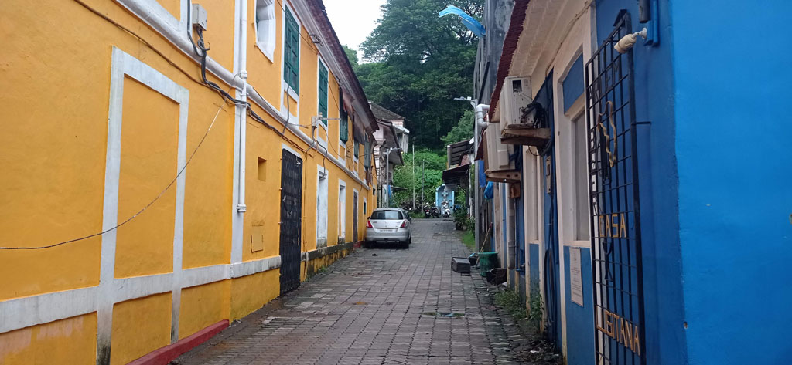
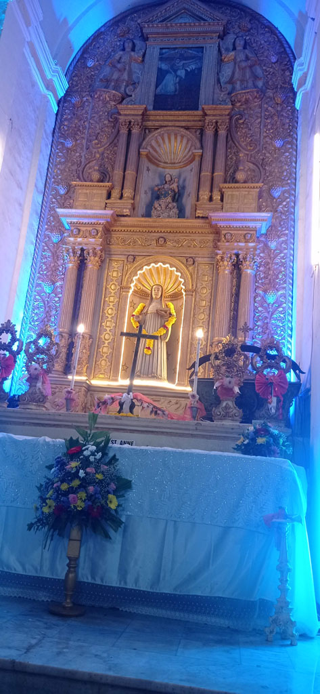
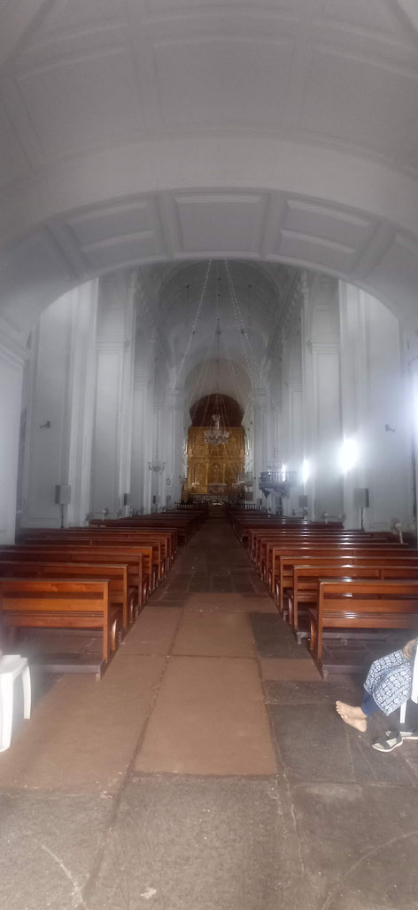
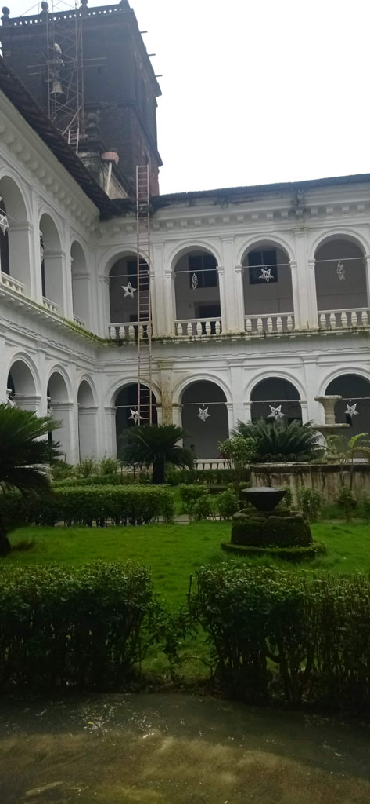
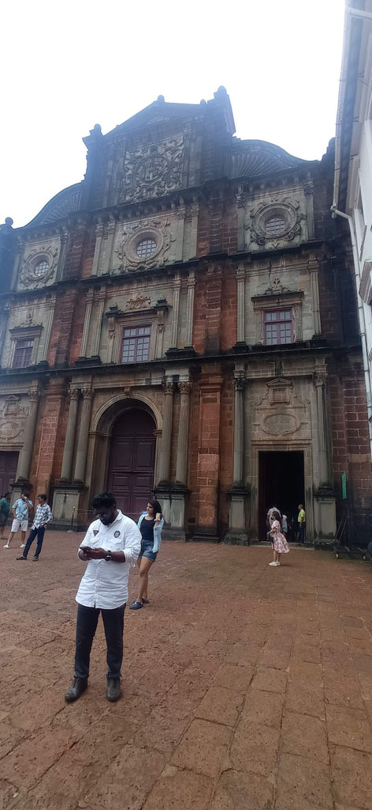

8h30 réveil.

9h000 direction un café dans la vieille ville, mas c'est beaucoup trop cher (on voit bien que cette ville de **Panaji** vit du tourisme), on se rabat sur une gargote de l'autre coté de la rue, le café est quand même à 30 R... On trouve une petite boulangerie locale, mais un peu tendance, on teste la carte, du bon et du moins bon.

10h30 à la gare routière pour se renseigner sur les bus/ moyens de se rendre à **Gokarna** et surtout trouver le bureau de vente des billets de train. Ce bureau n'est plus ici (bien que les peintures murales semblent laisser penser le contraire). Un officiel nous dit de retourner dans la vieille ville du coté du bureau de poste. Navette électrique pour s'y rendre. Nous cherchons sans voir le bureau, personne ne sait. E finit par voir le panneau caché par la végétation, c'est DANS le bureau de poste. Nous achetons nos billets pour **Mumbaï** le 31/7.

11h30 faisons le tour de la colline à pieds mais K fait une mauvaise réaction à son anti bio (ce n'est pas la première fois) et commence à être malade, retour à la guest house en tuk tuk

12h00 repas cantine

13h00 gare routière (on commence à connaitre le chemin), direction **Old Goa** où nous visitons ce qui est ouvert. Le musée est fermé le vendredi et nous n'avons pas trouvé l'entrée de l’église St François d'Assise

15h00 passage par le distributeur SBI avant de prendre le bus du retour. La mousson s'abat sur la région à la fin du trajet. Nous attendons 30 minutes sous un auvent à la gare routière avant de prendre un tuk tuk qui emprunte des routes inondées.

16h30 Repos hôtel, je profite d'une accalmie pour sortir avec E visiter le temple "orange" que l'on voit depuis le début en haut de la colline.

19h30 Cantine après avoir vu John le propriétaire de notre guesthouse. C'est aussi le pharmacien du quartier, sa boutique est en face, il nous fourni un anti vomitif pour K.

*Note : le territoire de Goa est placé en alerte rouge météo durant notre séjour, avec interdiction pour les pécheurs de sortir.*