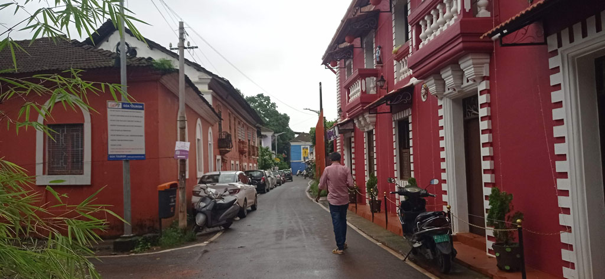
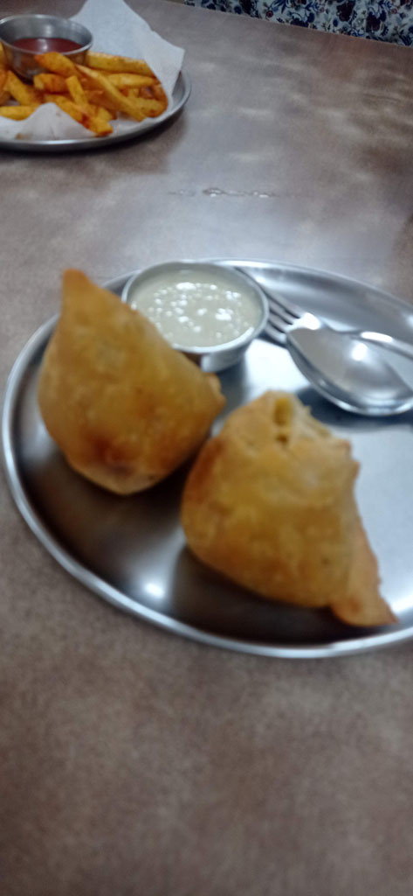
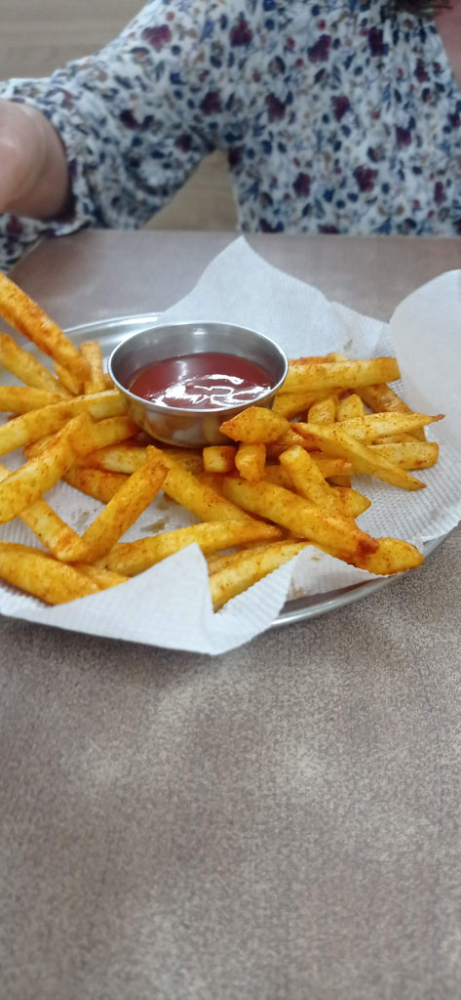

Je vais résumer ici les jours passés à Paniji .

Samedi 27 juillet : E est à son tout malade, fièvre et ventre en vrac, avec G nous assurons l'intendance, les enfants ne sortent plus vraiment de la chambre. John propose de faire venir un médecin si nécessaire. Repas du midi pris à emporter et manger sur le toit de la gh. Repas le soir dans notre cantine.

Dimanche 28 juillet : Nous restons finalement à **Panaji**, nous n'irons pas à **Gokarna**, les enfants sont trop malades. E gastro + fièvre, K pas mieux. Avec G nous ne sortons que pour prendre l'air et acheter des douceurs et boissons pour les enfants. Je me fait mordre par une meute de chiens en sortant à la nuit tombée.

Lundi 29 juillet : Même programme que la vieille. John fait venir un médecin le soir. Il est myope comme un taupe, l'hôtelier le guide comme un aveugle et il a d'ailleurs un chauffeur pour le transporter. Il adapte le traitement des enfants . Nous achetons tous les médicaments à la pharmacie de John.

Mardi 30 juillet : Nous sortons le matin avec G. L'après midi nous sortons les enfants en tuk tuk, ils vont un peu mieux. le soir nous retournons tous ensemble au restaurant.

