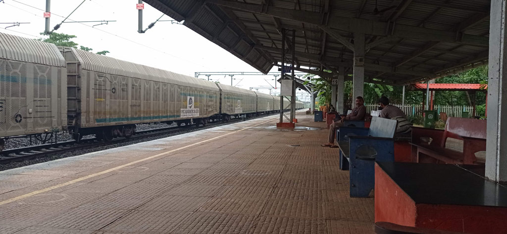
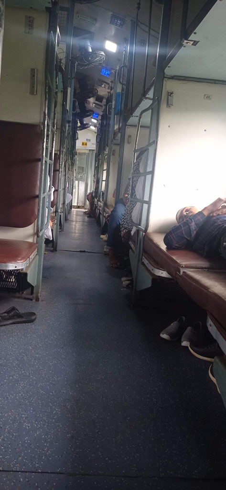

7h30 nous disons au revoir à John et prenons le taxi réservé la veille pour la gare de **Panaji** (à l'extérieur de la ville) 600 R

8h15 arrivée à la **gare**

9h30 le **train** arrive avec 30 minutes de retard, c'est parti pour 12h de "sleeper class"

10h30 notre "compartiment" se rempli. Il faut donc passer les banquettes intermédiaires en mode couchette. Nous mangeons les repas préparés dans le train et les en cas proposés par les vendeurs ambulants.

21h30 arrivés à **Mumbaï**, taxi pour la rue de notre hôtel, on trouve l'entrée cachée de cet hôtel (en haut d'un escalier délabré et sombre). Comme la chambre est correcte et la localisation parfaite on réserve pour 2 nuits supplémentaires.

Nous ressortons pour manger dans une cantine locale