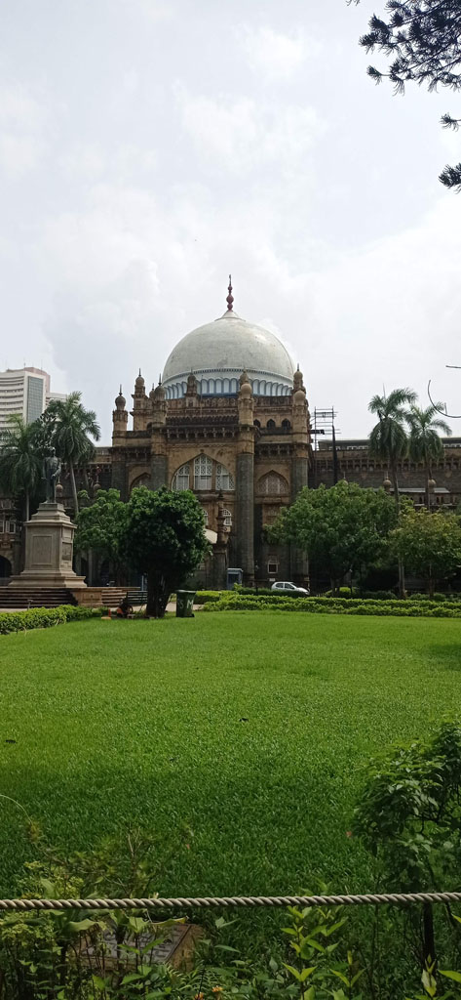
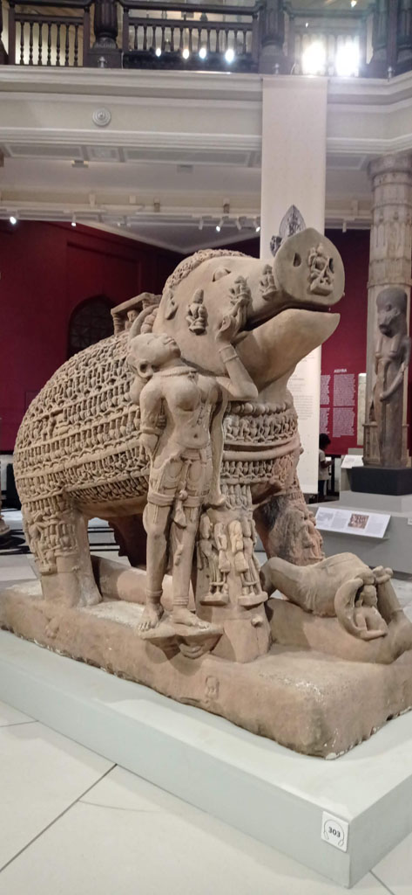
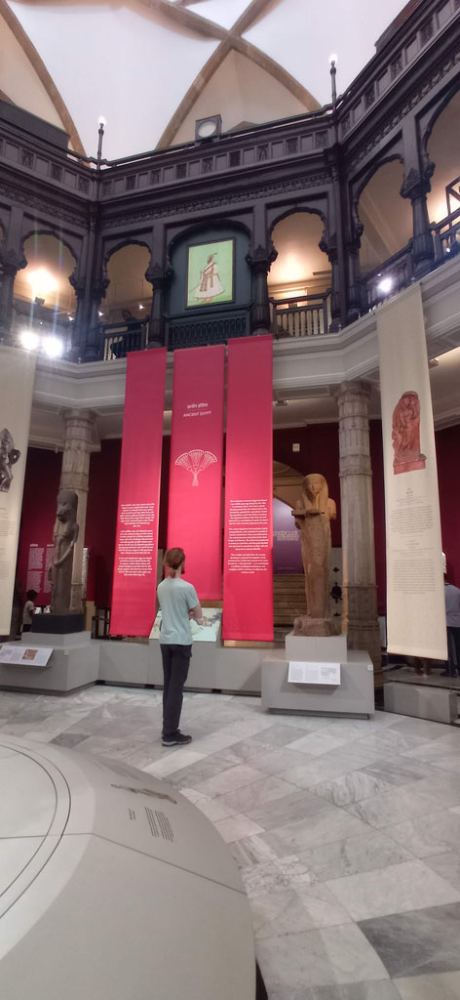
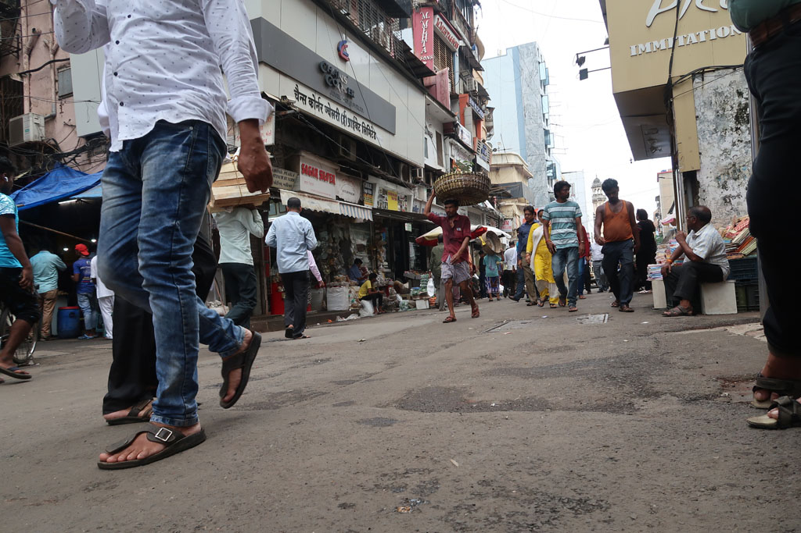
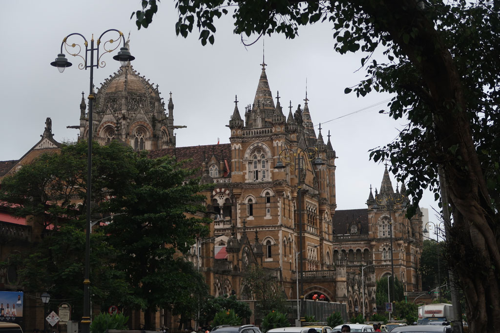
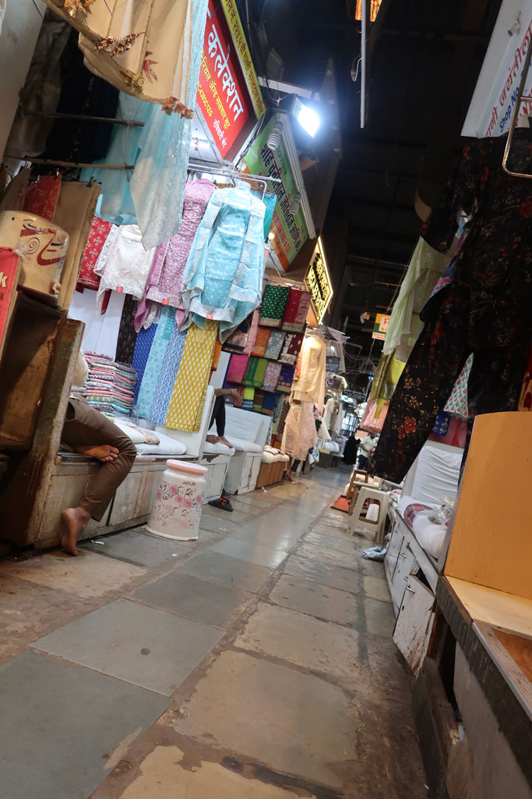
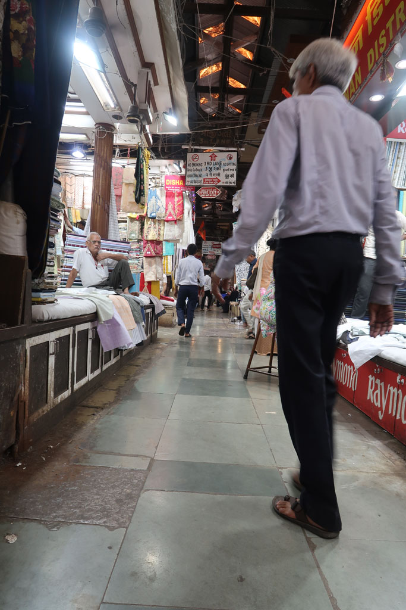
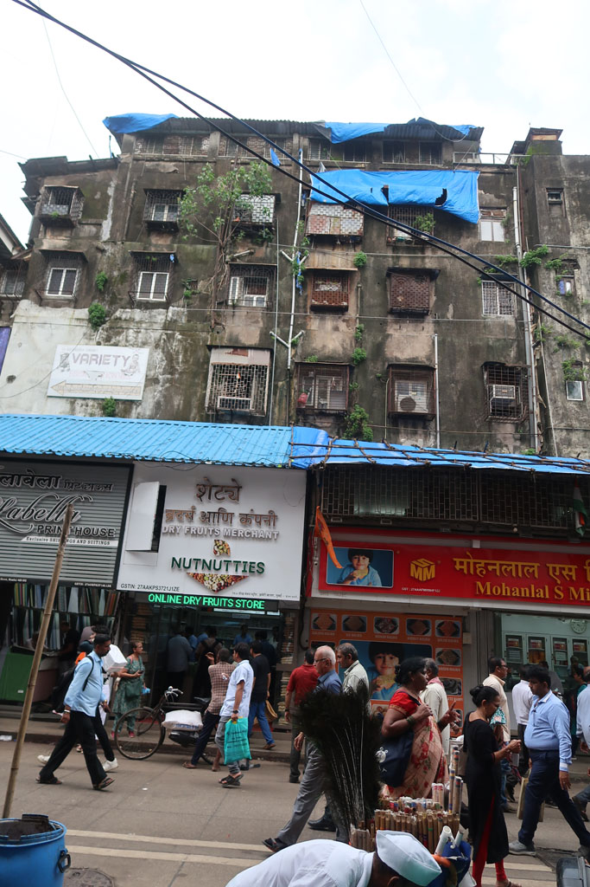

7h30 réveil à **Mumbaï**

8h30 on teste le café Léopold (les prix sont ceux de la grande ville)

10h30 visite du musée *Chhatrapati Shivaji Maharaj Vastu Sangrahalaya* sublime

15h00 prenons le bus pour le quartier Masjid. nous nous perdons avec délice dans les ruelles et les marchés de ce quartier. Les filles enchainent les bijoutiers

17h30 il est temps de revenir vers notre quartier (à pieds) en passant par les boutiques de livres informatiques pour E et les vendeurs de timbres pour G

18h00 nous prenons finalement un taxi pour finir le trajet (300 R)

19h30 nouveau restaurant

retour à l'hôtel.