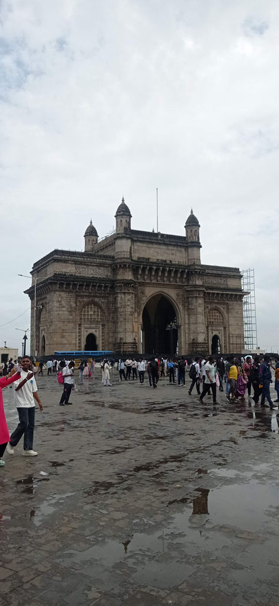

8h30 Réveil

9h00 Direction *Gate of India* après avoir réservé notre taxi pour le lendemain soir à 18h30 pour l'aéroport de **Mumbaï**.

9h25 embarquement pour **Elephanta**

10h30 Il n'y a pas grand monde sur l'ile ni sur le bateau en cette saison de mousson pas touristique. L'ascension est un peu rude dans cette humidité. Visite du site, très beau. Dommage qu'une partie de la grotte principale soir fermée pour cause de sol glissant. Tous les commerces ne prennent que la CB et ont des tarifs prohibitifs (tant pis nous mangerons à Bombay).

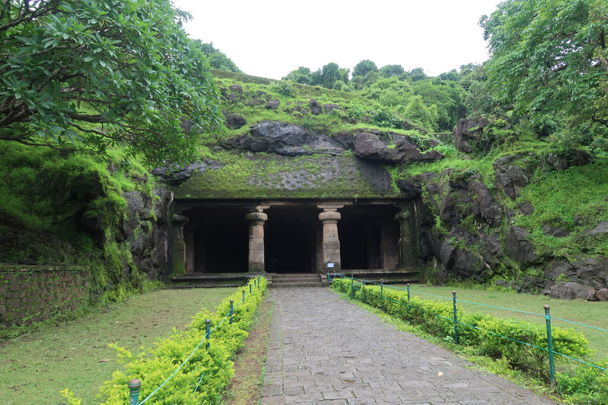

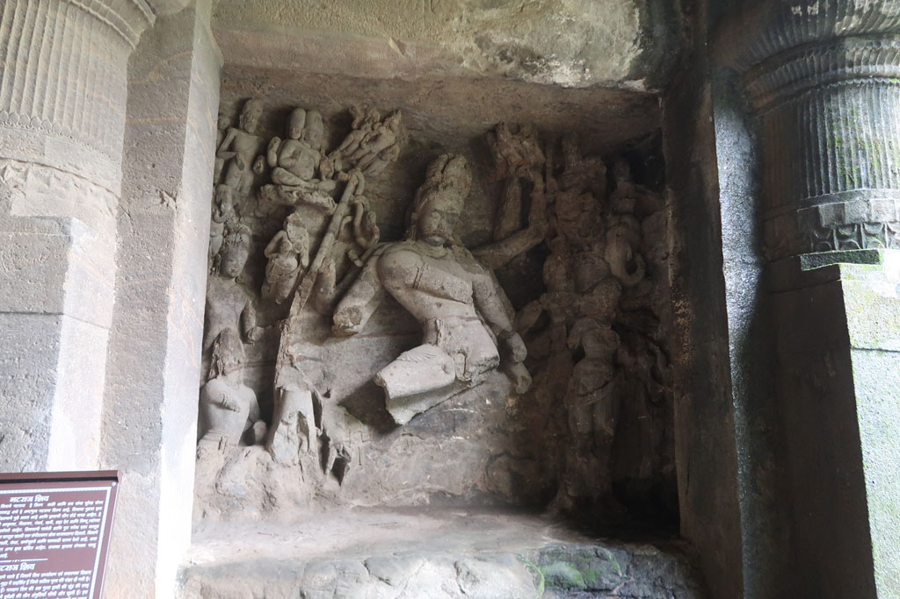
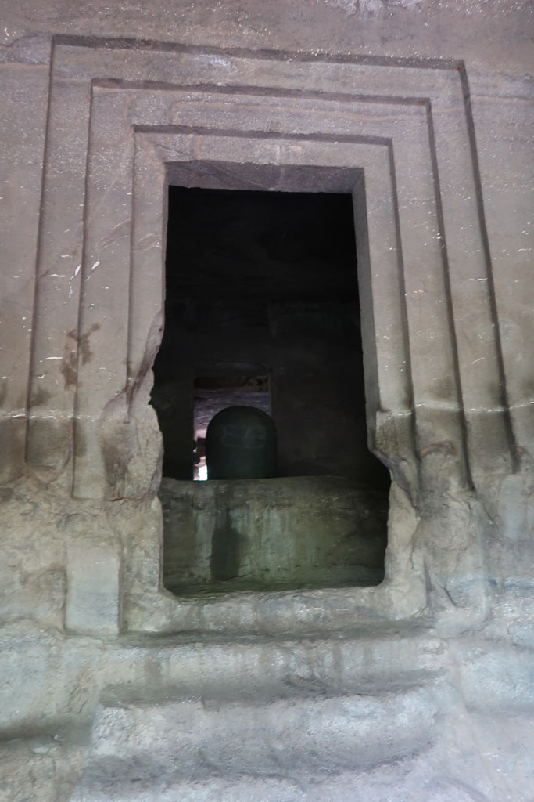
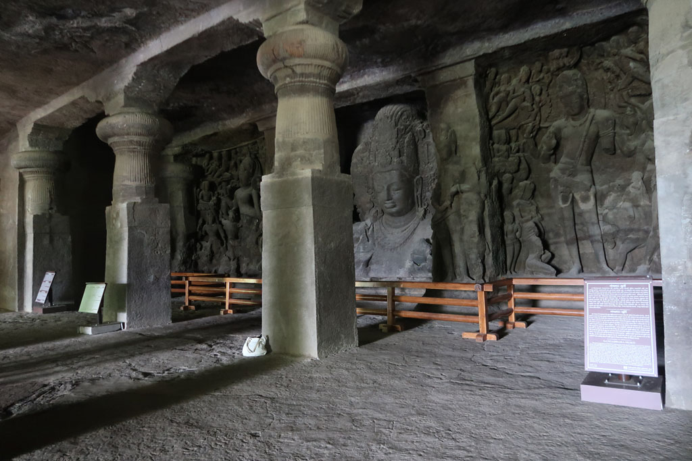
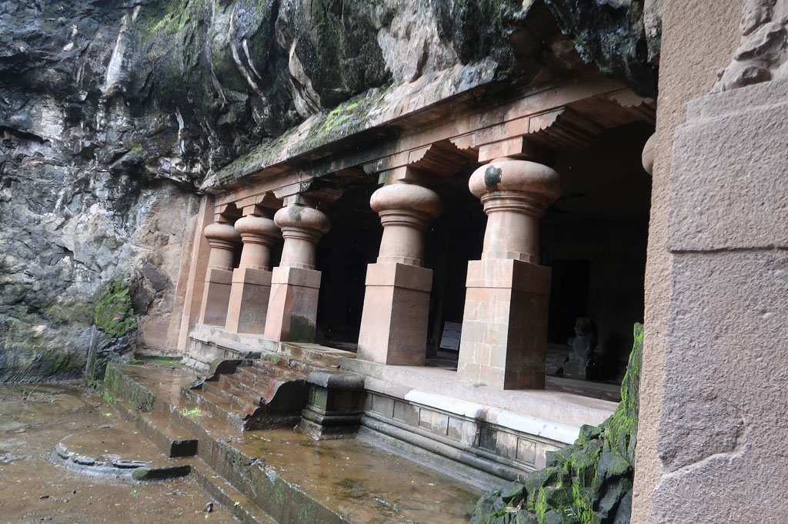
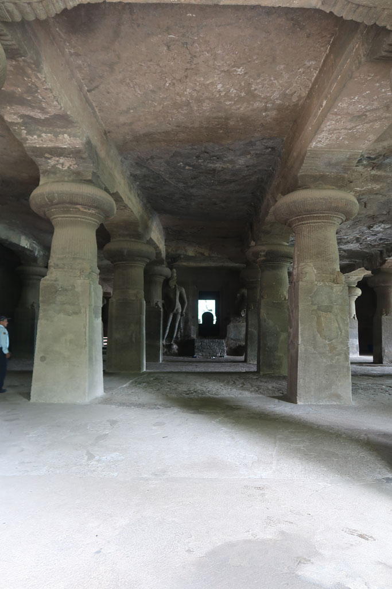
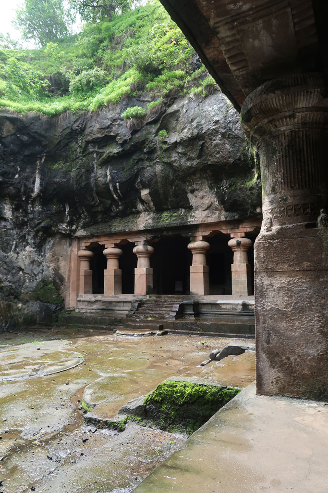
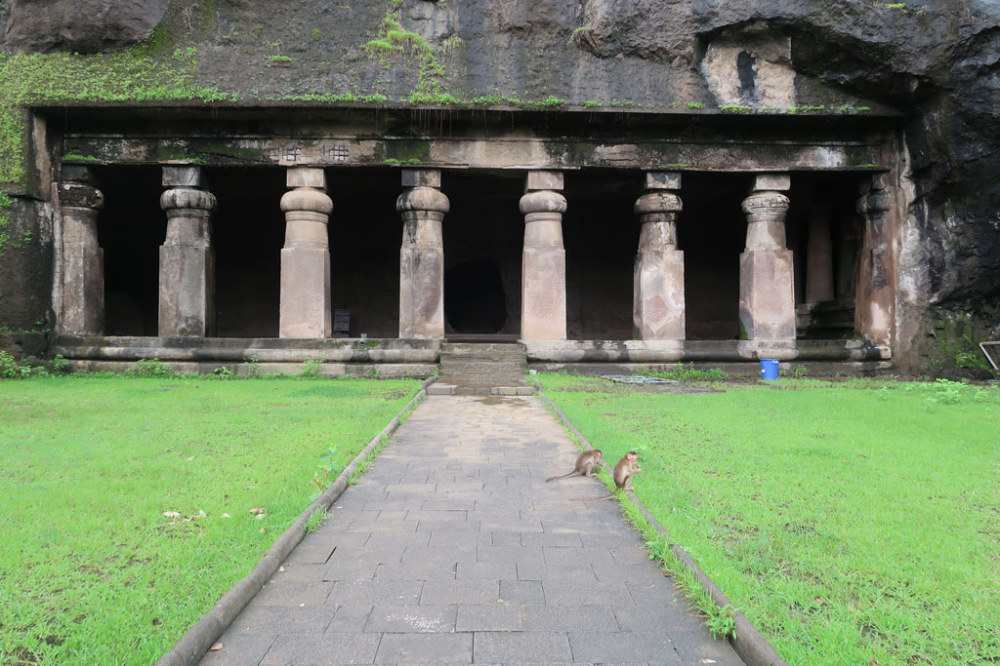

12h30 on attend le départ du bateau, la mousson commence à s'inviter.

13h15 pendant le trajet du retour, nous sommes frappés par la mousson et les vagues. Nous finissons comme tous les passagers, trempés.

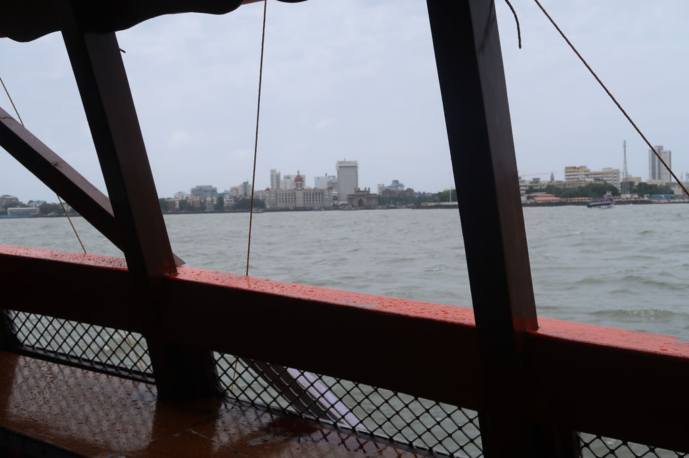
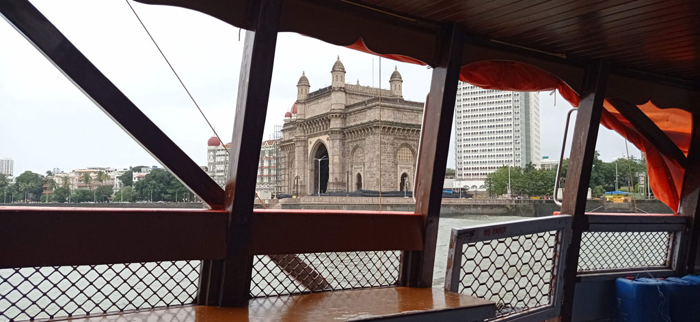

14h30 après un rapide passage à l'hôtel histoire de se sécher et se changer nous ressortons grignoter à l'Appolon.

Passage par les toilettes de l'hôtel avant de ressortir à la recherche d'une adresse recommandée d'un *magasin* de déco + mode, *Fabindia*. Hors de prix, bof.... Nous déambulons dans les rues avant de revenir dans notre quartier faire les boutiques.

19h30 nouveau restaurant, le madras café