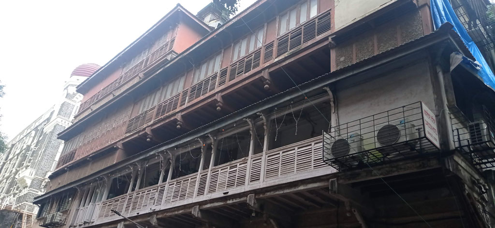
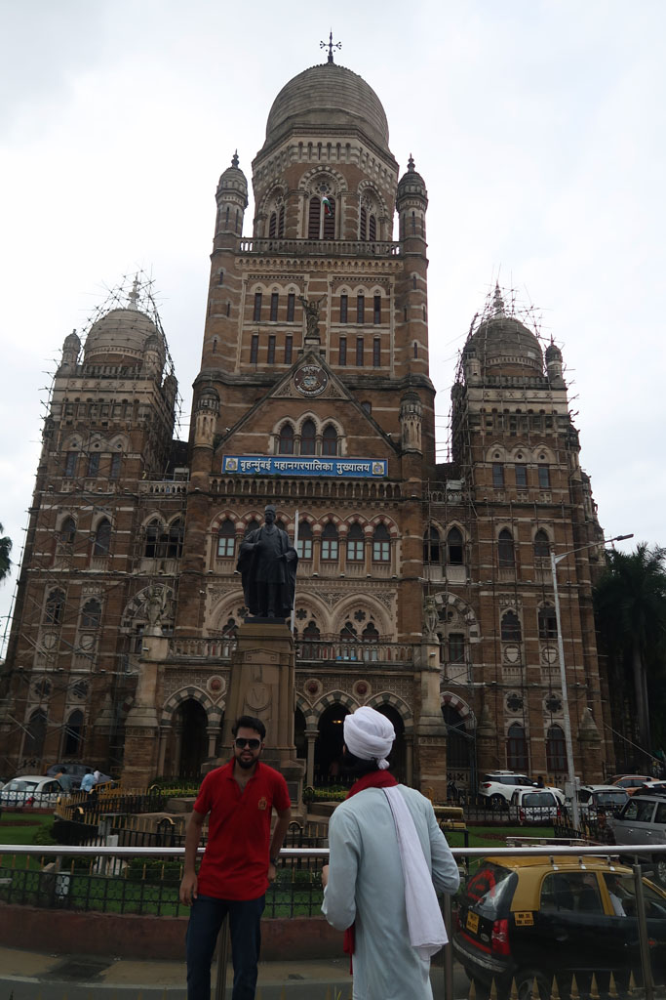
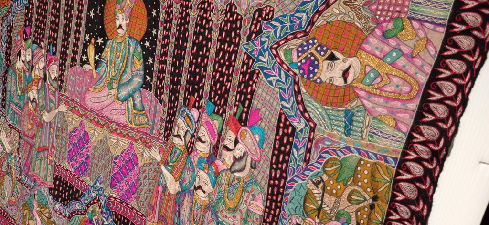
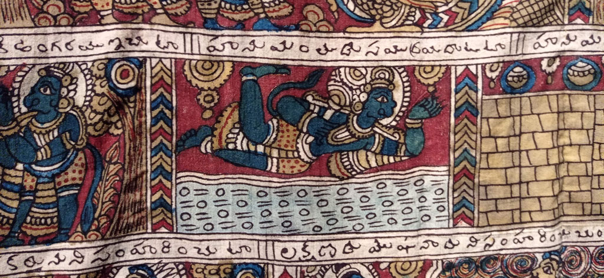
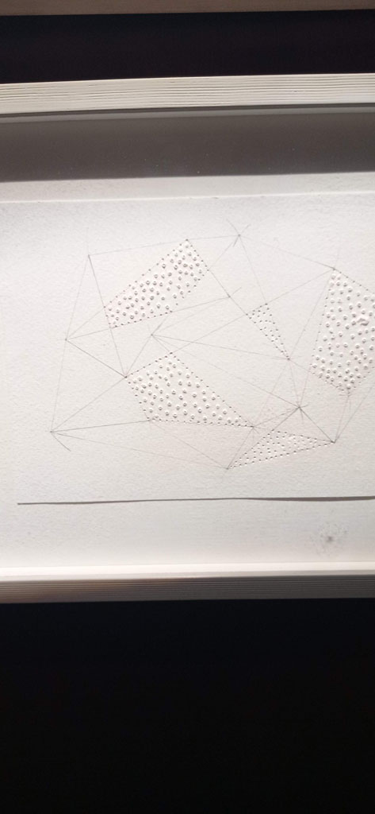
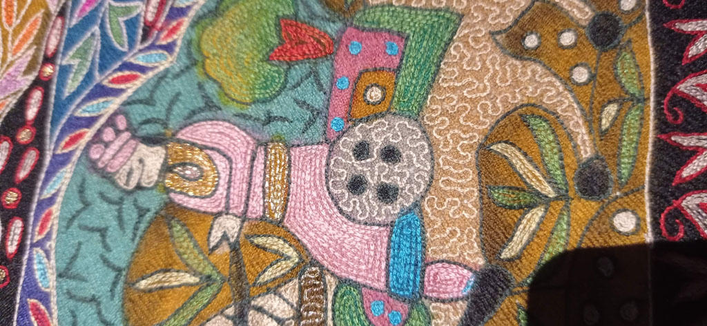
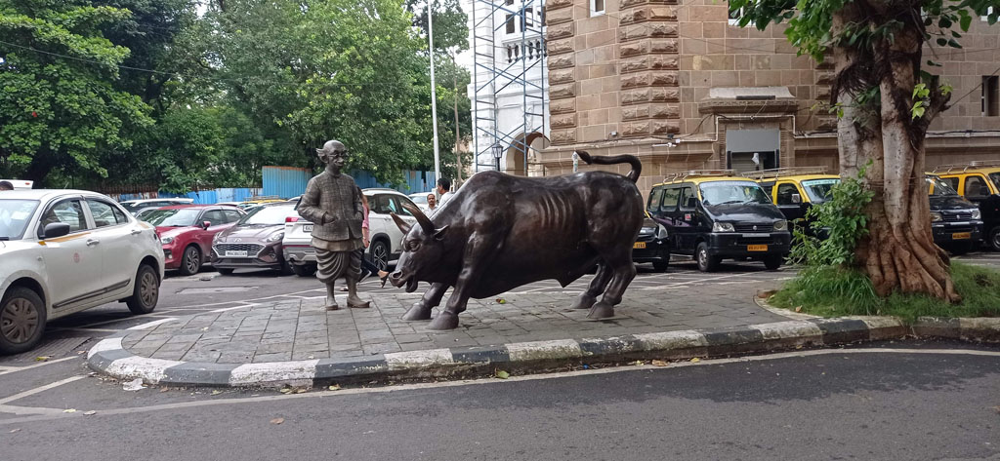
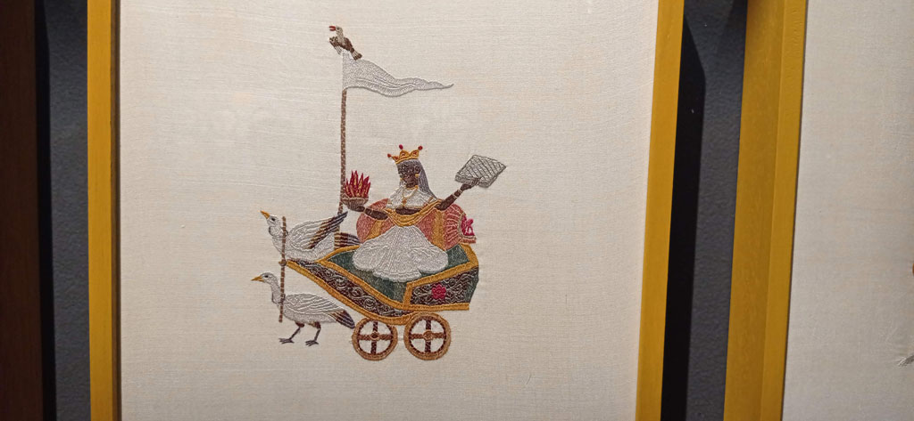
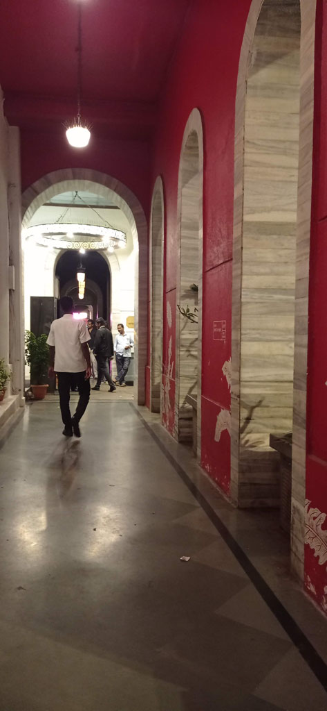

Pas de notes pour cette dernière journée à **Mumbaï**.

Dans mes souvenirs : grosse pluie le matin.

Visite d'un très beau **musée** / galerie sur la **broderie** et l'art par les femmes en inde (*National Gallery of Modern Art*)

Achat de strikers de carrom dans les boutiques de sport (*Bombay Sports* et *Pioneer Sports*).

Nous revenons à pieds le long de la **gare** victoria (*Chhatrapati Shivaji Maharaj Terminus*)

Le taxi vient nous chercher à 18h30 comme convenu pour nous emmener à l’aéroport. L'autoroute passe au dessus de la mer sous un ciel noir de mousson et des vagues blanches. Arrivés en avance à l'aéroport nous mangeons dans une chaine indienne notre dernier puri.