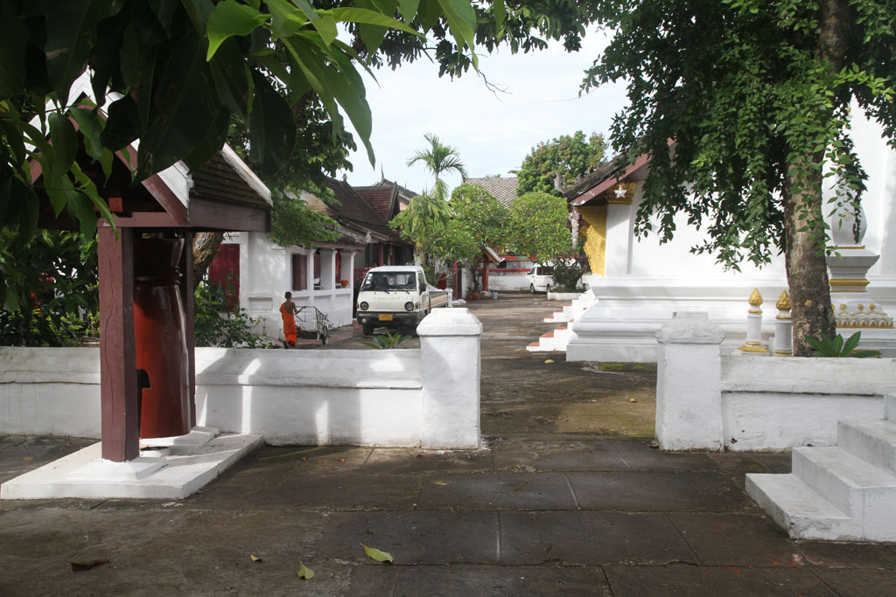

Après le passage en douane nous changeons 40€ à l’aéroport de **Luang Prabang**. Puis nous nous adressons au guichet des taxis (80000 kips). Direction la Thony1 guesthouse où nous avons une belle chambre pour nous 4 donnant sur un joli balcon en bois.

Après une petite sieste bien méritée après cette journée de voyage, nous partons à pieds en direction du centre ville.

Premier petit stop en terrasse d’un commerce pour nos premieres boissons laotiennes. 2 beerlao, 1 fanta 1 honey water.

De passage par le marché nous grignotons quelques cacahuètes et des bananes sautées.

Le soleil commence à tomber, nous en profitons pour manger sur le marché de nuit.

Pour conclure la soirée nous repartons nous promener le long du Mékong, où finalment une petite pause s’impose. 1 black iced coffee, 1 milk iced coffe & 2 hots chocolates.

Nous prenons finalement un tuktuk non loin du marché pour rentrer à la guesthouse, où nous rencontrons notre voisin de palier, un français expatrié.

Dodo 21h00 après une journée bien remplie.