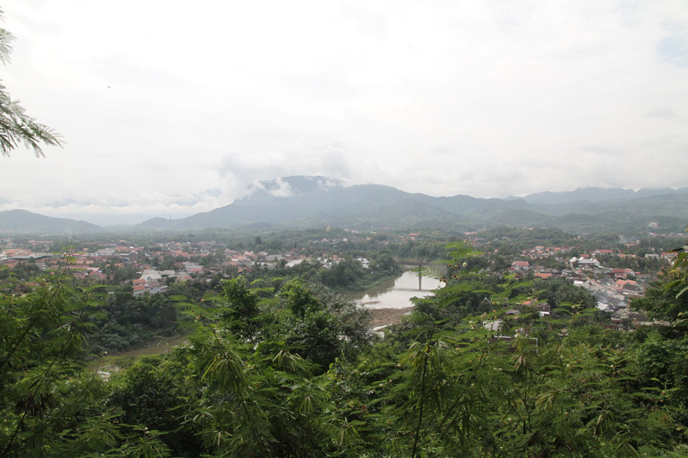
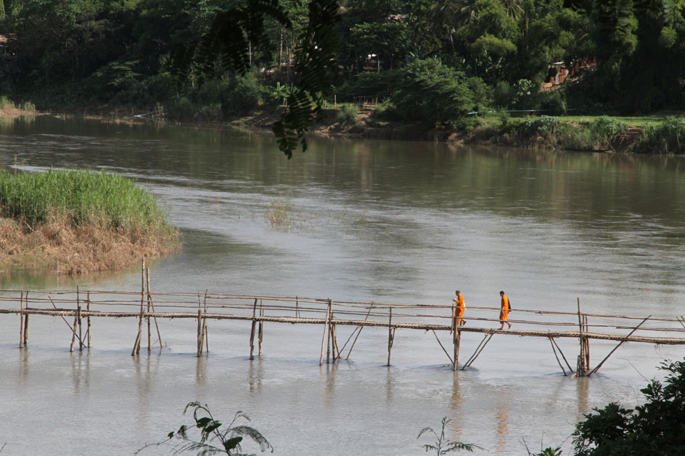
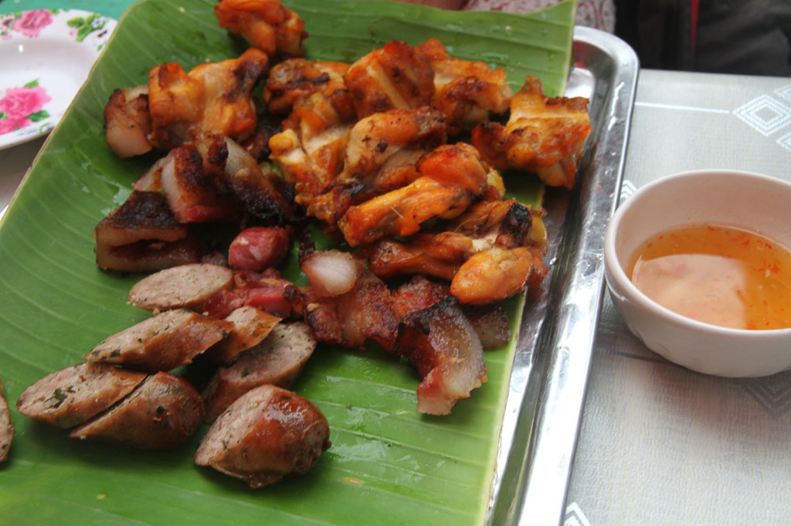

Réveil à 7h30 pour tout le monde. Après un bon petit déjeuner, omelette, oeufs, tartines et fruits nous partons à pieds à l’assaut du **mont Phusi**. après avoir bien profité du point de vue nous redescendons coté vielle ville à la recherche d’un DAB compréhensif.

Pause boisson sur un petit stand du marché textile, où petite fille recommence sa cure de jus de la passion entamée l’année dernière. Pour les autres ce sera 2 iced milk coffees & 1 iced black coffee.

Nous revenons à la guesthouse faire une bonne petite sieste par un chemin que nous n’avions pas encore pris.

Repartons ensuite dans l’autre sens pour entamer le tour de la presqu’ile. Hésitations devant le pont de bambou, pour savoir si nous devons aller explorer l’autre rive avant de revenir par l’autre pont. Finalement, heureusement que nous n’avons pas pris ce chemin, l’autre pont venait de disparaitre quelques semaines auparavant, emporté par le courant, nous aurions du rebrousser chemin.

Nous visitons tous les temples de la vieille ville, les uns après les autres. Nous commençons aussi à nous renseigner sur les prix d’un tuktuk pour la balade que nous voulons effectuer le lendemain.

De retour à coté du Mékong c’est l’heure de la petite pause Beerlao + sodas pour les enfants.

Sur la marché de nuit, les filles s’équipent de robes et pantalons plus adaptés au climat.

Après un tour des différents étals nous revenons à celui d’hier soir, pour notre repas. Quelques touristes passent, mais nous défrayons plutôt la chronique avec nos deux enfants à manger sur le marché en compagnie des locaux.

Comme la veille nous revenons en tuktuk à la guesthouse. Nous discutons avec le patron de nos options pour le lendemain. IL connait évidemment quelqu’un de beaucoup moins cher que toutes les options que nous avions pu réussir à négocier. (200000k au lieu de 360000k)