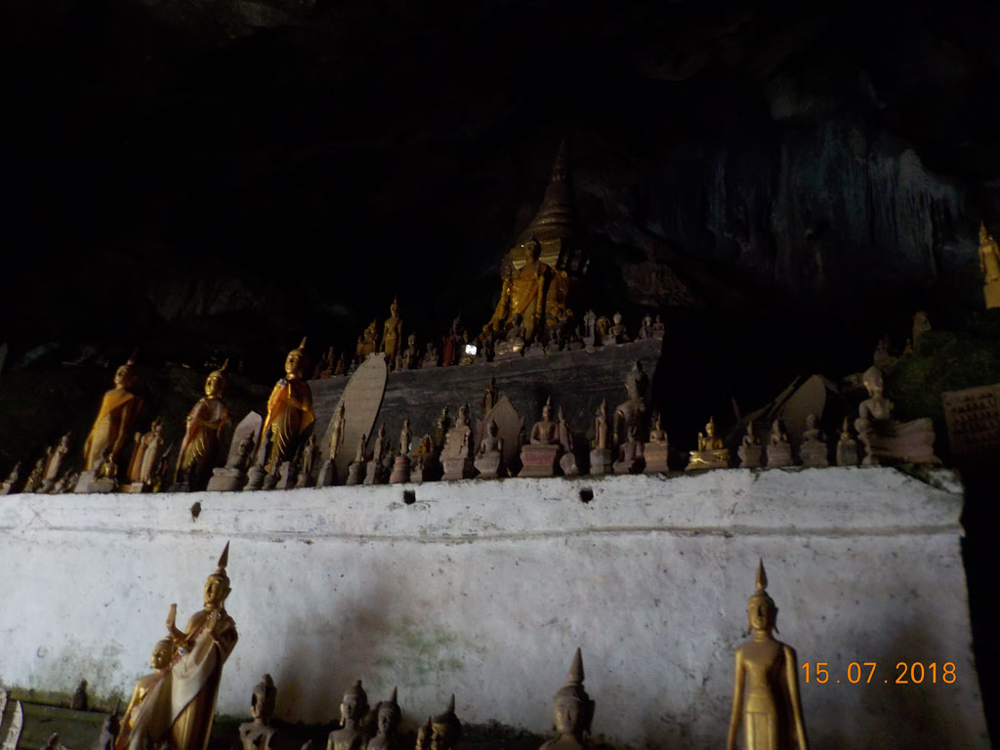
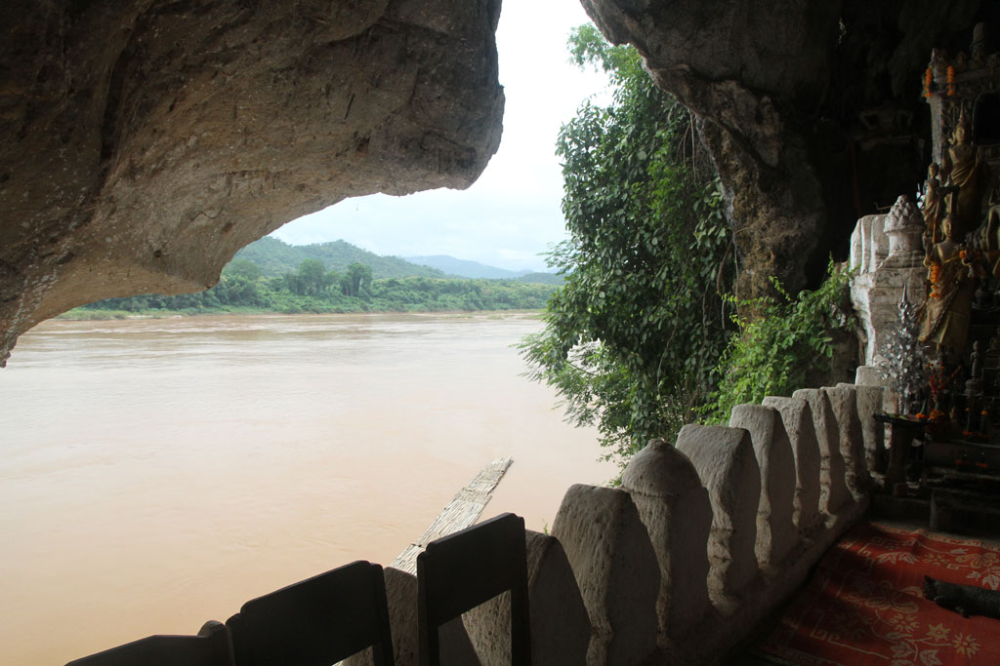
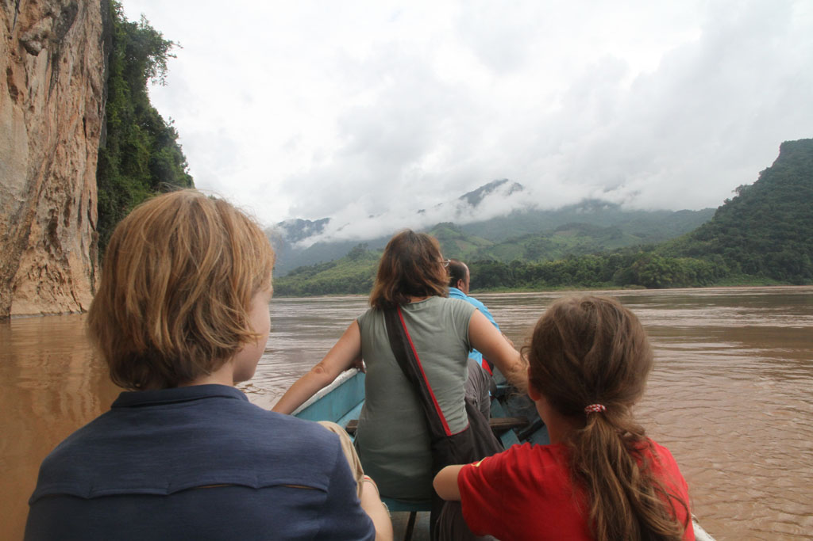
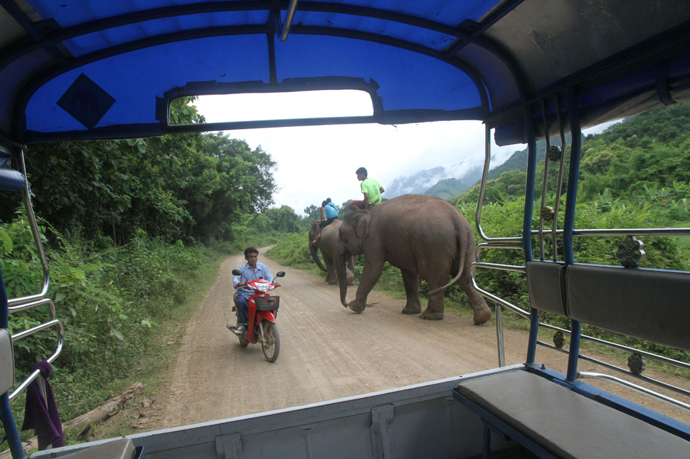
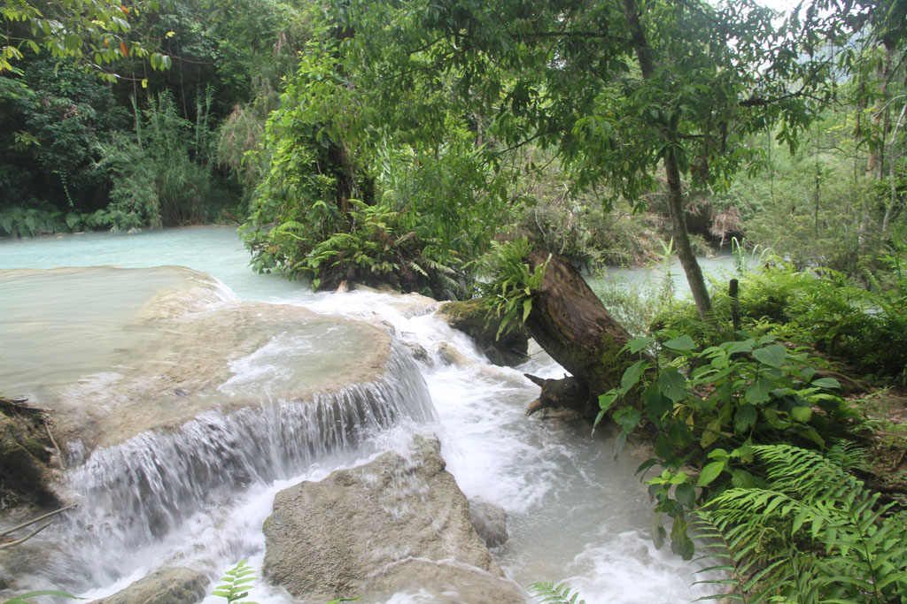
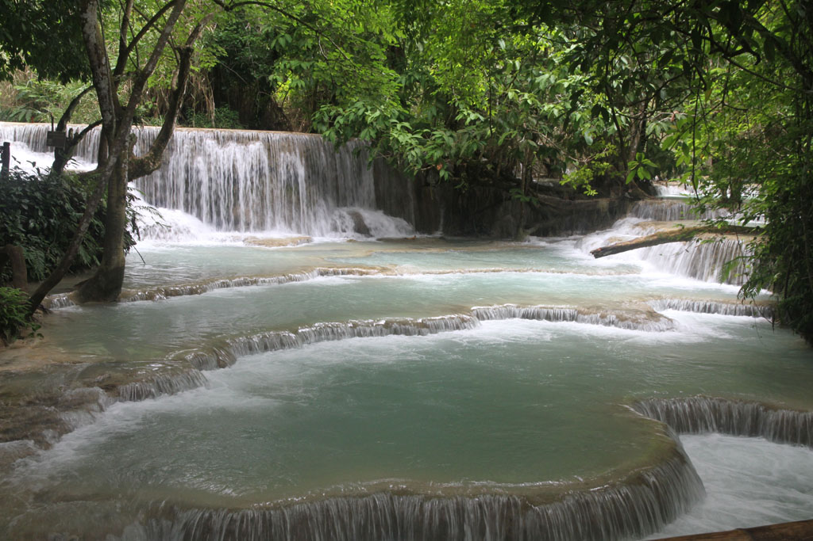
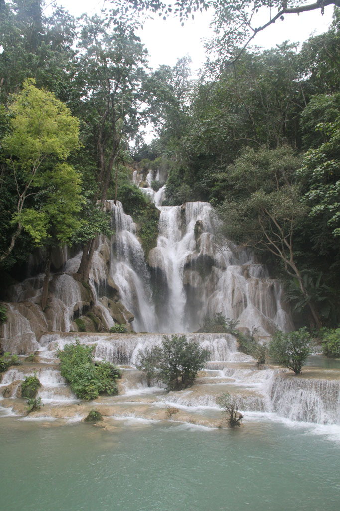
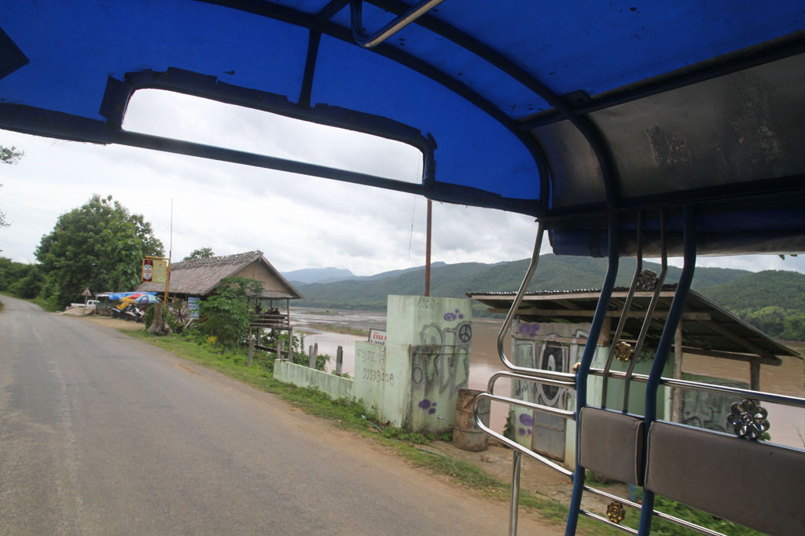
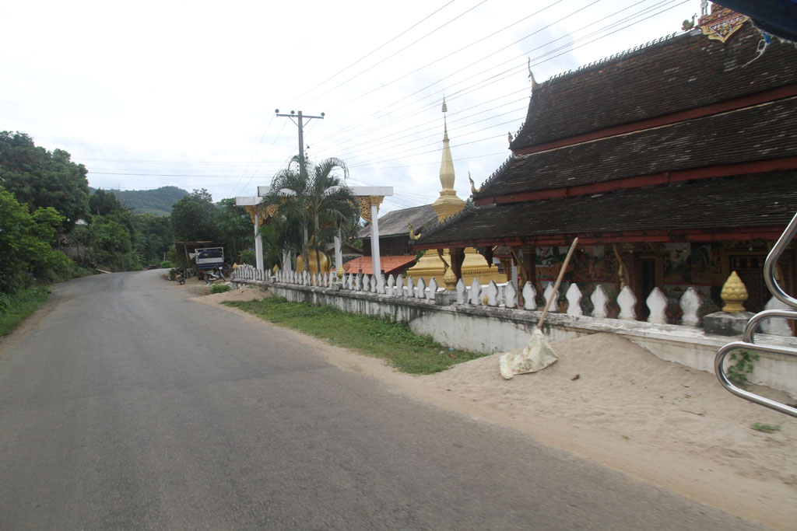

Réveil à 7h00 pour un petit déjeuner rapide (omelette, oeufs sur le plat, café, thé, tartines).

A 8h00 comme convenu, notre chauffeur vient nous chercher avec son camion bâché. Direction les **grottes de Pakou**. Au passage notre chauffeur en profite pour emmener son amie en balade, nous la prenons à bord à la sortie de la ville.

## **Les grottes de Packou**

Après une heure de piste relativement défoncée car des travaux d’aménagement d’une grosse route semble en cours, nous arrivons en vue du village situé de l’autre coté du Mékong. Nous sommes absolument les seuls touristes sur place (il y a la possibilité, plus chère, de se rendre aux grottes par bateau depuis **Luang Prabang** l’après midi).

La traversée en barque est le commerce des hommes du village, nous achetons nos tickets et pouvons donc traverser.

Un homme et son fils, venus par leurs propres moyens sont déjà sur place, nous les croisons alors qu’ils sont sur le départ. Ce seront les seuls personnes croisées sur ce lieu, magnifique.

Après une bonne heure sur place, il est temps de re-traverser la rivière. Nous revenons par les ruelles tranquilles du village et son temple. Bien que le commerce des d’écharpes soit bien visible le long de la rue qui mène au parking , nous ne serons absolument pas sollicités.

Notre chauffeur nous demande alors si nous voulons aller voir les fameuses chutes d’eau du coin, car cela fait d’habitude partie du tour classique. Nous n’avons pas prévu les maillots de bain, tant pis nous y allons pour le paysage.

C’est reparti pour un peu de piste. 10h30 Packou -> 11h30 Luang Prabang -> 12h30 chutes.

## Les chutes d’eau

Petite balade autour de ces chutes d’eau, **les cascades de Kuang Si**, sous la pluie. L’endroit est rempli de touristes locaux comme étrangers. Comme nous n’avons pas nos maillots de bain et qu’il serait inconvenant de se baigner en sous vêtements au milieu des locaux qui pic-niquent tout autour des chutes, nous trempons juste les pieds.

Après une heure retour sur **Luang Prabang**.

Retour à la guesthouse où ces 4 heures de camion bâché en ont épuisé certains. Petite sieste donc.

## Fin de journée

Pendant ce temps, K. et moi partons à la recherche d’un tube de colle avec l’aide du propriétaire qui m’a écrit le nom sur un bout de papier.

16h00 après la mission sieste/colle, mission tickets de bus pour le lendemain. Ce sera donc un départ entre 8h00 et 8h30 devant notre guesthouse.

A la recherche d’un DAB qui marche, différent de celui d’hier. Toutes ces rochers nous ont fatigué, une petite pause boisson au bord du Mékong s’impose. (jus de citron, jus d’ananas, iced milk coffee, iced black coffee)

18h00 on retrouve notre stand sur le marché > au menu ce soir : nems, poulet, porc, saucisses, riz, coca, bières