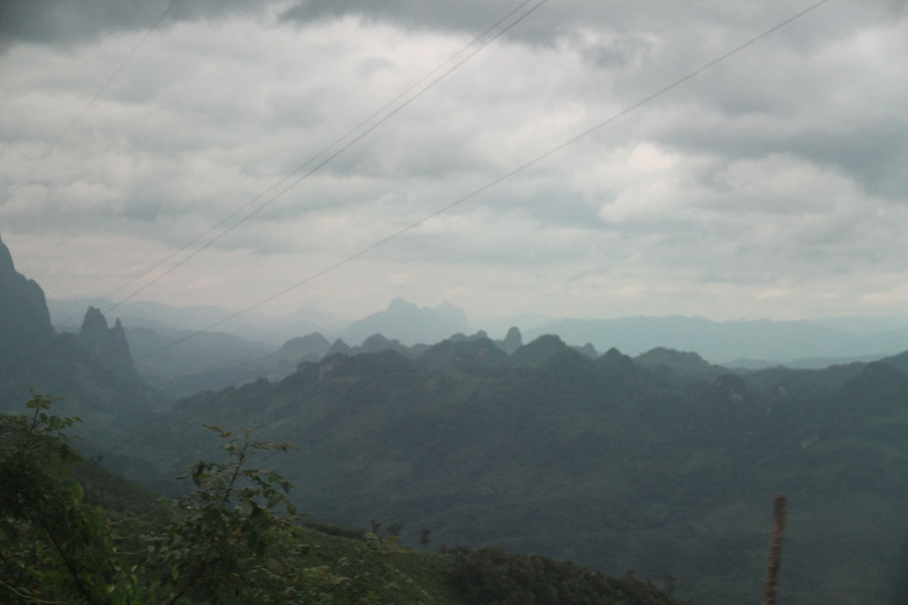
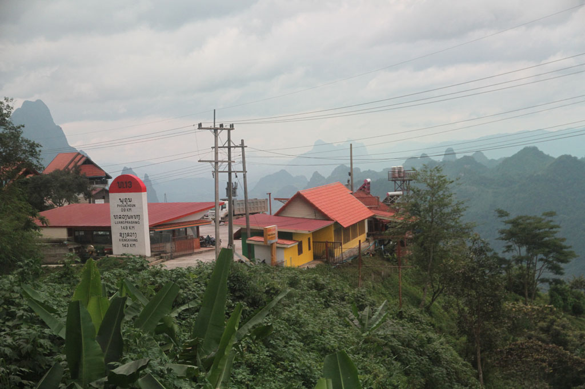

Réveil à 7h00 pour un petit déjeuner (omelette, œufs sur le plat, café, thé, tartines).

Nous sommes prêts à 8h00, devant l’absence de nouvelles de notre moyen de transport nous demandons à notre hôte de se renseigner. Il semblerait que l’on nous avait oublié. Un tuktuk vient vite nous chercher pour nous emmener au mini bus qui n’attendant plus que nous.

9h04 départ sur cette route de montagne plus que tortueuse, mais avec des paysages magnifiques.

11h30 arrêt au bord de la route, notre chauffeur prend un petit en cas.

12h00 pile ça repart pour 4h00 de zig-zags interminables.

16h15 nous arrivons enfin à la **gare routière** de **Phonsavan**.

Bien que devinant le manège, nous acceptons qu’un chauffeur de taxi nous emmène vers une guesthouse. Il s’avère que c’est celle que nous avions repéré. Et les prix pratiqués sont ceux affichés. IL ne semble pas y avoir d’arrangements avec le chauffeur. Et comme notre gentil taxi est aussi et surtout un guide local nous discutons alors du tour que nous voulons faire le lendemain. Après discussions et renseignements pris, nous ferrons affaires avec lui, très sympathique il pratique aussi les meilleurs tarifs du coin. 600000k au lieu d’un minimum de 800000k ailleurs. Dès fois il faut faire confiance à son instinct.

Après une bonne douche direction la gargote en tôle située au coin de la rue. Au moment où nous nous installons, un véritable déluge s’abat sur la ville.

Fin de journée, l’averse se calme le temps pour nous de retourner à l’hôtel. Les enfants dorment. Dans la boutique des guide, située de l’autre coté de la rue, guitare et chants s’expriment jusqu’à tard dans la nuit.