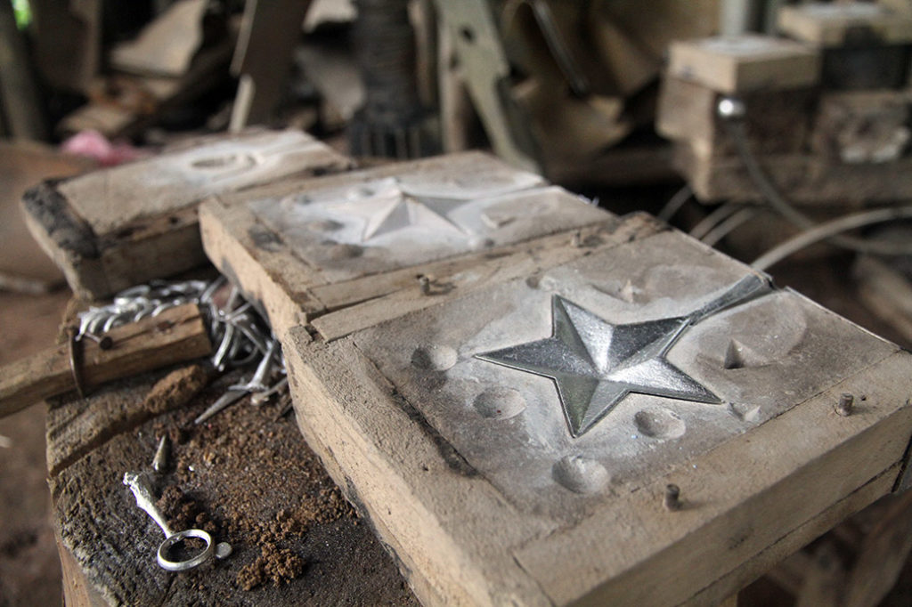
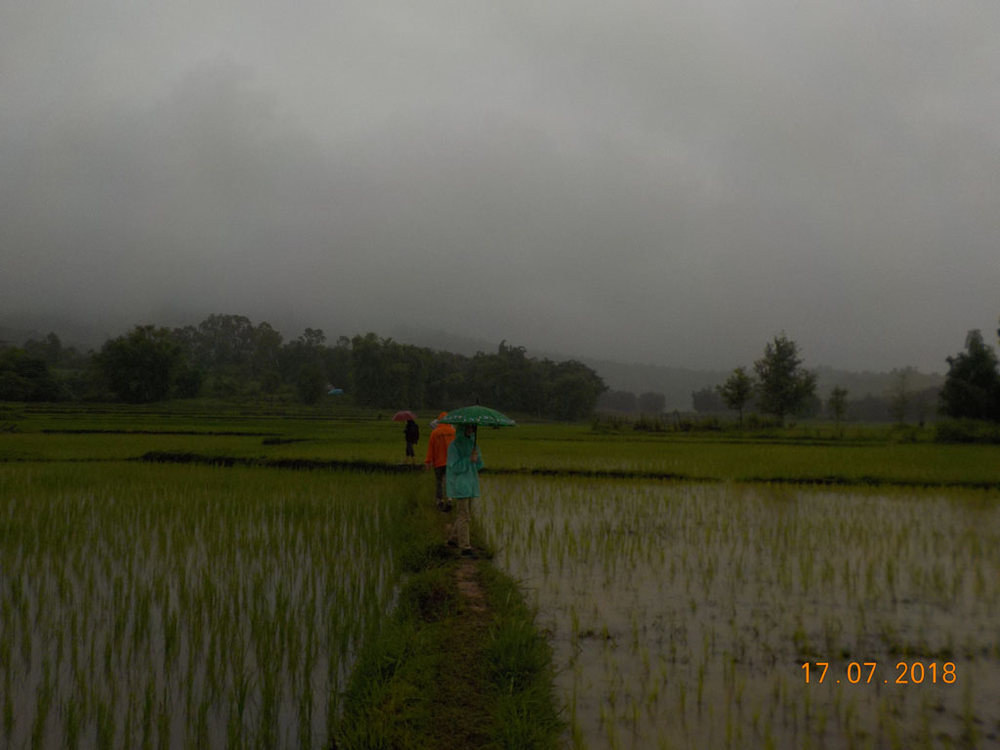
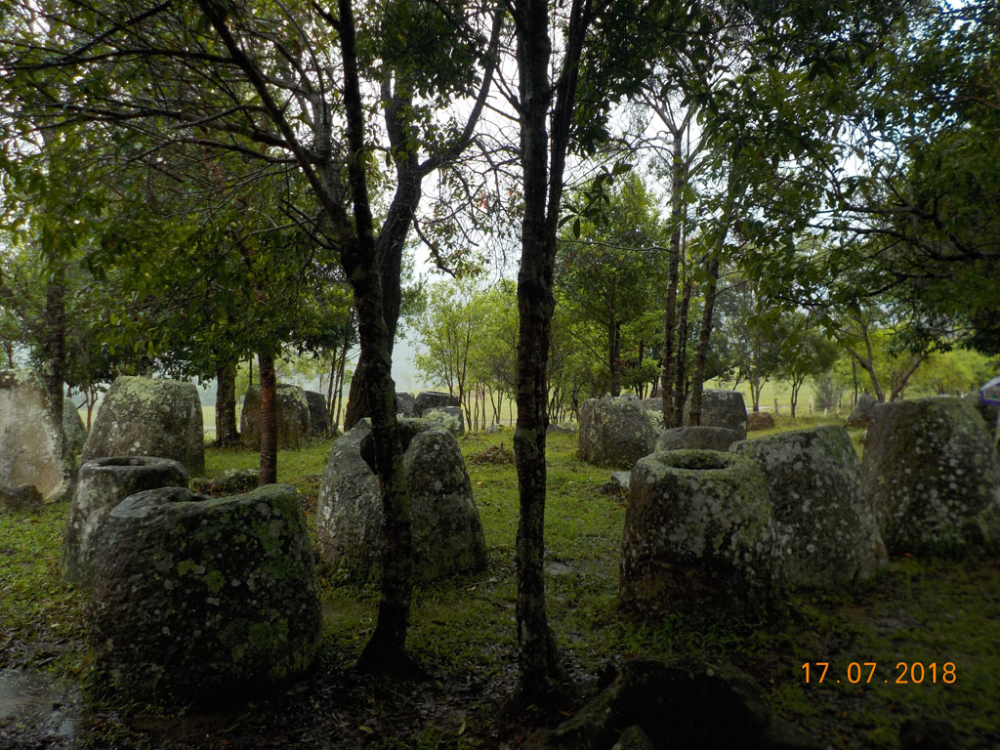
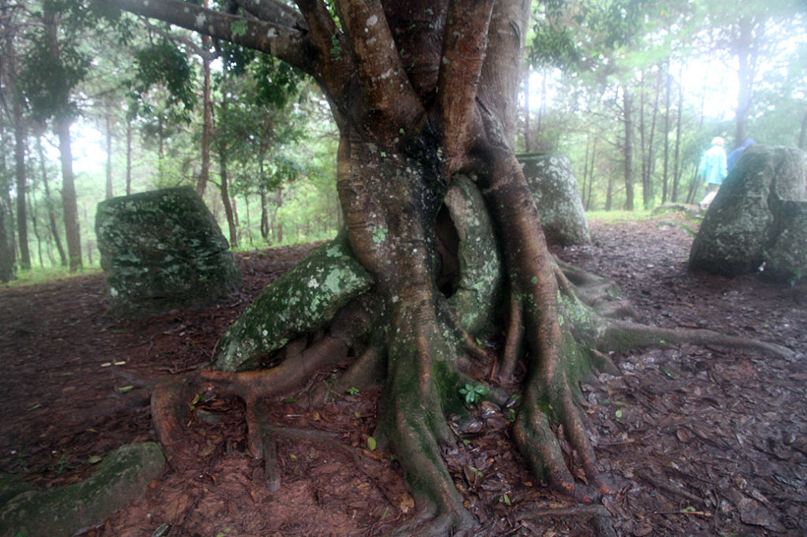
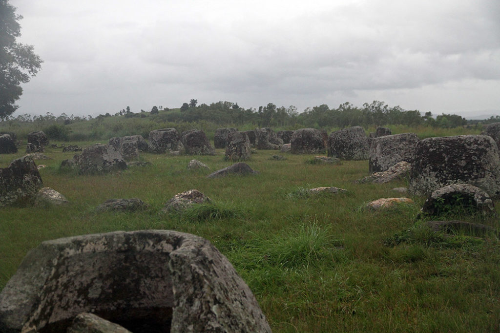

Réveil à 7h00.

7h30 direction la petite gargotte à l’angle de la rue, pour prendre un petit déjeuner. Autant le repas d’hier soir était bon, autant ce matin ce n’est pas terrible. Frieds eggs, gried omelet, coffee, tea.

8H00 après un petit tour par la chambre nous allons faire un tour sur le marché local.

9h00 Nous retrouvons notre chauffeur pour cette superbe journée, malgré la pluie.

Nous avions convenu du circuit suivant dans cet ordre :

**Spoon village :** J’avais très peur du passage “obligé” par ce village, mais ce fut une très heureuse surprise. Notre guide nous emmène chez un des fondateurs de cette activité de recyclage de l’aluminium des bombes retrouvées sur place. Son activité à commencé par la fabrication de seau à usage local, pour se transformer en une activité de moulage de bijoux et de cuillères. La discussion ne fut jamais mercantile. Rien d’ailleurs n’était à vendre. Tout était autour du partage de son métier. Et comme notre hôte fabrique aussi son “whisky” il a fallu gouter. 60° le matin ça réveille.

**Site n°3 :** Au milieu des rizières par ponts et talus nous arrivons sur cette petite colline. Notre guide profite de notre passage pour ramasser des champignons.

**Site n°2 :** Entre pinède et montagne pelé, le site aurait mérité plus que la pluie.

**Site n°1 :** le plus grand, soit disant le plus beau. Bof. La ville peut être trop proche gâche un peu la majesté du paysage. Belle petite grotte néanmoins. Nous fuyons bien vite son porche qui nous aurait bien abrité de la pluie à cause des 2 essaims pendus juste au dessus.

15h00 de retour ne ville nous achetons nos billets pour **Ventiane**.

17h30 nous décidons d’aller faire un tour (repérage pour le soir), les restaurants routards n’existent plus où sont fermés. Le grand marché n’existe plus non plus il est remplacé par un grand centre commercial par encore ouvert. Et toutes les petites échoppes alentours n’existent plus non plus.

19h30 nous changeons de cantine et essayons celle d’en face. Un peu poivrée comme cuisine mais très bonne. Riz sauté légume, Porc sauté riz, Beerlao, Jus d’ananas, eau.