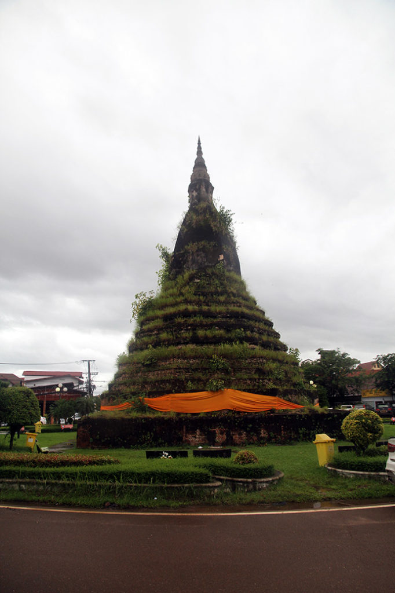

Réveil à **7h30**, vite il faut partir.

**8h30** checkout, nous allons ensuite déposer nos sacs à la guesthouse repérée la veille au soir. Première fiche d’hôtel à remplir du séjour.

**9h00** la pluie menace, nous partons à la recherche d’un petit déjeuner après un passage à la **laverie**. En direction du marché la pluie s’abat soudainement. Nous trouvons refuge dans un petit café vendeur de canettes pendant 1h00.

**10h30** des 2 marchés nous n’en feront qu’un à cause de la pluie. Nous prenons finalement notre petit déjeuner dans une chaîne. Le **musée** à l’architecture coloniale datée et moussue est définitivement fermé et en cours de transfert vers un nouveau site.

De retour vers notre guesthouse, on fait une pause beerlao avant un bref passage par la chambre.

Achat des billets de bus pour le lendemain (sleeping bus)

Pour le repas nous faisons malheureusement confiance au guide du routard. Première expérience décevante de cuisine depuis que nous sommes arrivés.

**14h00** la pluie tombe toujours, nous montons nous sécher dans la chambre.

**15h00** les enfants font une pause TV, G. la sieste. Je sors voir le **mékong** et me balader alentour.

**16h00** Promenade en ville tous les 4 maintenant que la pluie a cessée. Institut français, arc de triomphe, poste, cartes postales, temples…. Marché de nuit pour quelques emplettes.

**18h45** pause beerlao , jus de la passion, sprite en terrasse non loin de notre guesthouse.

**19h30** Repas à notre guesthouse, crevettes+ riz, porc grillé + riz, beerlao, sprite, fanta.

**20h30** Petite crêpe au chocolat pour digérer :)

**21h00** retour au marché de nuit pour quelques achats supplémentaires.

**22h30** les enfants profitent de la TV, on redescend prendre une beerlao avec G..

**23h00** extinction des feux.