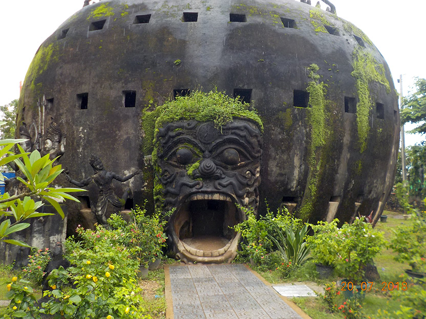
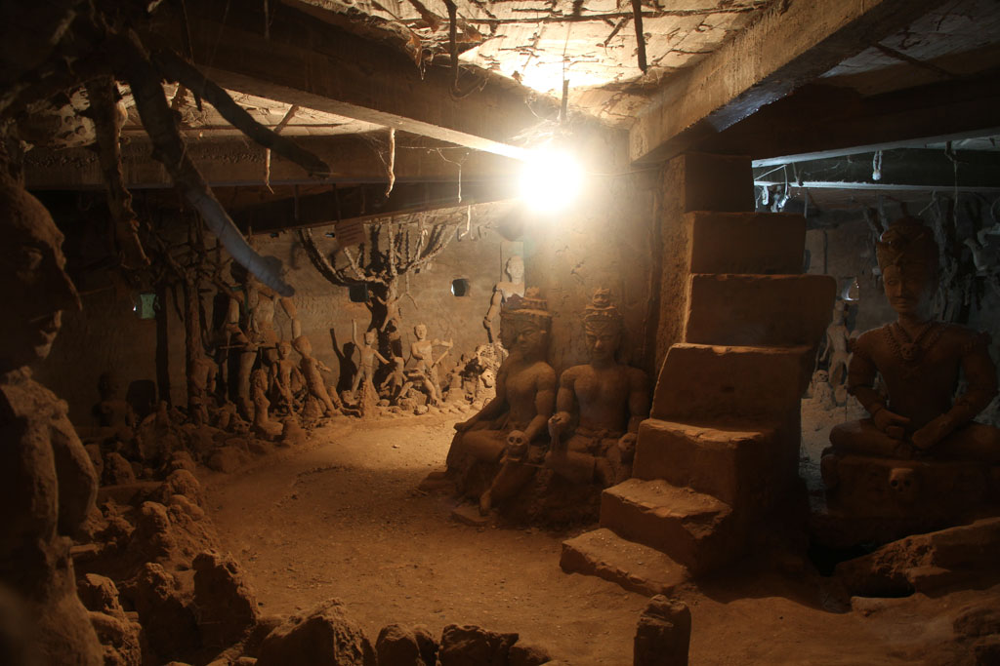

7h00 je descends fumer une clope sur la terrasse avec le patron.

9h00 réveil du reste de la troupe et direction une enseigne à touristes pour un petit déjeuner en compagnie du chat.

10h30 récupération de nos 3 kilos à la laverie/marchande de cigarettes.

11h00 nous laissons les sacs à la réception et partons à pieds pour le centre ville. Nous croisons la route du bus “vert” de la ligne 14 et du coup on se décide à aller faire un tour au **Buddha parc** de **Vientiane**. Rencontre avec 2 françaises dans le bus. Visite plutôt rapide et de jardin mythologique de béton. On retrouve nos 2 françaises à l’arrêt du bus pour le retour. Longue discussion avec un moine parlant français.

14H00 Le bus nous dépose au terminus et on se prend enfin un VRAI café glacé dans un stand de rue et nous revenons à pieds dans le quartier des guesthouses.

15h15 Arrêt chez Tyson pour profiter de la belle terrasse avec quelques verres en attendant le départ de ce soir.

17h00 Retour à la Guest pour un riz sauté porc et nouilles sautées légumes + beerlao et sprite.

18h00 un camion baché vient nous chercher. Nous sommes les premiers d’une longue série.

19h00 Arrivée à la gare routière. On nous remet nos tickets.

21h00 Départ du bus.