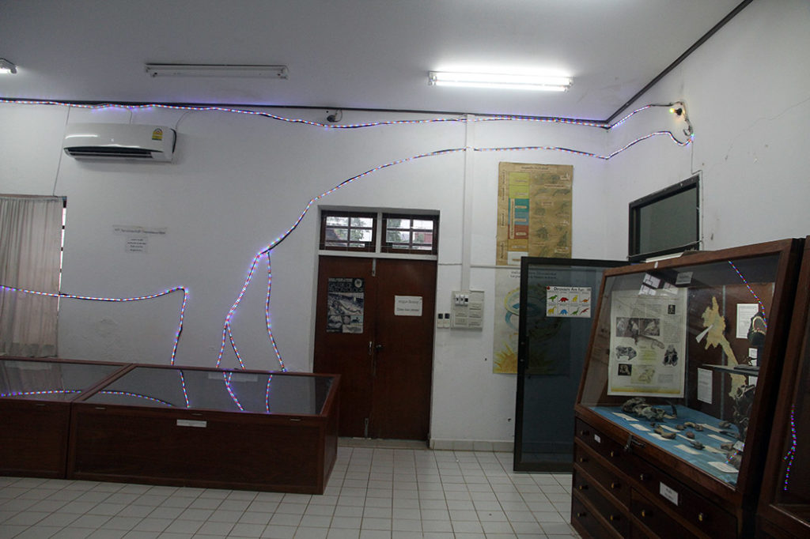
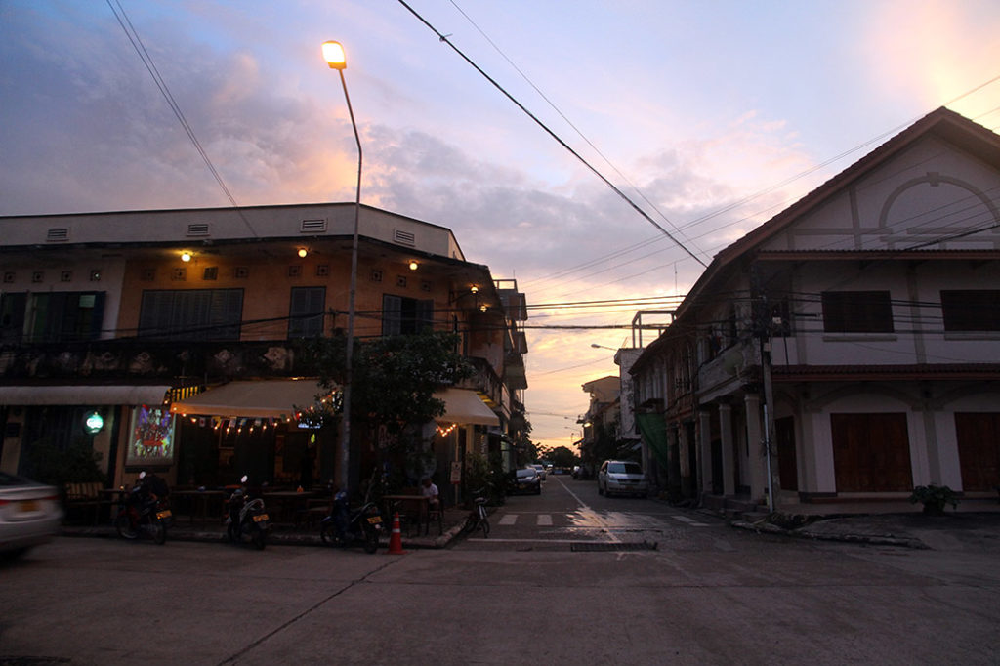

4h00 on nous réveille, pour nous déposer au bord de la route au milieu de nulle part. Le chauffeur nous désigne un min van, on monte dedans et c’est parti pour 20min dans la nuit. …

pour arriver à la gare routière de de **Savannakhet** à 4h45. Nous attendons sur les bancs de la gare routière que le jour se lève.

6h30 on attrape un tuktuk pour partir à la recherche de la guesthouse. C’est toute une aventure, notre chauffeur ne connait pas cette guesthouse, il réveille un gardien de nuit dans un hôtel, qui ne connait pas non plus. Pour faciliter la communication il appelle une de ses connaissances qui parle anglais. Finalement nous rencontrons un vieux chauffeur de tuktuk qui en plus de parler français, connait la guest house en question. Ce sera finalement lui qui nous y déposera. La chambre ne sera pas prête avant midi. En attendant on nous propose un petite chambre temporaire que l’on décline poliment. K. s’effondre sur le canapé et se repose. Le petit déjeuner est aussi offert, on en profite. Vers 10h00 on part se balader en ville. Très beau temple, nous restons à regarder les maçons travailler le béton frai en arabesques. Le musée des dinosaures est fermé. Au milieu de cette petite ville comme figée dans le temps, toute déserte et décatie, on se fait une petite pause café glacé coca.

12h00 A la guesthouse, notre chambre est prête. Apres une bonne douche tout le monde s’effondre et fait une petite sieste.

15h00 Retour en ville, le **musée** des dinosaures est enfin ouvert. Petit visite rigolote avec un gardien qui semble vivre sur place avec sa famille. On retourne à la poste tenter d’envoyer nos cartes postales. Le gardien/jardinier nous explique que c’est le weekend, et que par conséquent tout est fermé. D’ailleurs les ballots de courrier s’entassent dehors… Le musée local situé à coté de la poste est lui aussi fermé. Nous allons donc prendre une bière au bord du **Mékong**. Sur la rive d’en face un bouddha thaïlandais nous contemple.

17H30 Promenade sur le **nightmarket**. On teste plein de stands. 1 brochette poulet. 1 brochette saucisse, des frittes pour les enfants, 1 spirale de chips, 3 brochettes de poulet + riz gluant, 3 brochettes de crevettes + riz gluant froid, 1 jue de fruit passion, 3 brochettes (aubergines, surimi, knack)…

19h30 on rentre tranquillement en achetant des petits gâteaux.