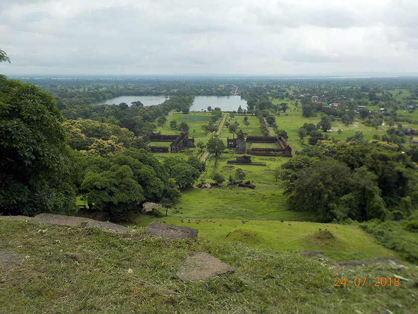
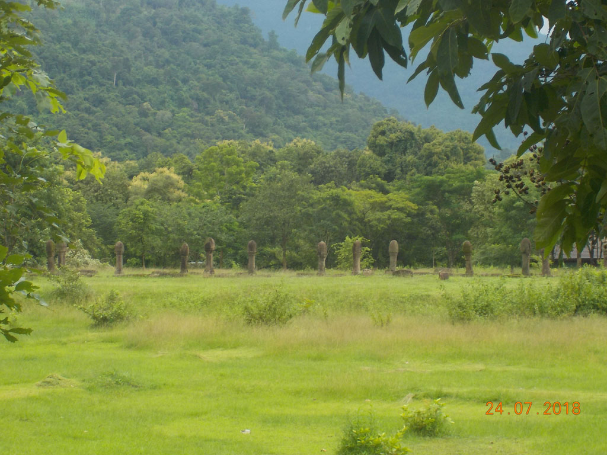
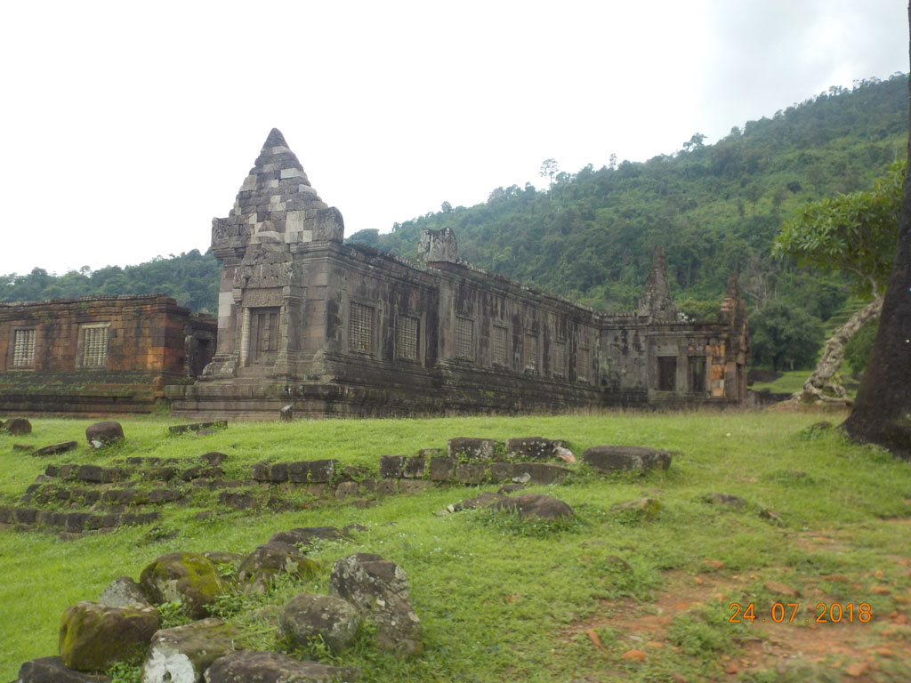
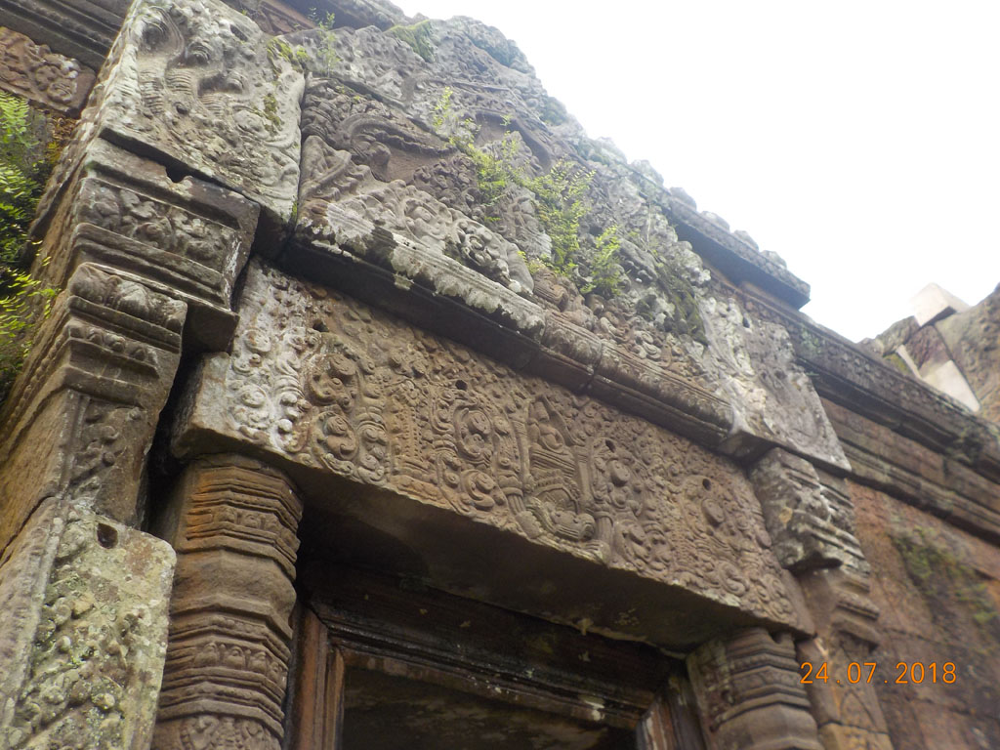
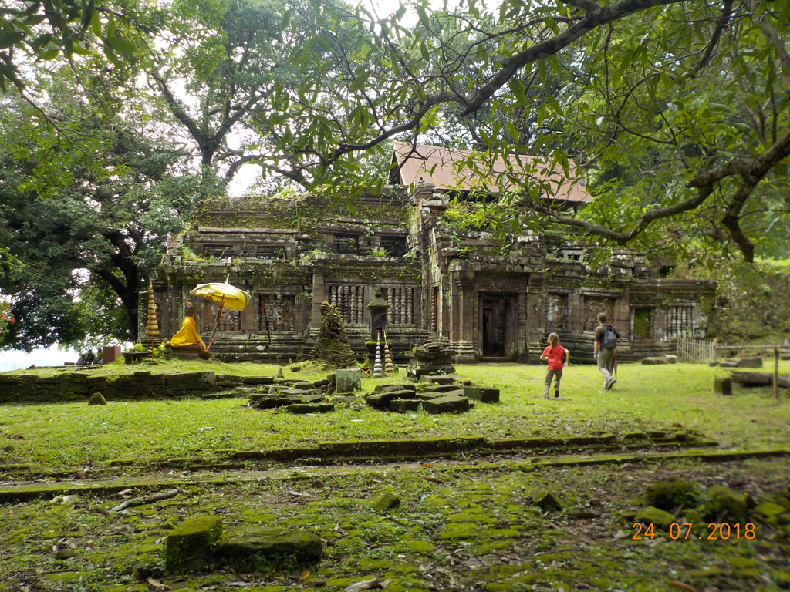

8h00 réveil au son du fleuve. Nous prenons notre petit déjeuner sur la terrasse couverte de la cuisine de la guesthouse. Pilotis sur le fleuve, belle ambiance. Crêpe au sucre ou au chocolat pour les enfants. Oeufs sur le plat, Tartine de porc grillé, café, eau, chocolat.

9h00 en guise de tuktuk ce sera notre hôte qui nous emmène au temple de **Wat Phou** situé non loin. Superbe balade, quasiment seuls dans ces ruines. (Les touristes arrivent de **Pakse** au moment ou nous commençons à redescendre). Un seul regret nous ne nous étions pas assez renseignés avant, du coup nous ne nous sommes pas baladés dans la campagne environnante, et ses autres temples proches. Petit conseil donc ,passer par l’office de tourisme de **Champassak** avant d’aller à **Wat Phou**.

12h30 retour à la guest house où après une bonne bière face au Mékong, nous allons faire une petite sieste.

15h00 A la recherche de la poste. D’abord fermée, puis ouverte, il est difficile pour le préposé de trouver le bon nombre de timbres et de la bon affranchissement pour nos cartes postales, nous épuisons son stock de timbres compatibles pour l’Europe. On en profite pour passer par le bureau des renseignements juste à coté et c’est là que nous découvrons toutes les balades autour de Champassak et du Wat Phou, nous aurions du commencer par là.

18H00 c’est l’heure de la beerlao face au fleuve. On discute avec la fille du patron et ses amis français. Pour le repas je prend sans hésitation le plat du jour familial un curry poulet grenouilles riz extraordinaire. La fille fait des beignets de crevettes frais on en profite aussi. A ceci s’ajoute un riz sauté au poulet, des nouilles sautées beaucoup de Beerlao et 2 pepsi.

Le patron qui est aussi le gérant de la compagnie de bus locale nous propose de prendre le bus du lendemain pour rejoindre Pakse.