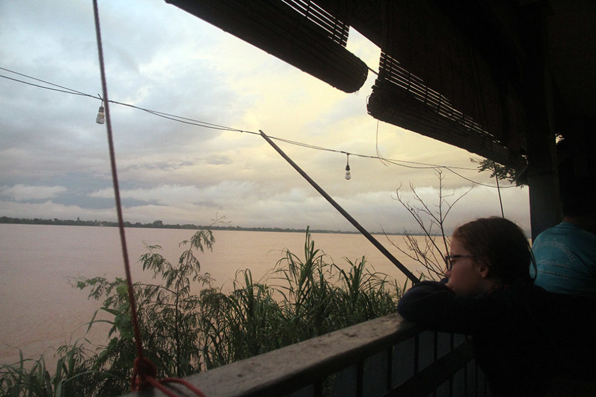

**7h00** réveil sous le soleil, petit déjeuner en terrasse avec 2 françaises et 5 hollandais (2 femmes et 3 enfants)

**7h45** notre tuktuk nous emmène à la gare routière. Le bus ne part qu’à 9h00, ou montons dedans à 8h15 réserver nos places. A 8h30 le conducteur n’arrive pas à démarrer le bus, il va falloir le pousser un peu en dehors de la gare routière puis faire venir un autre bus avec des câbles… Dans le bus on retrouve les françaises et les hollandais de notre guest house, qui arrivent tant bien que mal juste avant le départ. Nous partons tous en direction de **Pakse** le bus met 5h30.

Arrivés à la gare routière un tuktuk nous emmène au centre ville à 7km. G. et K. négocient un passage aux toilettes d’un hôtel tout proche. On prend ensuite un tuktuk à 15h00 pour tenter d’aller à **Champassak** en espérant y trouver une chambre.

Arrivés à **16h00** nous obtenons sans aucun problème une chambre dans la guest house que nous avions repéré, juste au bord du Mékong. L’orage tonne, le ciel est noir, la pluie tombe mais c’est très beau.

**18h30** nous allons manger car il faut commander avant que la cuisinière ne rentre chez elle. Poulet au gingembre + riz gluant, Nouilles sautées aux légumes, nouilles sautées au poulet, beerlao & pepsi.

Nous allons bien vite nous coucher après une petite conversation avec le patron. Sa fille vit en france et arrive demain.