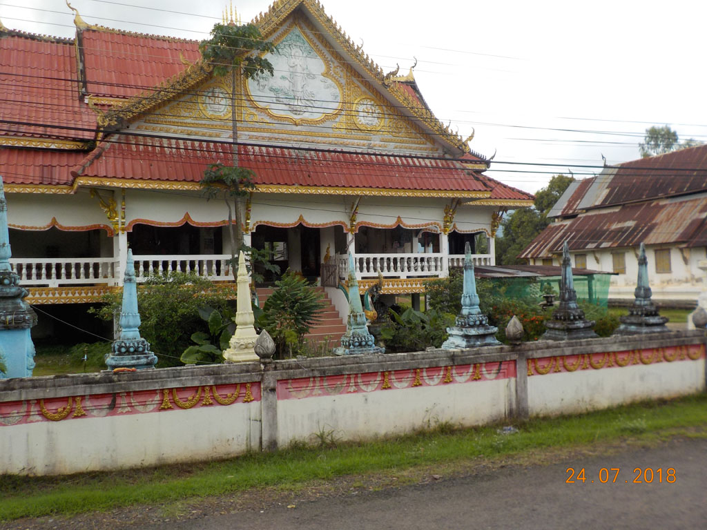
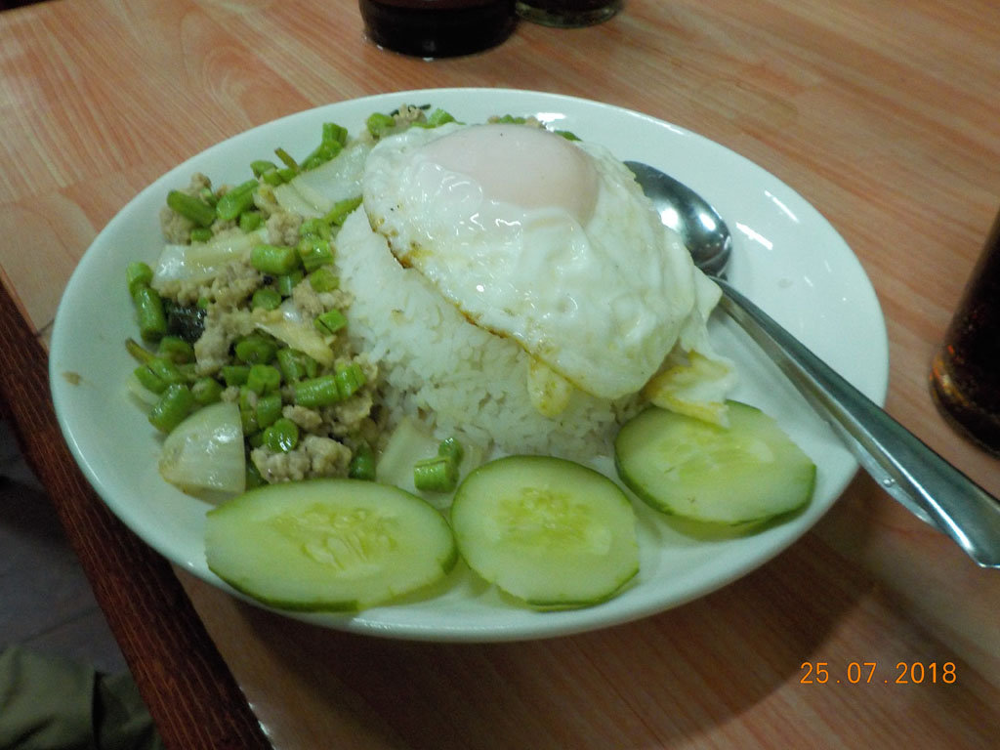

Réveil à 6h30 pour boucler les sacs avant le petit déjeuner (2 crêpes sucre, 2 oeufs, du café et de l’eau)

8h10 le bus/camion bâché qui devait passer à 7h30 arrive enfin. Nous détonnons parmi tous les paysans qui vont à **Pakse** avec leurs sacs vendre leur production. Sourires complices.

8h50 Arrivés au grand marché, nous marchons jusqu’à notre prochaine guesthouse recommandé par la femme de notre hôte à **Champassak**.

9H00 Nous recherchons le meilleur prix pour partir de **Champassak**, entre notre hôtel / agences / petite compagnie. C’est finalement dans la petite compagnie installée sur le trottoir de l’hôtel ou nous étions arrivés le premier jour que nous trouvons la meilleure offre.

Visite très courte du WetMarket tout proche plutôt vide et inintéressant.

10H00 nous prenons un **tuktuk** pour le “Big market”, confusion, on nous dépose devant le supermarché local. Heureusement le vrai marché est situé non loin. On se perd joyeusement dans cet endroit armés de café glacés glanés sur de petits stands.

11h30 dans la partie restauration du marché est venue l’heure de la pause déjeuner. Riz oeufs légumes porc et riz sauté légumes.

12h20 Après avoir acheté des tongs, nous prenons un tuktuk pour rentrer à l’hôtel où nous faisons une bonne sieste.

15H00 Mission poste, suite…. Elle est ouverte et le tarif est inférieur à celui de champassak, pourtant vérifié par le préposé dans son vieux manuel des postes :)

15h30 arrêt au bord de la rivière dans une petite gargote pour refaire le plein de beerlao et de pepsi.

16H00 on revient à l’hôtel en passant par un grand temple/ collège monastique.

18h00 Écriture du carnet en terrasse pour moi tandis que G. fait du bracelet. Un énorme orage s’abat alors sur Pakse. Nous restons bloqués sur la terrasse couverte de l’autre coté de cour pendant qu’une pluie infernale tombe.

20h00 on retrouve enfin les enfants qui ont pensé à rentrer les chaussures (un peu trop tard).

20h30 la pluie se calme, on traverse la rue pour aller manger dans une petite gargote située en face. Nouilles crispy, cochon haché légumes riz œufs, pilons poulet, poitrine de porc grillée riz gluant, beerlao, pepsi, cafés.

22h00 le ventre bien plein, nous faisons nos sacs avant de dormir.