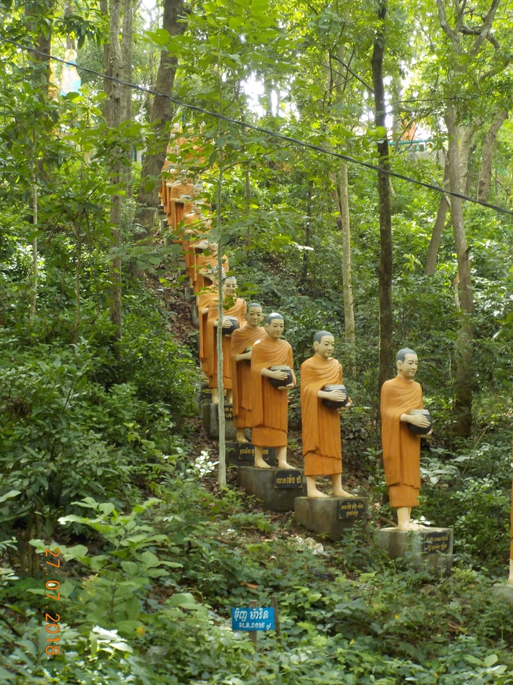
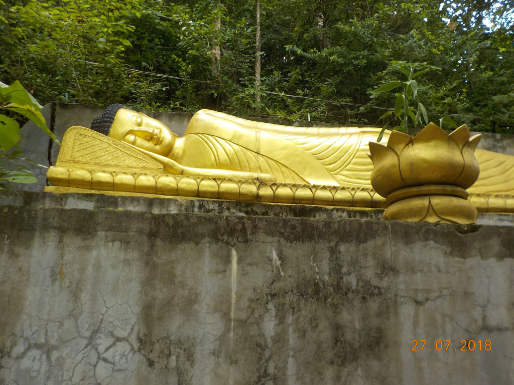

7h00 Réveil.

8h00 Petit déjeuner au Tokae restaurant, crêpes chocolat, omelette légume, chocolat glacé, café glacé, jus d’orange, café chaud.

8h30 A la recherche du distributeur, Canadian Bank sans connexion, banque locale sans VISA, et l’autre banque locale nous donne seulement des billets de 100$, nous rentrons à l’intérieur faire de la monnaie.

9h00 Retour à la guesthouse, notre hôtelier n’est pas là, on repart donc en direction de la gare routière en achetant 2 bouteilles d’eau.

9h30 Nous négocions ferme, une voiture pour **Sambok Mountain** (30 puis 20 puis 10$)

9h50 Arrivés au pied de la montagne, nous prenons notre temps, escaliers, **temples**, **singes**, **moines**, lézards bleus et rouges.

11h00 retour, à la guest house, on croise notre proprio sur la gare routière, il vend aussi des places de bus. on réserve pour le lendemain. Tour du marché pour acheter les tongs manquantes et retour à la guesthouse. On boucle les sacs et on va prendre le bateau pour **Kho Trong**. On part faire le tour à pieds, une belle boucle de 7km. On termine la boucle bien fatigués 1thé glacé et une bouteille d’eau à l’embarcadère.

16h10 bateau de retour, on s’arrête grignoter dans une petite gargote, quelques nems un tartine à l’ail, cocas et cafés glacés.

19h00 pour le repas du soir ce sera sur le bord de la route dans un espèce de night market. 2 cuisses de poulet grillées, 2 tranches de poitrine grillée, de l’eau et des jus d’orange.

19h40 sur le chemin du retour on s’arrête au Tokae restaurant, pour 2 bières, coca et 7up et finalement une crêpe en dessert.