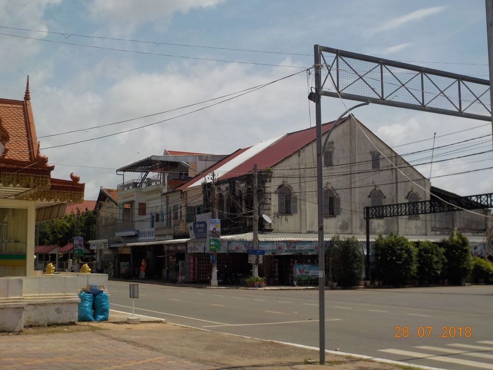

7h00 Réveil.

8h00 Une fois les sacs bouclés, nous retournons au **Tokae Restaurant** prendre notre petit déjeuner, crêpes banane chocolat, crêpe chocolat, 2 oeufs bacon baguette, chocolat glacé, café lait glacé, café glacé, jus.

9h00 grand tour du marché juste en face, puis nous nous rapprochons des berges. Petite pause sous un arbre jus de canne et brochette ananas.

10h00 retour à la guest house, normalement le bus ne devait partir qu’à 11h00 mais un scooter vient vérifier que nous sommes déjà là et 5 min plus tard un mini bus arrive.

11h30 arrêt repas pour le chauffeur, on se contente de café glacé, le petit déjeuner pas si lointain étant copieux.

13H30 Arrivée à **Komong Cham**, tuktuk à 3$ pour rejoindre la guest house. On pause les affaires, E. prend une douche, tandis qu’avec G. nous bouclons les billets de bus pour le lendemain.

14h00 C’est l’heure de la découverte, on part marcher le long des berges, temple, avenue tristouille, marché de nuit de jour…

15h00 Arrêt boisson bière, coca, jus de citron, truc rose aux fruits de la passion.

16h00 Retour à la guesthouse, le reste d’entre nous se prend un bonne douche.

18h30 On fait le tour des popotes de rue, coté **Mékong** il n’y a que du sucré, coté ville abats de volaille ou saucisses. Les locaux ne sont pas vraiment là pour manger, il s’agit plus du lieux ou grignoter du sucré le long des berges en famille. Du coup on se rabat sur un petit restaurant face à la rivière, plutôt touristique, mais c’est le seul où il y a du monde, aussi bien locaux que touristes. Nouilles sautées au porc, Nouilles sautées crevette, Riz frit légume poulet. 1 Angkor, 1 Cambodia, 1 jus de la passion, 1 coca. Pas terrible mais au moins cuisiné du jour.

21h00 Retour à la guest house après une petite balade au milieu des lumières colorées de la ville et la découverte de la piscine flottante sur le Mékong. Où tous les gamins nagent en gilet de sauvetage.