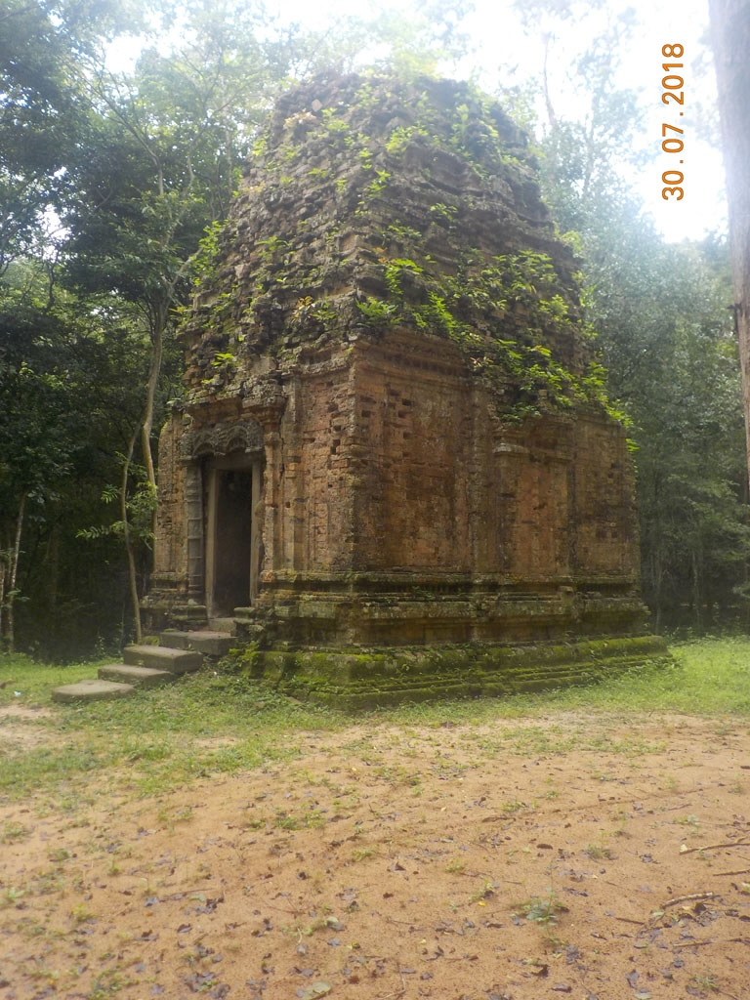
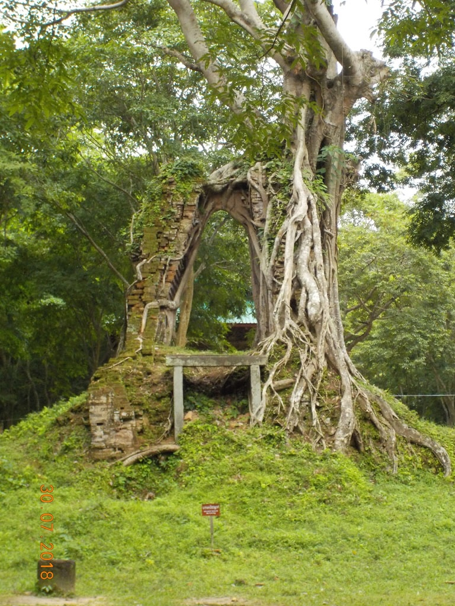
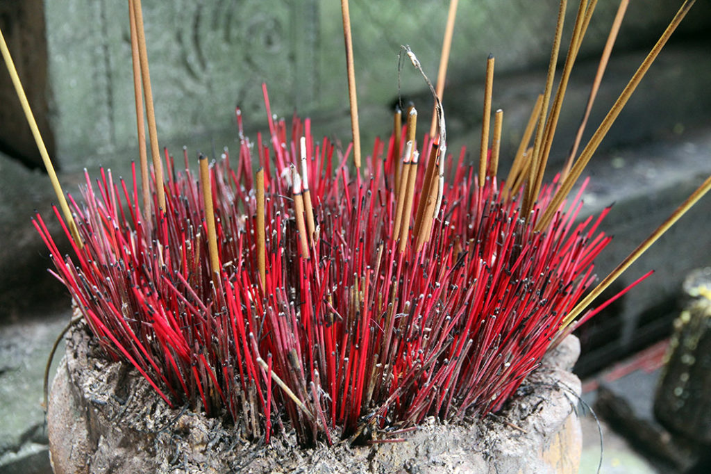

6h00 Réveil pour moi.

7h00 Carnet pendant que tout le monde se prépare, nous avons commandé à 8h00 pour aller visiter les temples alentours.

8h00 Pile à l’heure, nous faisons une pause dans une boulangerie.

9h00 Nous partons visiter pendant 2h30 les **temples** perdus dans la foret. Superbes. Nous sommes totalement seuls. Quelques rares cambodgiens sur la fin du parcours. En le sachant il aurait fallu pouvoir rester plus longtemps. Mais comme notre chauffeur nous attendait….

13h00 retour à la guest house

14h00 Repas dans la petite cantine qui borde la place d’hier soir. Nouilles porc, nouilles, nems, Cambodia, soda. Puis balade café et sieste.

18h00 Retour sur la place pour le repas du soir. Poulet entier riz, riz sauté légumes, Cambodia et cocas

20h00 bien crevés, dodo après un aller-retour sous la pluie acheter un briquet. Le club, bar à entraineuses du début de la rue commence à se remplir…