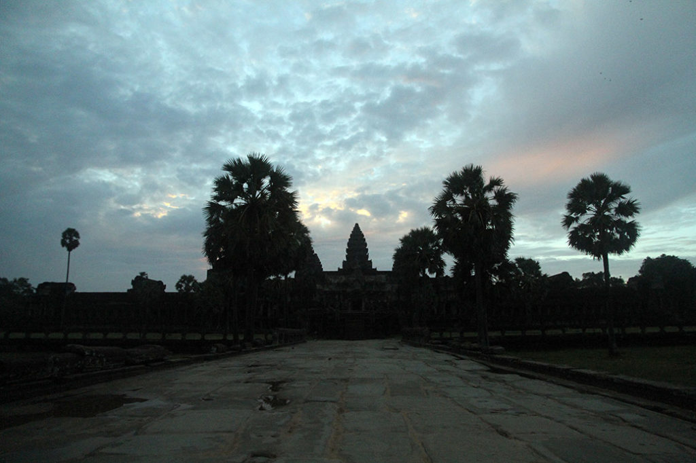
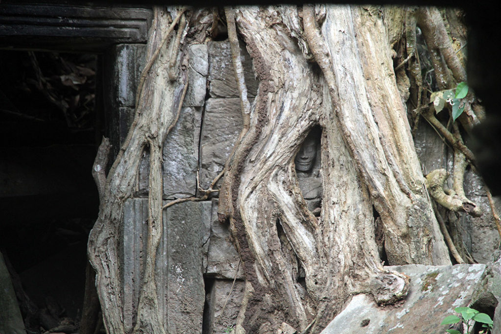
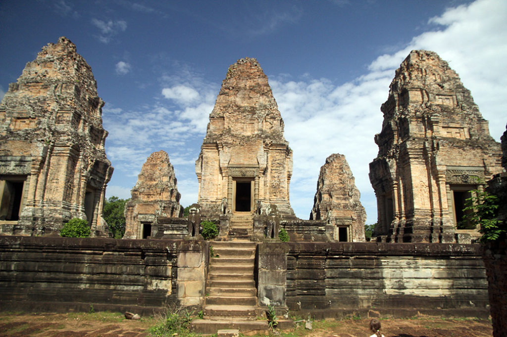
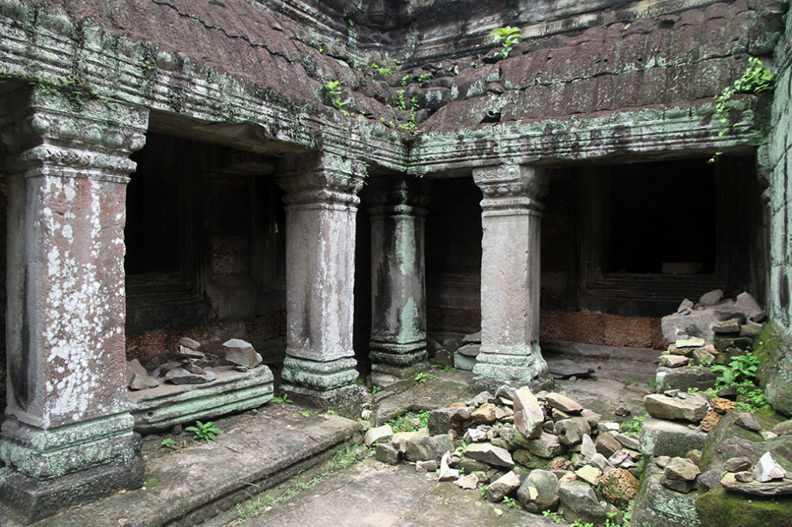
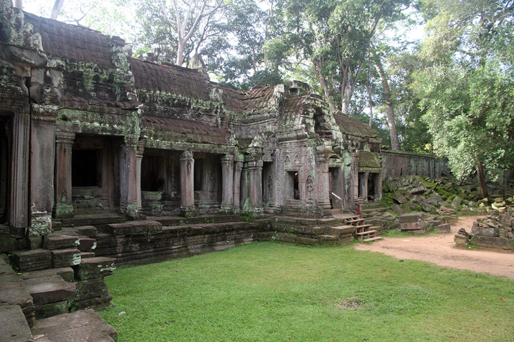
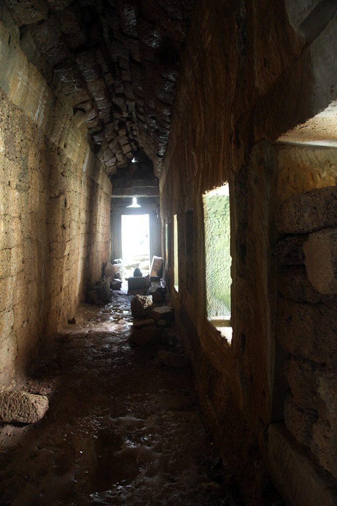
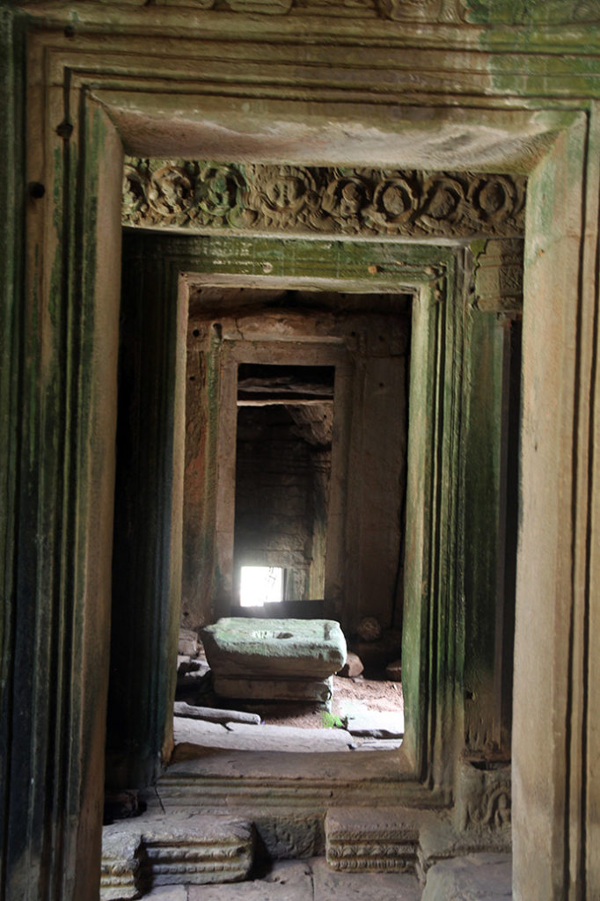
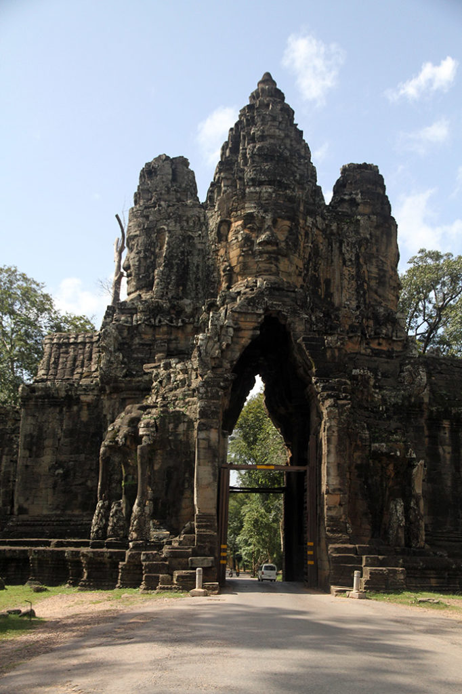
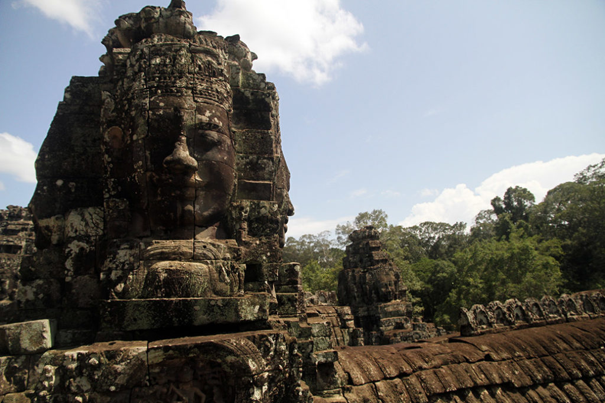

4h30 Réveil.

5h00 Départ avec Mr Tung pour **Angkor**, après avoir déposé nos sacs à l’hôtel ou normalement nous devrions avoir une chambre à notre retour. Et récupéré les petits déjeuners qui nous attendaient en barquette.

5h30 Arrivée à Angkor Wat, nous assistons au lever du soleil, seuls sur la jetée de pierres. Tous les touristes sont le long des bassins pour faire la photo du catalogue de voyage avec le reflet… Du coup nous serons les premiers à pouvoir rentrer dans le temple, Et donc relativement seuls lors de cette visite.

7h00 on en ressort nous allons avec Mr Tung prendre un premier et dernier petit café glacé, car hors de prix….

7h30 les autres temples du site s’ouvrent aux visiteurs. Plutôt bien organisés avec notre guide nous arriverons à prendre tous les autres touristes à revers, du coup nous serons majoritairement seuls lors de nos visites, ce qui est très agréable.

15h30 Après 15 temples petits et grands c’est bien exténués que nous quittons le site.

16h00 La chambre est bien disponible et nos sacs nous attendent dedans. Direction la piscine pour se remettre de cette longue journée.

17h30 de retour dans la rue, on achète nos billets de bus pour le lendemain matin. Après un très bon repas au Steven Corner, on repasse par les berges manger quelques pancakes.

19h00 Dodo pour tout le monde.