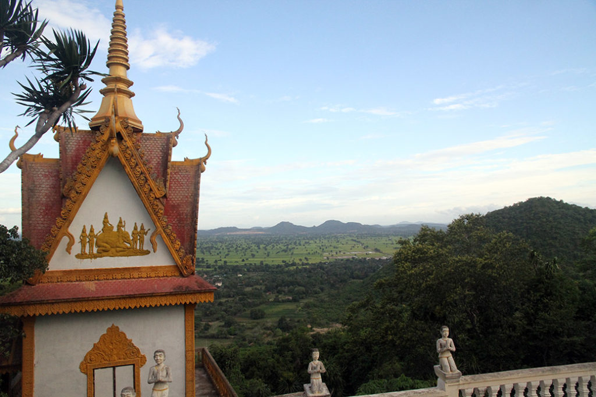
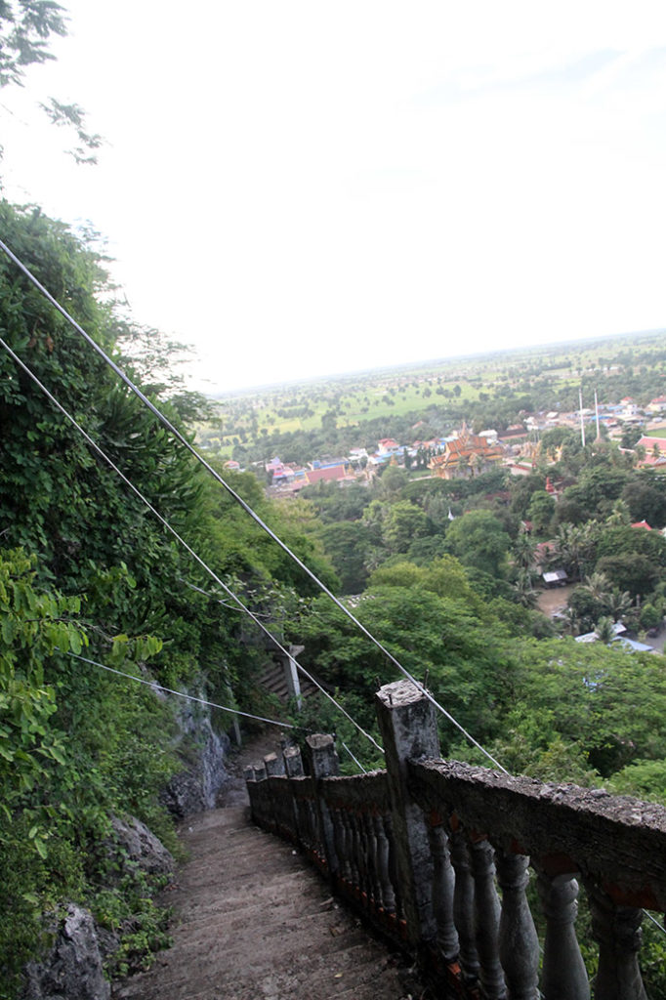
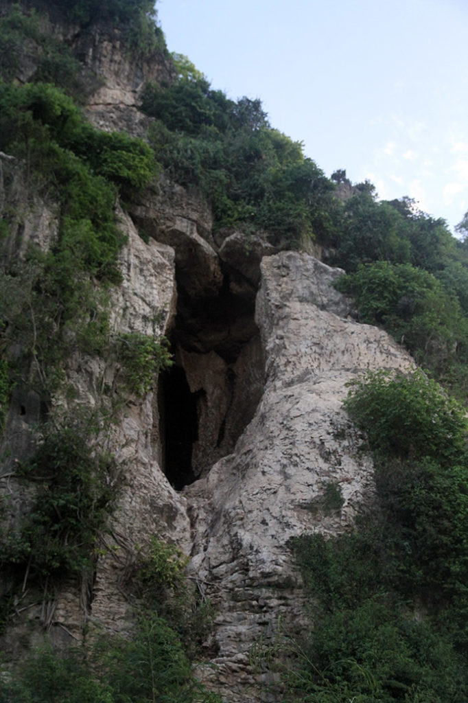

7h00 Réveil.

8h10 Après avoir déposé le linge, nous nous baladons dans la ville. Au passage on achète les billets de bus pour le lendemain.

11h00 Pause café en terrasse. Visite des 2 marchés à la recherche de Kramas, ces écharpes cambodgiennes. Nous partageons un bol de nouilles des nems et des sodas. Avant faire trempette à la piscine.

15h30 Départ en tuktuk pour les “**killing caves**” et “**bat caves**” situées à **Phnom Sampeu**. Très jolie promenade avec une vue spectaculaire sur la campagne. Autant la foule s’amasse pour la sorte des chauve souris de la **grotte**, autant nous étions relativement tranquille lors de l’ascension et de la visite du temple.

18h30 Retour à l’hôtel, nous partons grignoter sous les tentes situées le long de la berge… bof bof. Porc et nouilles sautées au menu. On se console en se promenant le long des berges avec quelques pancakes.

22h00 retour à la chambre en passant par le toit terrasse, admirer la vue nocturne.