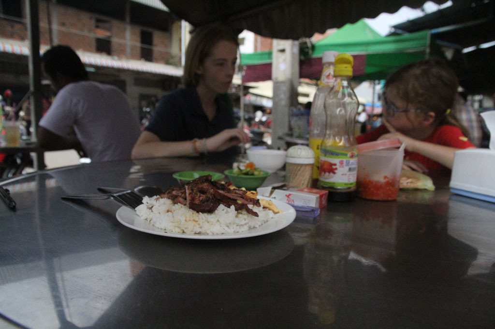
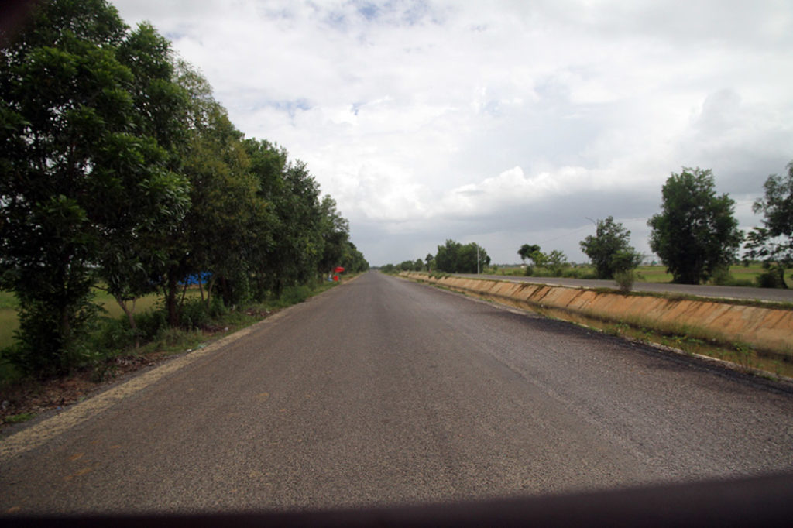
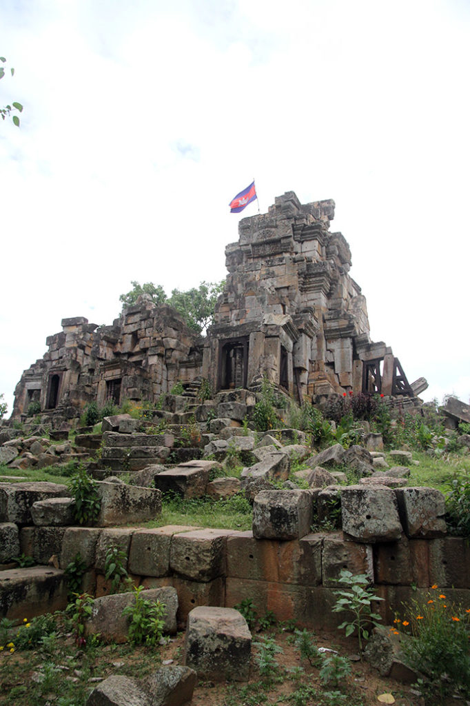

7h00 Réveil.

8h00 Nous retournons à la petite gargote sur le trottoir, non loin du marché prendre notre petite déjeuner en compagnie des écoliers de **Battambang** en uniforme. Nous détonons mais c’est vraiment excellent ici. Cochon ou poulet mariné grillé riz oeuf, cafés glacés au lait ou pas, sodas.

9h00 Après cette “petite” étape gourmande, nous marchons jusqu’au marché en oubliant que nous sommes samedi….

10h30 Ce sera finalement piscine avant de boucler les sacs et libérer la chambre. Nous déposons les sacs à la réception.

Vers 12h00 nous profitons de cette belle journée sur une terrasse. cafés glacés, jus de citron frais, sodas, nems…

13h00 De retour à l’hôtel, on prend un tuktuk pour aller visiter un vieux temple **Ek Phnom Temple**, proche d’un bouddha en construction et d’un bassin. Le lieu est super paisible. Nous profitons bien de la balade, suivis par les gamins du coin qui se servent des ruines comme d’un terrain de jeu géant.

Au retour le conducteur, nous propose de faire un petit détour pour aller voir un autre temple dans les environs **Somroung Knong**. Nous voilà donc partis à travers la campagne magnifique de pont en rivières.

17h00 Nous revenons de notre excursion, on profite du café en bas de l’hôtel.

18h00 La balade commencée sur les berges est écourtée à cause de la météo.

19h00 Repas dans un petit restaurant non loin du marché et des berges. Je suis malheureusement un peu nauséeux et me contente d’un riz blanc. Je goute néanmoins chez les autres. Superbe cuisine. Beignets de crevette, ribs porc légumes sautés. crevettes aigres douces riz, sodas et bières.

21h00 de retour à coté de nos sacs à l’hôtel. L’attente commence, vers 22h30 nous faisons appeler par le gardien de nuit la compagnie de bus qui devait venir nous chercher vers 22h00. On nous avait un peu oublié….

22h35 Direction la compagnie de bus.