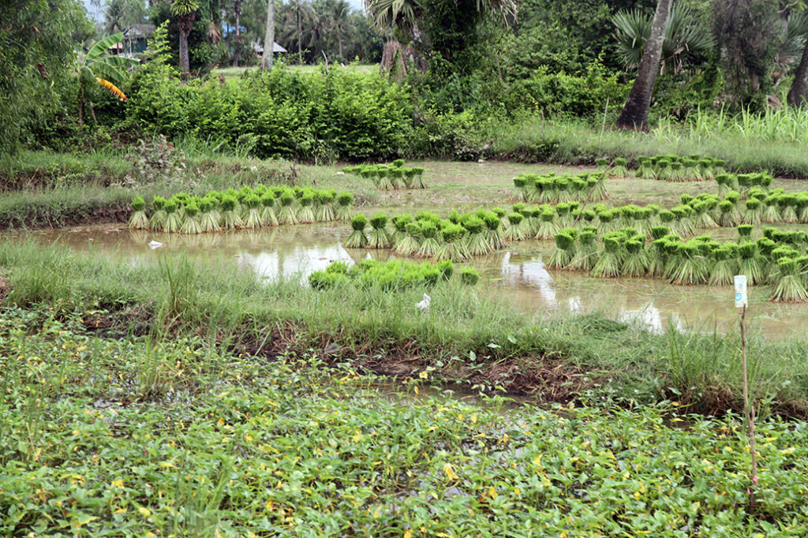
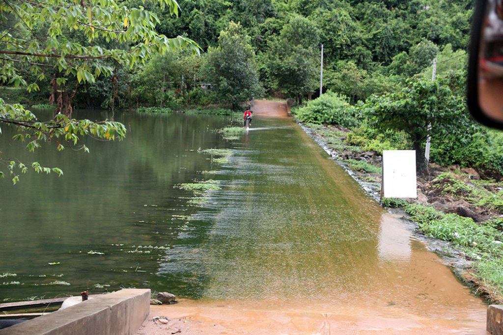
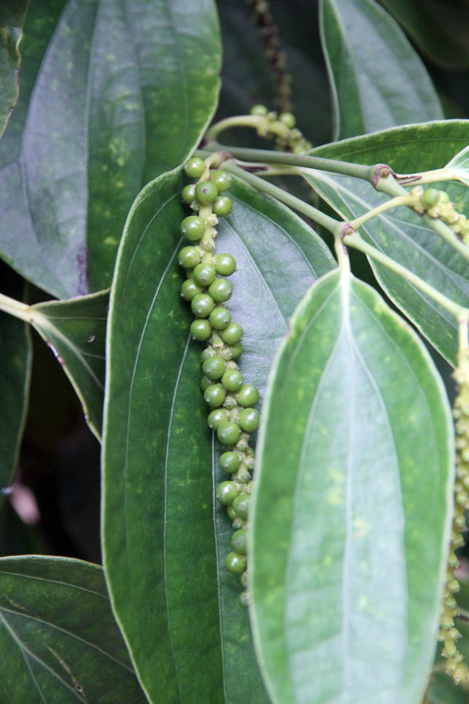
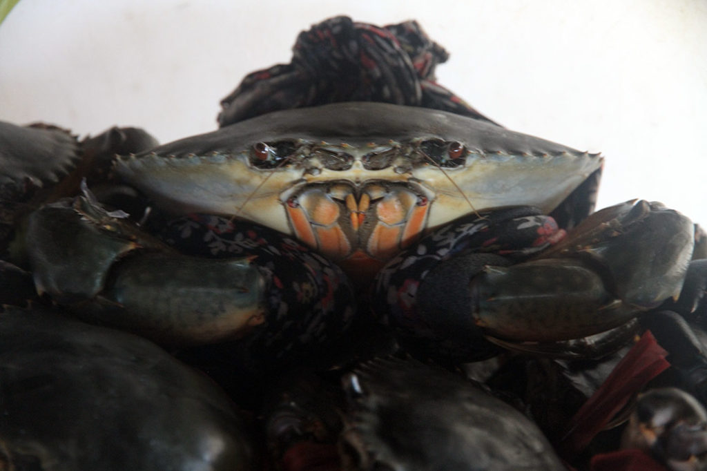
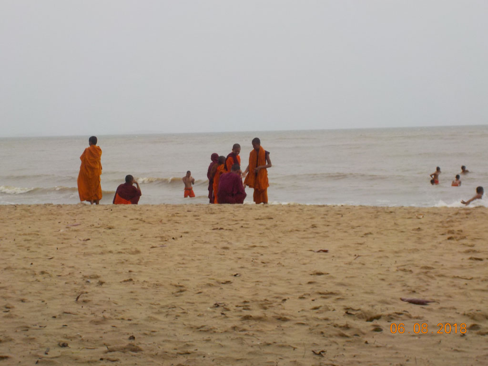

8h00 Réveil

8h30 Au coin de la rue, la traditionnelle gargote où les écoliers et travailleurs prennent leur petit déjeuner. Porc loclak et café glacés noirs ou au lait. Non loin une dame fait chauffer son huile pour des beignets de bananes écrasées. En attendant et par gourmandise on reprend quelques cafés dans un kiosque. (Le monsieur qui sert G. se fait disputer par sa femme car il a pratiqué les prix normaux et pas les prix touristiques…)

9h30 Les beignets sont enfin prêts, on se régale en rentrant vers la guesthouse.

10H00 Départ en tuktuk explorer la campagne environnante. Au milieu des rizières et petits villages. Arrêt à une grotte, mais la circulation intérieure ne me parait pas accessible à nos enfants, et comme G. à le vertige…. Nous visiterons aussi “la plantation” avant de revenir vers **Kep**. On s’arrête dans un petit restaurant au bord de l’eau. Nous sommes seuls, tout comme dans la ville. Ce n’est pas vraiment la saison touristique et le temps est exécrable (E. et moi poussons le tuktuk embourbés sur les peits chemins). Cochon légumes, beignets crevette, bières, jus de citron.

Nous allons ensuite (moi et les enfants) nous baigner sur la plage principale de **Kep** sous la pluie, tandis que G. nous attend sous un arbre. Bonne baignade avec les moines du monastère voisin venus eux aussi profiter de ce moment de jeux sous la supervision des vieux.

17h30 Retour à **Kampot** dans la guesthouse, où après une bonne douche nous discutons avec 2 français retraités voyageurs et deux jeunes filles françaises dont c’est le premier voyage. Elles ont eu un accident de scooter en short aujourd’hui. Comme nous sommes à la fin de notre périple nous leur cédons une grosse partie de notre pharmacie.