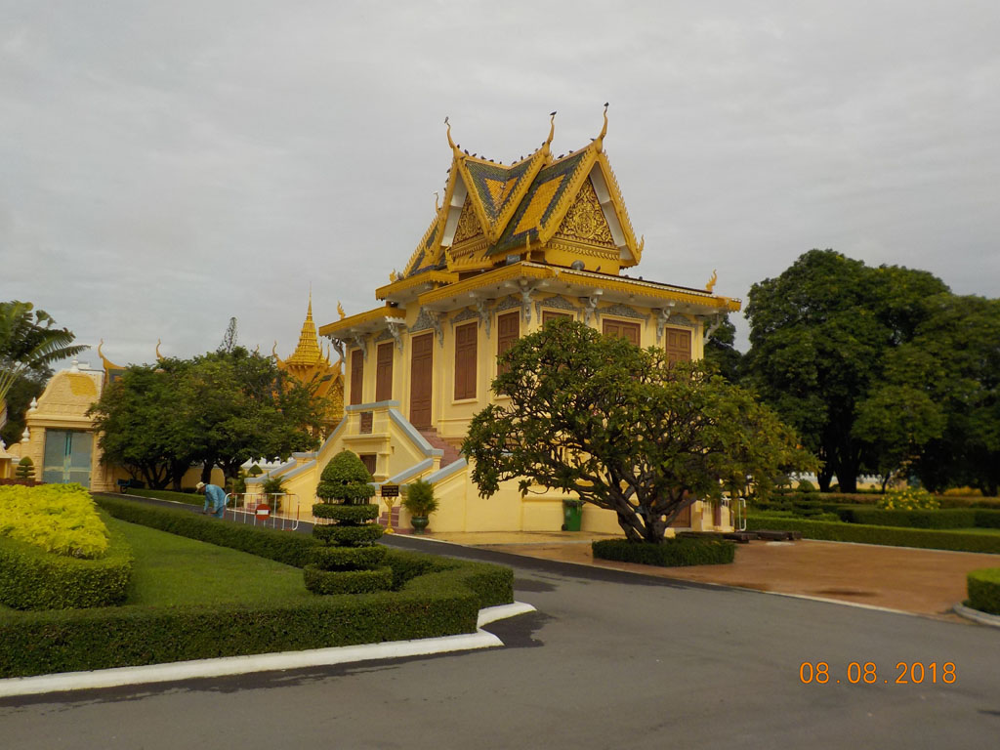

6h30 Réveil

6h50 Passage à la boulangerie du quartier faire quelques stocks.

7h10 Le bus de 7h30 vient nous chercher.

7h45 Départ réel depuis les comptoir de la compagnie.

11h30 Arrivée à **Phnom Pen**, Nous prenons un tuktuk pour notre hôtel. Avant de partir en balade dans la ville. Arrêt dans un restaurant, cantine des voyageurs de la compagnie de bus voisine. On se régale avec des nouilles porc oeufs, des oeufs frits nouilles, riz frit cochon, cafés glacés et sodas. Nous marchons ensuite longuement jusqu’à la poste, tout en traversant quelques quartiers ou beaucoup de vieux messieurs regardent de bien jeunes filles…. Arrêt urgent dans un café non loin de la poste pour E.. Tandis que je veille sur le malade les filles vont à la poste envoyer nos cartes du Cambodge.

16h00 Retour sous la pluie en tuktuk

18h30 Départ en imperméable pour un restaurant situé non loin. Repéré dans le “Routard”, bon mais en dessous de ce que nous avons pu croiser. Cury cochon, crevettes nouilles, poulet, jus d’orange, soda et bières.

20h00 Retour à l’hôtel.