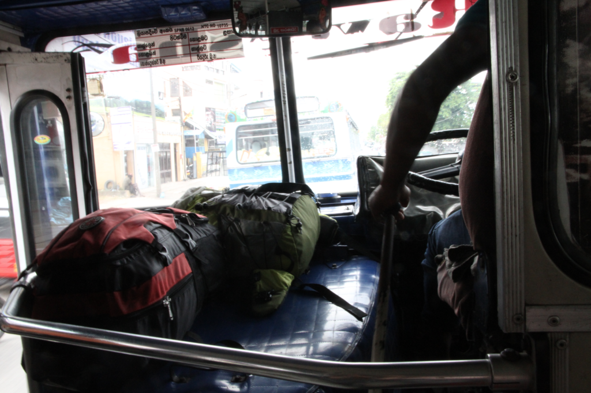
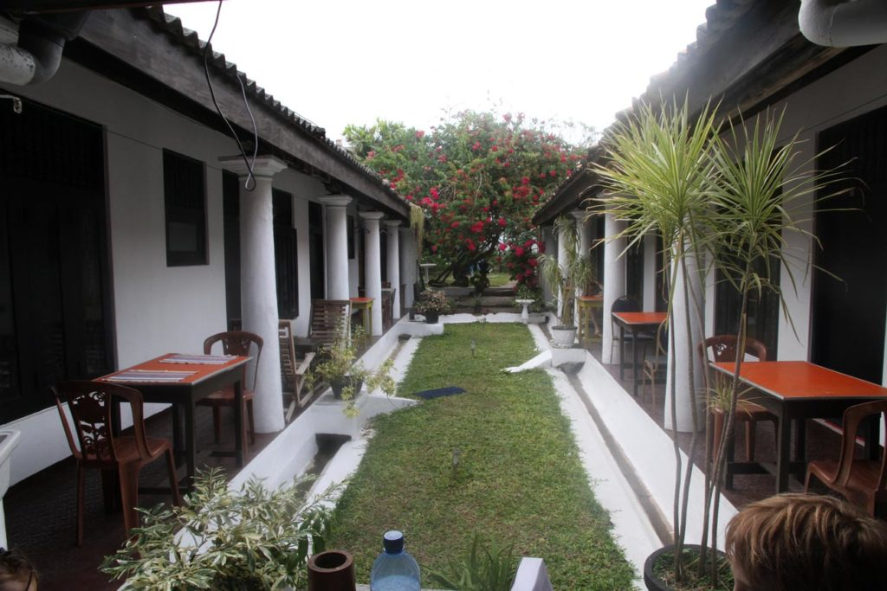
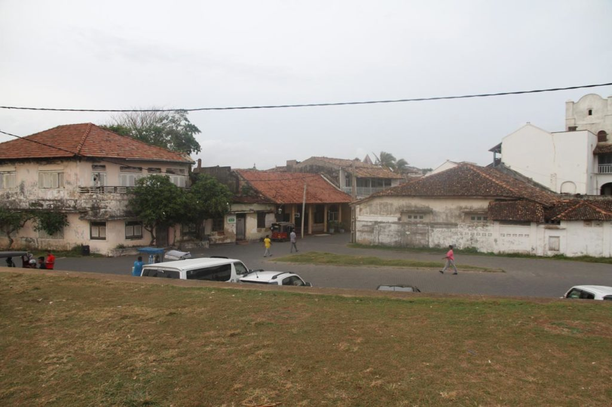

Petit déjeuner à la guesthouse. Au bout de la rue sur l’artère principale avec l’aide toujours attentionnée des passants nous attrapons le bus pour **Galle**.

Après avoir décliné les propositions des tuktuks, nous partons à pieds depuis la gare routière vers notre guesthouse.

L’après midi sera consacrée à la balade dans le vieux fort et sur les remparts depuis lesquels nous observons la vie locale. Partie de **cricket** endiablée, etc…

Nous avions gardé un bon souvenir de Galle de notre précédent voyage. Sentiment qui partira très vite malgré la beauté du lieu. Cette sensation de ville endormie, mais habitée, laisse place à un enchaînement de résidences secondaires clinquantes, de magasins, d’hôtels et de restaurants pour touristes avec les prix qui vont avec.