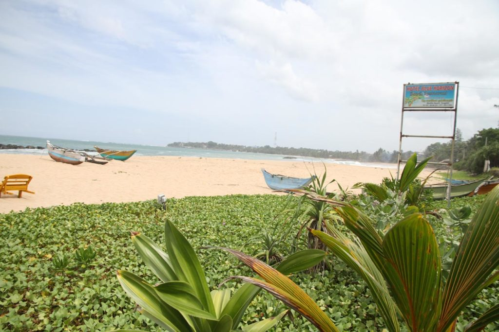
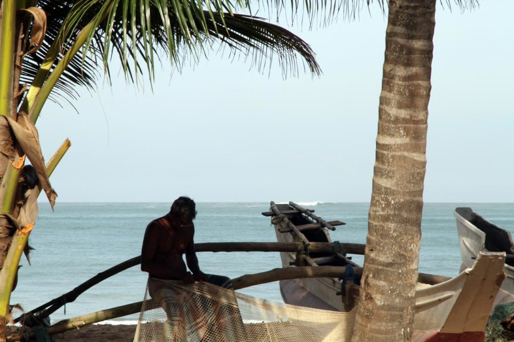
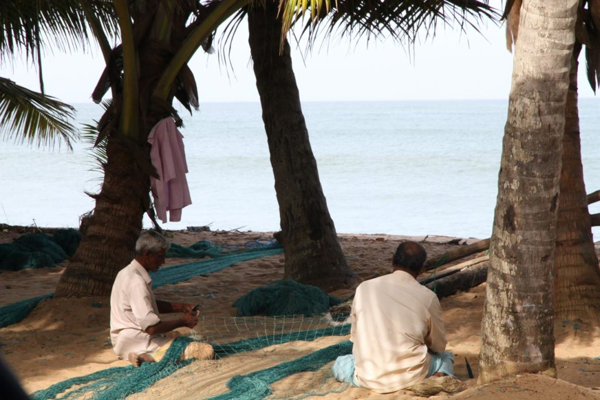
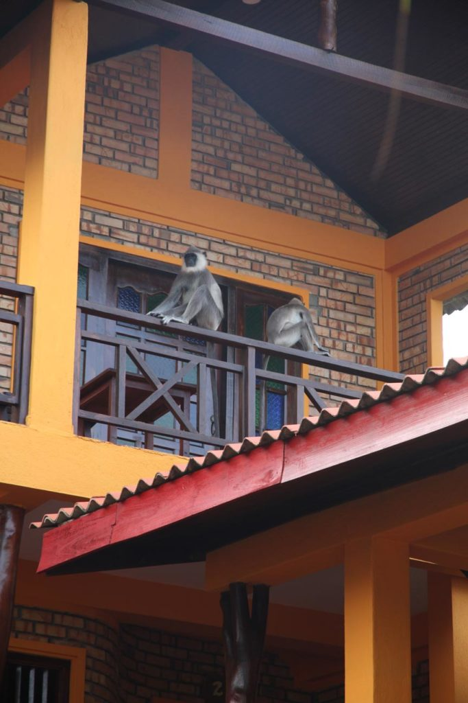

Pressentant la transformation à grande vitesse du sud touristique nous fonçons vers le sud.

Petit déjeuner à la pension puis direction la gare routière. Bus pour **Matara** où après une courte pause nous prenons celui de **Tangalle**.

Pour se remettre de ce début de parcours un peu rapide nous resterons 2 nuits.

Les enfants profitent bien de la plage. Nous aussi d’ailleurs.

Baignade le 2eme jour sur la route du port de pêche (via la côte). Petit stop boisson sur le retour.

Comme il fallait s’y attendre le sud du Sri Lanka change vite. Depuis les fenêtres de nos bus ce ne sera qu’hôtels en construction de Galle à Tangalle.