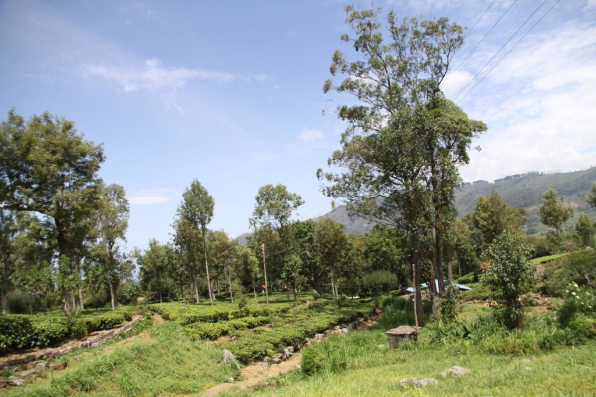
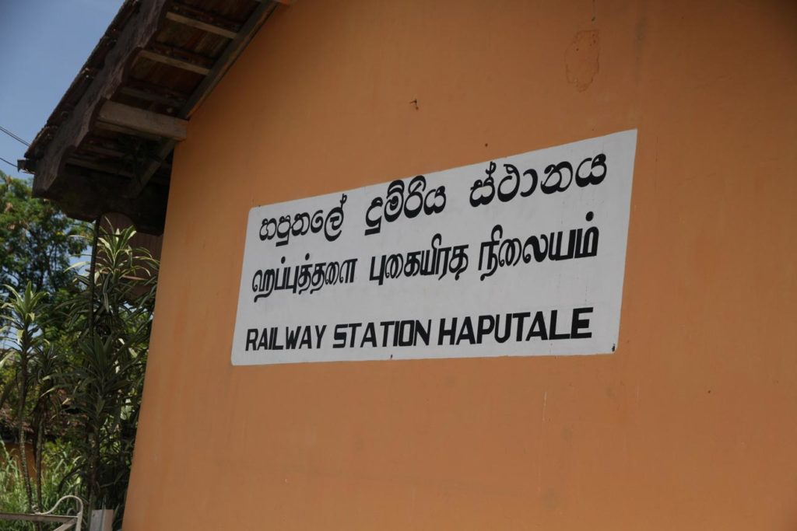

Nous commençons notre remontée vers le nord du pays.

## Jour 1

Après un petit déjeuner à l’hôtel, tuktuk pour la gare routière. Bus pour **Weliwara**, nous sommes les seuls touristes du coin, c’est très agréable et après les aimables conseils des gens du coin bus vers **Haputale**.

A l’arrivée nous tentons notre chance chez M. Amarasinghe chez qui nous logions 13 ans auparavant. C’est désormais son fils qui dirige cette adorable pension. Lui même se contenant de regarder le cricket à la télévision (avec notre fille qui découvre ce sport) pendant que sa femme entretient toujours ses merveilleuses fleurs. L’accueil est toujours aussi sympathique.

Petit visite à pieds d’**Haputale** via le “raccourci” du patron. Premier contact pour les enfants avec les **“hotels”** le temps de déguster une boisson fraiche avant de rentrer, la nuit tombant, en tuktuk à notre pension.où nous mangeons un excellent curry préparé par la patronne.

## Jour 2

Le lendemain matin après un solide petit déjeuner local pour nous, occidental pour les enfants, nous prenons le tuktuk conseillé et négocié par le patron pour faire les 11 kms jusqu’à l’historique fabrique Lipton.

Après la visite nous nous faisons ramener à la gare pour y acheter les billets de trains du lendemain. Petit encas non loin de la gare dans un hôtel et retour via le raccourci.

Je pars en fin d’après midi en balade dans les collines situées au dessus de la pension avec les enfants. Seuls nous contemplons les vallées alentours assis au milieu des plantations de thé.

*Note : Pas vraiment un point négatif, mais plutôt un regret. A l’époque (13 ans auparavant) nous avions fait le voyage jusqu’à la plantation dans un mini bus décrépi en compagnie des ouvrières et avions visité l’usine, seuls, avec un vieux monsieur tout en prenant quelques photos. Désormais il faut patienter dans une salle d’attente que le nombre de touriste soit important, ce qui arrive assez vite, pour faire une visite guidée, assez courte où les photos sont interdites.*