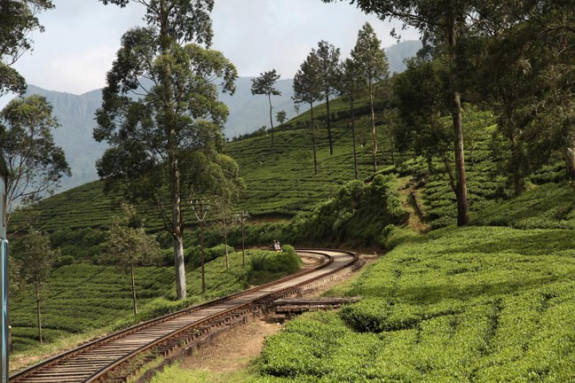
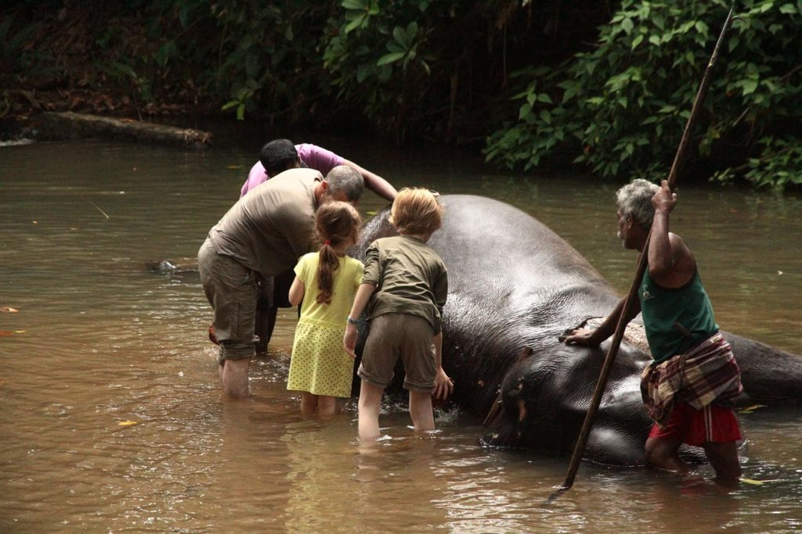

## Jour 1

Après notre petit déjeuner, le tuktuk vient nous chercher de bonne heure pour la gare. Le voyage est toujours aussi beau.

> *Seul regret nous sommes dans un de ces nouveaux trains bleus, les anciens wagons rouges avec leurs places réservées aux moines me manquent un peu.*

Arrivés à **Kandy** nous prenons un tuktuk pour la guesthouse que nous avions choisi mais qui s’avère complète. Du coup nous nous rabattons ur sa voisine.

Descendons à pieds en ville. Quel choc, **Kandy** a tellement changée.

Jus de fruits très bon au royal bar inn puis retour à l’hôtel où nous mangeons un riz curry insipide et les enfants un riz sauté.

## Jour 2

Tuk-tuk de la pension jusqu’à la gare routière. Bloqués dans les embouteillages nous rejoignons péniblement la “junction”. Tuktuk enfin jusqu’à la milléniumfondation

> *Note : Autant nous voulions montrer les éléphants aux enfants, autant nous ne vouions pas cautionner ce que Guides, sites et personnes rencontrées nous disaient de ce qu’est devenu l’orphelinat. D’un endroit plutôt tranquille, gratuit et fréquenté par une majorité de Cingalais, cela semble être devenu un zoo bien loin du bien être animal et plus une usine à rupees.*

Nous nous rendons donc à la millenium foundation…. bof bof.. nous ne payons pas l’entrée spéciale balade à dos de pachyderme. les enfants se contenterons de les nourrir et de leur frotter le dos dans la rivière. Ils seront très content, nous un peu déçus, perdus dans nos souvenirs de l’époque. Juste avant de repartir nous visitons la fabrique à papier en caca d’éléphant.

Pour le retour nous faisons le chemin inverse, tuktuk puis bus.

En cette fin d’après midi ce sera séance shopping et délicieux jus de fruits.

Comme nous avons prévu de repasser plus tard par **Kandy**, nous nous rendons à notre ancienne guesthouse. Coup de coeur, 13 ans plus tôt. Non seulement elle existe toujours mais en plus la propriétaire nous reconnait. Tout en buvant un thé gentiment offert le temps que l’averse passe, nous nous remémorons le passé. Elle se débrouille alors avec sa fille désormais responsable des réservations pour que nous puissions séjourner chez elle lors de notre prochain passage… YES…

Retour à notre pension bien fade.

Tuktuk pour une petite soirée en ville. Repas à l’Old Empire, excellent riz curry pour nous et wraps bacons avocat pour les enfants qui voulaient changer un peu du curry/nouilles. Retour ensuite à la pension après une petite balade nocturne.