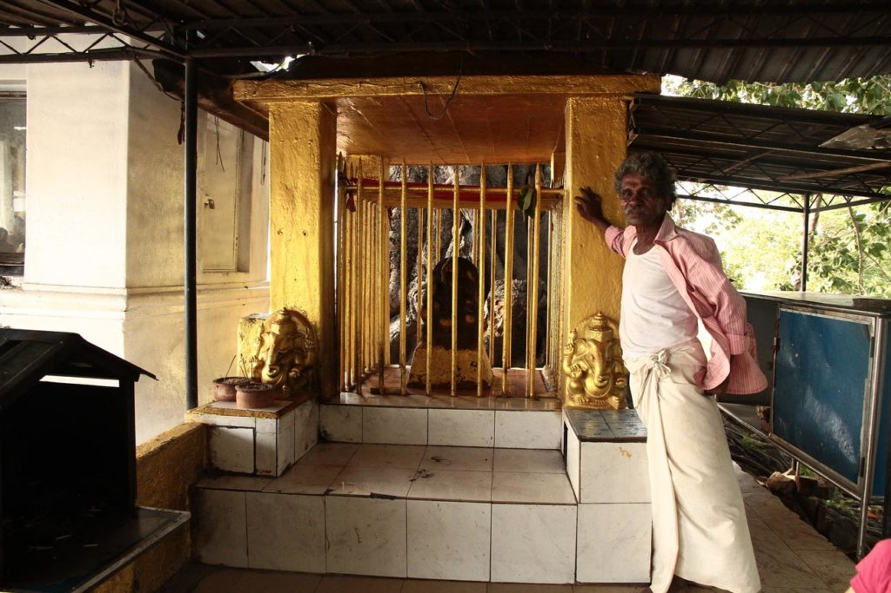
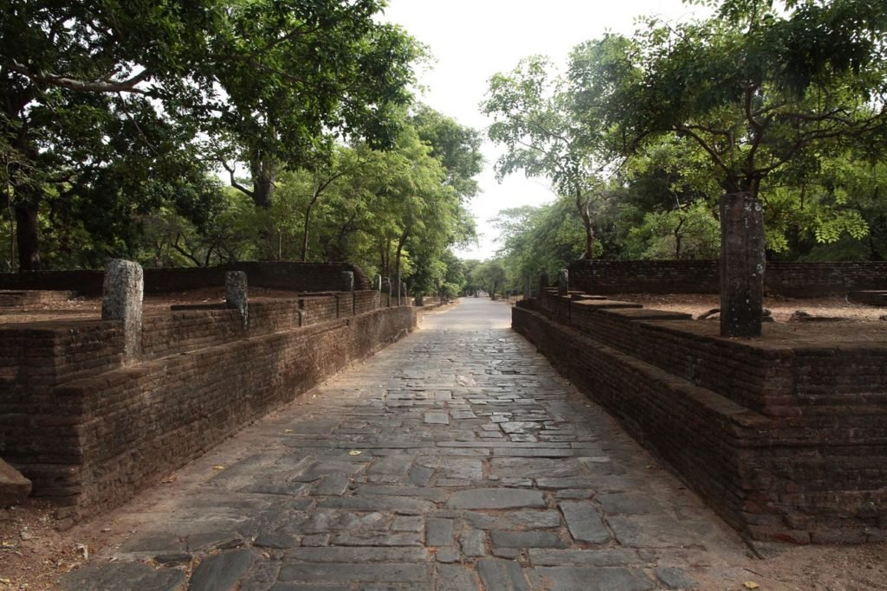
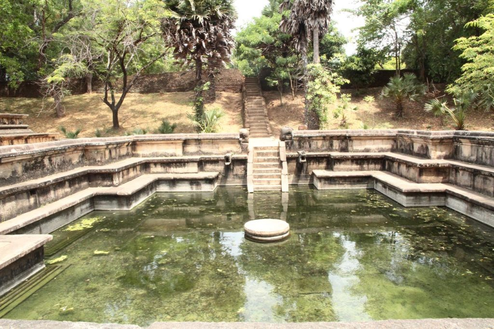
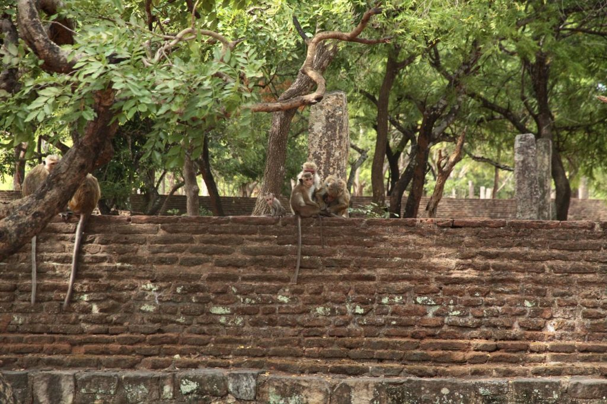

## Jour 1

Petit déjeuner à la pension puis tuktuk pour la gare routière. Ayant déjà visité **Dambulla** et **Sigyria** à l’époque nous faisons l’impasse et “montons” directement vers **Polonnaruwa**. A la descente du bus, tuk-tuk pour nous rendre à l’hôtel. Balade au bord du réservoir après un petit encas dans la gargote locale.

Nous revenons à l’hôtel en tuktuk et c’est K. 6ans qui nous ramène, toute fière de conduire le tuktuk. Nous avons en effet retrouvé le chauffeur de ce matin.

## Jour 2

Réveil à l’aube.

Rapide petit déjeuner puis tuktuk pour l’entrée du site.

7h30 nous achetons nos billets et partons visiter les ruines à pieds, au grand désespoir des chauffeurs de tuktuk et des loueurs de vélos. Seuls dans le site nous savourons la balade. Chassés parfois par les singes dont nous dérangeons les territoire. Nous sortons du site vers 12h30 après 5h de balade et un arret boisson au “fond” du site. Nous visitons à ce moment là le musée (1h).

Pour finir cette journée bien remplie, nous repartons au bord du réservoir, rafraichir nos pieds dans les canaux.

Retour enfin à l’hôtel.  
  
*Si c’était à refaire : nous commencerions par le grand quadrilatère à l’entrée, vide à l’ouverture, qui finalement sera noir de monde lors de notre retour, au moment où nous avons voulu le visiter.*